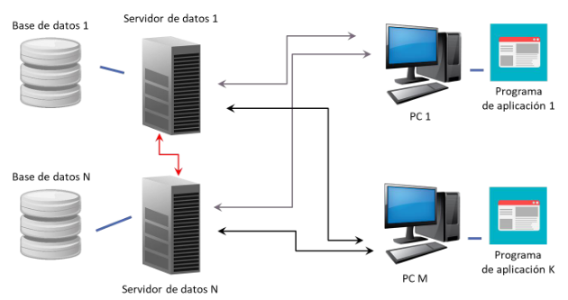
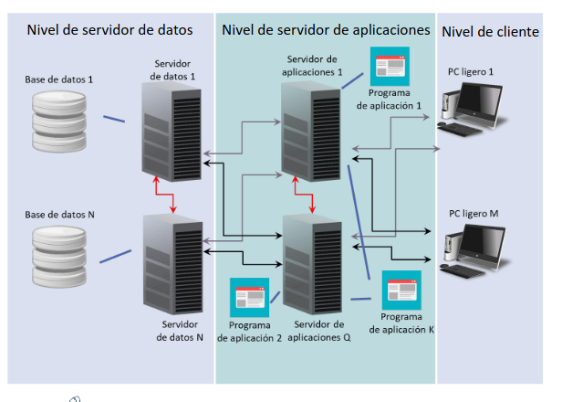

# TEMA 2.Arquitectura de un SGDB

## 2.1.Niveles generales de la aquitectura

Hay una serie de motivos por los cuales es interesante organizar el sistema gestor en niveles y son las siguientes:
    
    · Los usuarios pueden acceder a los mismos datos desde distintas perspecticas, es decir, cada usuario tendrá una visión distinta de la base de datos. De esta forma, el usuario soro verá la punta del iceberg de todo el pedrusco.
    · La organización global de los datos puede cambiarse sin afectar a los usuarios proporcionando, en ocasiones, independencia lógica. Estableciendo mecanismos de comunicación entre los distintos niveles conseguiremos esta independencia.
    · Los usuarios no tienen por qué gestionar los aspectos relaticos a la representación física de los datos. Esto quiere decir que el administrador de la base de datos puede cambiar la forma de representar los datos sin influir en los usuarios, esto se hará con mecanismos de conversión entre los niveles.

En definitiva, lo que se busca con estos niveles es que se usen mecanismos que obliguen a que se verifique la independencia de los datos.

### 2.1.1.Arquitectura ANSI/SPARC

Esta arquitectura se organiza en tres niveles bien diferenciados:

    · Nivel interno: se encuentra a más bajo nivel y es el más cercano a la infraestructura física. Básicamente contiene las estructuras de datos sobre las que se sustentan los niveles superiores.
    · Nivel Conceptual: En este nivel se encuentra la versión lógica global de los datos usando modelos de datos para representarlos (en oracle suele haber un conjunto de tablas que serán una abstracción de lo que hay por debajo , que son ficheros que se relacionan entre sí).

    · Nivel externo: es el único nivel no desarrollado por el Administrador y sí por los programadores pues serán aplicaciones que: para cada tipo de usuario, se dispone de una visión distinta. Cuando hablamos de visión, nos referimos a qué parte de la base de datos es la que puede visualizar el usuario.

Todo esto surgió a través de un precedente de dos niveles conocido como DDGT-CODASYL.

Lo que nosotros haremos será crear tablas en el nivel conceptual que se traducirán en ficheros en el nivel interno. Para proporcionar independencia usaremos las visiones pues cada usuario sólo verá los datos que debe conocer y ninguno otro.

### 2.2.2.Correspondencia entre niveles

Cuando tratemos de crear la base de datos también lo haremos por niveles de manera que una vez acabado un nivel inferior pasaremos al superior; no obstante, obviaremos este nivel ya creado pues así conseguimos que los distintos niveles no este ligados fuertemente provocando que un cambio en un nivel inferior ocasiones reprogramar niveles superiores.

Para conseguir esto, usaremos las __transformaciones entre niveles__ ,también llamadas correspondencias, que no son más que un conjunto de normas que establece cómo se definen los datos de un nivel en términos de uso.

___Conseguir la independencia física de los datos___

Para ello, deberemos establecer una transformación (comunicación en la introducción) entre los niveles _interno_ y _conceptual_ pues ya sabemos que esto tiene que ver con cómo estén los datos almacenados físicamente.

Esta transformación no es más que una tabla donde se guarda, para cada dato del nivel conceptual su posición en el almacenamiento físico de manera que caundo se cambie la posición física del elemento en cuestión, sólo necesitaremos cambiar la dirección almacenada en la tabla de correspondencia.

De esta manera, nos limitamos a expresar cómo se organizan las tablas del nivel conceptual en función de registros y ficheros en el nivel interno.

Esta transformación ya la realiza el sistema gestor de bases de datos, actualiza todo sin problema.

___Conseguir la independencia lógica de los datos___

Para ello, deberemos establecer una transformación (comunicación en la introducción) entre los niveles _conceptual_ y _externo_ pues ya sabemos que buscamos que un cambio en el esquema lógico no produzca la reporgramación de toda una aplicación.

#TODO: PReguntar por funciomaniento.

El funcionamiento consiste en describir cada visión interna en terminos del esquema conceptual global que hay en el nivel conceptual. Luego, cualquier cambio producido en dicho nivel solo deberá provocar la modificación de la tabla de correspondencia.

Cabe recalcar, que esto no es posible en algunas ocasiones pues si hago una modificación lo suficientemente sustanciosa puede ocurrir que deba reimplementar parte de la aplicación.

Por ejemplo; si en una base de datos representamos a una persona por su nombre (nombre y apellidos todo junto) y dado un tiempo necesitamos separar esto, crearíamos dos entidades más como _Apellido 1_ y _Apellido 2_. Entonces, si ya disponíamos de independencia lógica la principio, sólo deberemos añadir la regla a la tabla de corresponcencias como _nombre completo = nombre + apellido1 + apellido2_ y continuaremos teniendo dicha independencia.

Otra transformación para conseguir esta independencia es la transformación _externa-externa_ donde intentamos describir esquemas externos en términos de otros sistemas externos. 

Esta independencia puede llegar a conseguirse o no, pero en el caso positivo, deberemos saber que cualquier cambio en el esquema subyacente ocasionará un cambio en la correspondencia y no variará el esquema externo dependiente.

## 2.2.Lenguajes de una Base de Datos

Veamos primero la recomendación ANSI/SPARC.

Se nos recomienda disponer de un lenguaje específico orientado a los datos, que permita definir,controlar y manipular datos. Además, se nos recomienda usar un _DSL_(_Domain Specific Language_) que no es más que no usar un estándar de manera que distintos SGDB no puedan leer algunas instrucciones de las que usemos; cada _DSL_ está compuesto por tres partes: _DDL_(_Data Definition Language_),_DML_(Data Manipulation Language) y _DCL_(_Data Control Language_).

    · DDL: Proporciona la definición de estructuras de datos y esquemas de la BD.
    · DML: Proporciona mecanismos para la introducción de datos, modificación, eliminación y consulta de los mismos. Además, proporciona consultas a los esquemas definidos en la BD.
    · DCL: Gestiona los requisitos de acceso a los datos y otras tareas de administración de la BD.

En resumen, entre niveles encontramos las tablas de correspondencias, que contienen la ubicación de los datos en un nivel superior dentro del nivel inferior.

Por último cabe recalcar que _Oracle_ no es más que un estándar usado junto con algunas modificaciones propias de cada empresa, pero en el fondo es dicho estándar.

___Lenguajes anfitriones___

Dentro de una base de datos encontramos siempre un lenguaje anfitrión, es decir, un lenguaje sobre el cual se programan la mayor parte de las operaciones a realizar en la base de datos. 

Este lenguaje es el encargado del desarrollo de aplicaciones en el sistema operativo que trabajen sobre la base de datos. Es decir, las aplicaciones que van a interactuar con la base de datos estarán programadas en este lenguaje.

Tienen dos características importantes:

    - Casi cualquier lenguaje de propósito general nos puede servir de lenguaje anfitrión.
    - Dispone de herramientas específicas como _Developer Oracle_...

A su vez, proporciona dos aspectos bastante importantes:

    - Procesamiento avanzado de datos; un ejemplo de esto puede ser utilizar operaciones que engloben otras u operaciones que trabajen con varios datos de forma conjunta.
    - Gestion de la interfaz de usuario; es decir, son las encargadas de proveer la visión en el nivel externo de la base de datos.

Para poder trasladar de la base de datos al entorno de procesamiento de la aplicación es necesario de disponer de un mecanismo que defina correctamente las __estructuras de datos__ y las __operaciones__ con todo lo relacionado con los datos.

Para esta comunación entre el lenguaje anfitrión y la base de datos usaremos __instrucciones__ que deben __convivir__ con el lenguaje anfitrión; lo cual dependerá del __acoplamiento__, hay dos tipos:

    - Fuerte(PL/SQL): son aquellos lenguajes donde el estándar SQL está tan integrado con el resto del lenguaje que dichas sentencias de acceso a la base de datos no llegan a distinguirse.

    - Débil(API's): son aquellos lenguajes que para hacer uso del estándar SQL necesitan de algun plug-in, biblioteca o algo del estilo, provocando que dichas sentencias de acceso se diferencien al completo del lenguaje anfitrión. 

Podemos ya denotar que el acoplamento __débil__ proporciona una solución de menos peso y trabaja con menos movimiento de datos haciendo siempre alusión a bibliotecas que puede que, ni siquiera, estén cargadas en la máquina que use nuestra base de datos.

Como ejemplo más elaborado del __acoplamiento débil__, vamos a desarrollar el uso de _DSL inmerso_ en el código fuente del lenguaje anfitrión.

En este caso, el programador escribe un código híbrido mezclando sentencias de ambos lenguajes. Tras esto, un preprocesador es el encargado de traducir el cógido fuente del lenguaje anfitrión a __llamadas API__ de acceso a la base de datos.

Una vez que el código se ha vuelto un poco más homogéneo se _compila_ y _enlaza_ con la biblioteca de acceso a la base de datos.

## 2.3.Descripción de los niveles

Pese a que en el temario se dedica un apartado a cada nivel, sólo se comenta lo que hay descrito en el apartado del esquema ANSI/SPARC; no obstante, hablaremos un poco de cada nivel profundizando un poco más en el nivel __interno__.

Con respecto al nivel __externo__, debemos notar que es la parte de la BD relevante para los usuarios o aplicaciones que harán las consultas. 

Cada usuario, sólo recibirá una visión de lo estrictamente necesario de la base de datos pues el resto de información que no le sea de interés no tendrá ninguna utilidad que no sea vulnerar la seguridad de los datos. 

Es solo en este nivel donde se muestran los datos __derivados__ de otros y donde se trabaja con el lenguaje anfitrión.

Centrándonos ahora en el nivel __conceptual__, proporciona una estructura global e integrada de todos los datos desde el punto de vista lógico. Para ello, suele usarse un modelo de datos lógico, que en nuestro caso, será el modelo de datos relacional. 

En este nivel se encuentra el grosso de lo que conocemos como contenedores, relaciones, atributos... Es en este nivel donde se trabajan las operaciones sobre la base de datos.

Además, contiene las restricciones de los datos asicomo su información semántica, de seguridad y de integridad(dominios).

Pasamos ahora al nivel __interno__, que es la representación física de la BD en el computador, es decir, cómo se almacenan en la memoria física. 

Es el encargado de buscar el rendimiento óptimo del sistema representando las estructuras de datos, las organizaciones con ficheros, las comunicaciones con el _SO_ para gestionar la memoria de la forma más eficiente para ganar velocidad en las consultas.

Este nivel tiene la peculiaridad de que parte de las responsabilidades son delegadas en el _SO_ teniendo dos niveles:

    - El nivel físico que es realmente el que se delega en el sistema operativo.
    - La organzación del nivel interno, es decir, lo que se hace a nivel hardware, puede usarse hashing... Con esto nos referimos a qué estructura de dato sse utiliza para localizar los datos, es decir, la correspondencia entre el nivel físico y conceptual.

#TODO: Preguntar por cada subparte

## 2.4.Administrador de la Base de Datos

Este personaje se puede entender, dentro de la base de datos, como el creador de todo, es decir, "Dios en minúsculas".

Con este símil ha debido quedar claro que el _DBA_(_Data Base Administrator_) es una figura primordial en los _SGBD's_.

Pese a que en las transparencias aparecen muchas funcionalidades, hoy en día dichas funcionalidades están repartidas en varios grupos asique las funciones que realmente hace el _DBA_ son las de vital importancia:

    - Decide la estructura de almacenamiento en el nivel interno proporcionando el esquema interno y la correspondencia entre el nivel conceptual y el interno; elementos sin los cuales la BD no podría funcionar de forma correcta.

    - Define e implanta la política de seguridad que vaya a usarse, es decir, la gestión de usuarios o gestión de acceso y la gestión de privilegios(quien entra a que).

    - Proporciona técnicas de optimización del rendimiento como liberar el espacion no utilizado, reorganizar las operaciones para que sean más veloces, determinar la necesidad de nuevos recursos hardware y establecer las prioridades en el uso de los recursos.

    - Monitorizar el SGBD realizando un seguimiento continuo de la actividad del sistema auditando, en caso de que sea necesario, el acceso de los usuarios a los diversos recursos de la BD; comprobando los niveles de uso de los sistemas de almacenamiento y evaluando la eficiencia con que se realizan las operaciones.

Hagamos una parada para hablar un poco de las __auditorías__, este concepto consiste en, en cada acceso, en cada operación, en cada utilización de la base de datos guardar un registro de cada uno de los pasos que el usuario ha realizado en su consulta. Esta práxis puede ser perjudicial en algunos casos ya que requiere un gran uso de la memoria, pero también muy útil en otros previendo que pueda haber un mal uso de la base de datos.

Por ejemplo, en los datos fiscales de una persona no es deseable que haya manipulaciones de los mismo o usurpaciones de identidades.

Veamos ahora las demás funciones que son asociadas, en la actualidad (antes las hacía el _DBA_), a distintos grupos dentro de una empresa:
    
    - Elaboración del esquema conceptual realizando análisis de las necesidades de la empresa, identificando los datos operativos, elaborando el esquema lógico e implantando el esquema conceptual.
    - Gestionar la conexión con los usuarios mediante análisis de requerimientos, diseño lógico y codificaciones dle esquema externo mediante las correspondencias entre el nivel _externo_ y _conceptual_.

    - Definir las restricciones de integridad mediante el establecimeinto de reglas e incluyendo dicha integridad en el esquema conceptual.

    - Definir e implantar la estrategia de recuperación frente a fallos que suelen utilizar las facilidades proporcionadas por los SO's y SGDB's(redundancia, arrays de redundancias...). Además, se deben realizar copias de seguridad e implementar políticas de gestión de transacciones.

En resumen, este apartado está para recalcar la importancia de la figura del _DBA_ en el mundo de las Base de Datos, dando mucha importancia a que es una figura muy cotizada y muy valorada.

## 2.5.Tipos de aequitecturas de implantación

Hay una gran diferencia entre un __Sistema de Bases de Datos__ y un _SGDB_ pues el primero de ellos es un sistema que contien un sistema de información, puede ser perfectamente un conjunto de tablas que relacionen elemento o entidades del mundo real. 

La diferencia es que el _SGBD_ esta incluido en el _SBD_ pues será el encargado de manipular esos datos y proporcionar cada uno de los niveles explicados en este tema.

En un princio¡pio, se usaba un __esquema centralizado__ de los datos que consistía en una supermáquina que contenía la base de datos y el _SGDB_ al que se conectaban los dispositivos. De esta forma, toda la carga de gestión y procesamiento de información recaía en servidores centrales de gran tamaño y poca velocidad con mucha probabilidad a embotellamientos. 

Viendo los problemas que esto causaba se busco implementar algo basado en el esquema __cliente-servidor__; no obstante, esto también presentaba serios problemas llegando así a tener una _BD_ __distribuida__ y programas de aplicación en arquitectura de tres capas:
    
    - Nivel de servidor de datos: contiene las bases de datos necesarias y los servidores de datos donde se encuentra el SGDB organizando la información de la empresa como una BD global y se realiza la traducción(transparente) de las peticiones de datos en peticiones en las sedes donde se encuentran estos datos.

    - Nivel de servidor de aplicaciones: contiene los sevidores de aplicaciones y los programas de aplicación que se ejecutarán visualmente en el nivel siguiente. Son los encargados pro trabajar con protocolos de red asicomo con los estándares... Es lo más comparable con el nivel conceptual.

    - Nivel de cliente: son computadoras ligeras dotadas de configuraciones basadas en estándares abierto. En muchos casos, se pueden ejecutar las aplicaciones desplegadas en un navegador web con soporte de ejecución avanzado. 

Esquema de la BD _cliente-servidor_:

 

Esquema de la una BD _distribuida_:

 

Como ventajas proporciona:
    
    - Reducción significativa del mantenimietno de los clientes.
    - Mayor facilidad y flexibilidad para el usuario.

Como inconvenientes:
    
    - Mayor complejidad en configuración y administración de servidores junto al desarrollo de las aplicaciones conforme a este modelo distribuido.
