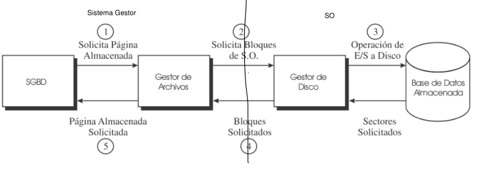
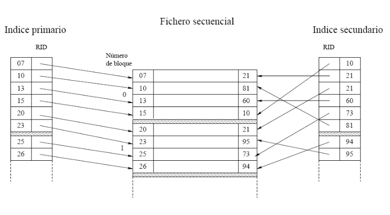

# 4.Nivel interno
---
## Índice
1. [Introducción](#Intro)
2. [Métodos de acceso a la base de datos](#MABD)
3. [Representación de la base de datos a nivel interno](#Repre)
4. [Organización y métodos de acceso](#Org)
5. [Métodos de acceso directo](#MAD)

---

## 4.1.Introducción

Nosotros hasta ahora hemos visto que una Base de Datos sirve para almacenar datos con un motivo concreto como motivo princial: la __consulta__ de la información que hemos almacenado.

Este hecho ocasiona una serie de consecuencias tanto en la organización lógica de los datos como en la organización física.

En este tema estudiaremos el __nivel interno__ teniendo en cuenta las siguientes características:

- Cuando realizamos una operación de forma lógica, esto se traduce a una seríe de operaciones a más bajo nivel dodne los operando son una serie de registros almacenados, realmente en la memoria del dispositivo,  en un sistema de almacenamiento externo.
- Provee al administrador de mecanismos para optimizar el almacenamiento y el acceso a los datos.
- Este nivel se encuentra implementado en el _SGBD_ salvo aquella parte que pertenece al nivel físico que es cedida al sistema operativo.

Hablando un poco más del nivel físico, destacamos las siguientes características.
- Se encuentra implementado en el __Sistema Operativo__ con llamadas al sistema y utilizando accesos a memoria que deberán minimizarse.
- Es el encargado de proporcionar al _SGBD_ una capa de abstracción sobre el hardware; de manera que, el _SGBD_ no percibe l acceso a los datos como una operación en memoria.
- Realiza el acceso a los medios de almacenamiento mediante llamadas a los servicios del sistema de archivos proporcionado por el _SO_; esto es lo que llamamos _llamadas al sistema_ referentes a la manipulación de memoria.

### Jerarquía de memoria

Tomaremos los siguientes criterios:
- Leyendo los nombres en orden decreciente de índice conseguimos:
    + Aumentar el coste.
    + Disminuir la cantidad de memoria de este tipo usada en los sistemas.
    + Disminuir el tiempo dedicado a acceder a un elemento de este tipo de memoria.
- Leyendo lso nombres en orden creciente de índice conseguimos:
    + Disminuir el coste.
    + Aumentar la cantidad de memoria de este tipo usada en los sistemas.
    + Aumentar el tiempo dedicada a acceder a un elemento de este tipo de memoria.

El orden es el siguiente:

1. Registros del dispositivo.
2. Memorias caché.
3. Memoria principal.
4. Memorias Flash.
5. Discos Magnéticos.
6. Cintas o Discos ópticos.

Como utilidad a explicar esta jerarquía, cabe destacar que los trs últimos niveles son los usados para almacenar la base de datos; pues al necesitar una gran cantidad de espacio que no sea volátil requerimos, por ejemplo _discos duros_.

Los tres primeros niveles son utilizados para minimizar los accesos a memoria externa que producen un gran retardo, es decir, la parte de la base de datos que está siendo usada en estos intantes es trasladada a la memoria principal con el fin de agilizar las operaciones.

### Memoria principal

Hablando un poco más sobre la memoria principal de un dispositivo es el dispositivo de almacenamiento primario de los ordenadores.

Como funcionalidad principal relacionada con las bases de datos dispone de hacer trabajos de caché de la porcion de la _BD_ de uso más reciente. Realizar trabajos de caché simplemente consiste en ser el elemento intermedio entre el almacenamiento secundario y las cachés: realmente, consiste en ubicar de forma temporal los datos afectados por las operaciones realizadas.

Para usar la memoria principal, el nivel interno del _SGBD_ debe oprimizar su uso pues, pese a ser rápida ya que acelera el procesamiento, es bastante cara. Además, como ya se ha comentado mucho, es volátil, entonces pierde su información una vez que deja de recibir señal eléctrica. 

Como resumen, el objetivo principal de la memoria principal en una _BD_ es reducir al máximo los accesos a memoria secundaria o externa.

### Discos Duros

Todos conocemos lo que es un __disco duro__, pero no todos conocemos que es el más usado para almacenar _BD_. Está formado por una serie de discos magnéticos donde cada cara se divide en pistas concéntircas para conseguir dividir cada pista concéntrica en sectores que representarán la unicada mínima de almacenamiento en el sistema, los __bloques__.

Al conjunto de pistas concéntricas del mismo radio en todas las caras se le suele llamar _cilindo_.

En cada acceso a disco se pierde un tiempo, que ocasiona una pérdida de rendimiento si el acceso es muy frecuente.

Dicho tiempo se conoce con el nombre de __tiempo de acceso__ que es el tiempo medio transcurrido entre una isntraucción y la obtención de la información pedida. Este tiempo se divide en la suma de:
    
- __Tiempo medio de búsqueda__, es el tiempo que tarda el brazo del disco duro en posicionarse en la pista.
- __Tiempo de latencia rotacional__, es el tiempo medio que tarda el brazo del disco duro en posicionarse en el sector una vez posicionado en la pista.

En ocasiones, el acceso podrá ser erróneo añadiendo a este tiempo el __tiempo medio de fallo__.

## 4.2.Método de acceso a la _BD_

Los _SGBD_ montan una forma para hacer el trabajo con los dispositivos de almacenamiento, cada uno su forma, luego no está generalizada; no obstante, tomaremos una idea general.

Como idea general, se usan los siguientes elementos:
- Archivo almacenado: es un registro donde se encuentran una serie de páginas de archivo.
- Páginas del archivo almacenado: son una agrupación de registros que representan bloques del sistema operativo.
- Bloques del _SO_: son los que se corresponden con los bloques del dispositivo de almacenmaiento; estos pueden estar formados por distintos criterios:
    
    + Tomar las tuplas de la misma tabla juntas, de esta manera todo está muy organizado, como si fueran tablas, muy intuitivo pero que en ocasiones no será lo más eficiente.
    + Agrupando según las operaciones más frecuentes, con esto nos referimos a que los datos se almacenen de manera que al aplicar una operación el trabajo computacional sea menor; esto será útil cuando dicha operación es la operación más repetida de la base de datos.

___Anotación___

En el primer bloque del sistema operativo suelen guardarse los datos iniciales como:
- Dirección a la primera paginal libre.
- Direccion a la primera pñagina de cada entidad o relacion.

Además, para controlar que no nos pasemos de tamaño ocupado existe un __factor de bloqueo__ que simplemente almacena la cantidad de registros que pueden ser almacenados en cada bloque para evitar desperdiciar paseos a disco.

_Fin anotación_

Las técnicas de correspondencia entre los bloques de _SO_ y los bloques de almacenamiento pueden ser desde paginación, hasta técnicas mucho más avanzadas.

Todo el acceso está dividido en dos partes:
1. Realizada por el _SGBD_:
    - El _SGBD_ se encarga de solicicitar al __Gestor de archivos__ una página almacenada con cualquier fin de consulta o modificación.
    - El gestor de Archivos se comunica a través del gestor de Disco con la siguiente parte. Una vez recibe respuesta de esta parte, le pasa al _SGBD_ l apágina qu eha solicitado.
2. Realizada por el _SO_:
    - El Gestor de Disco recibe una petición reenviada por le Gestor de Archivos implementando al comunicación con el _SGBD_. 
    - El Gestor de archivos se encarga de traducir la petición de bloque que ha recibido a una operación de E/S a Disco para la _BD_.
    - La _BD_ devuelve los sectores de disco que se han pedido y están almacenados.
    - El Gestor de Disco recibe los bloques y los pasa al Gestor de Achivos que los enviará al _SGBD_.

Se puede ver claramente, que es un 'toma y daca' entre el _SGBD_ y el _SO_ donde, en este último, es el Gestor de Disco quien se pelea con el hardware para recibir lo que se busca.

Todo esto puede resultar un lío pues, cómo sabe el gestor de almacenamiento cual es el bloque de disco asociado a un registro. Esto se consigue con una referencia del registro que es el __RID__; este elemento contiene un puntero a la página donde se encuentra el registro solicitado y un _offset_ que representa la posición dentro de la página del registro que se ha pedido.

### Requisitos de los accesos

A la hora de hacer un acceos debemos tener en cuenta una serie de información:
- Cada registro almacenado dispone de:
    + Una cabecera qu eindica el número y tipo de columnas que lo integran.
    + La información que contiene en las columnas.
- Las páginas o bloques de la _BD_ deben tener un tamaño múltiplo de los bloques del _SO_ que será la mínima unidad de E/S.
- Para recuperar un registro almacenado hay que determinar la página de la _BD_ que lo contiene, es decir, recuperar los bloques de disco que la integran.
- Hay que organizar la estructura de almacenamiento y lso métodos de acceso, de forma que se optimice la interacción con los dispositivos de almacenamiento secundario.
- Siempre hay que pensar en qu elas operaciones de E/S al almacenamiento secundario deben ser las mínimas.

### 4.2.1.Gestor de Disco del SO

Este elemento dentro de la comunicación entre el _SGBD_ y la _BD_ es el encargado de realizar presicsamente el puente entre estas dos estructuras de gran importancia:

- Organiza los datos en arvchivos, que realemtne son conjutnos de bloques, de _SO_.
- NO necesariamente debe haber un único Gestor de Disco por base de datos.
- Es el encargado de gestionar el espacio libre.
- Traduce la petición de bloques del _SO_ en operaciones de E/S.

Además de estas funcionalidaes tiene las funcionalidades básicas de un elemento de este tipo dentro de un _Sistema de Archivos_(_filesystem_).

### 4.2.2.Gestor de Archivos del _SGBD_

Es un componente del _SGBD_ que se encarga de:

- Realizar la comunicación con el _SO_ sobre los bloques que se quieren pedir, es decir, traduce la página solicirtada en el bloque del _SO_ pedido.
- [Organiza los datos](#organizacion) de manera que s eminimice el tiempo de recuperación, es decir, minimizar las E/S.

Como funciones básicas implementa:

- Creación de archivos almacenados asociándoles un conjunto de páginas o bloques de la _BD_.
- Eliminar archiivos almacenados.
- Recuperar registros almacenosdos de un archivo almacenado; para ello, el _sGBD_ propiciona el _RID_ del registro de manera que solo hay que obtener en memoria la página que contiene el registro para extraerlo.
- Añadir un nuevo registro almacenado a un archivo almacenado. Para ello hay que localizar la página de la _BD_ más apropiada de las pertenecientes al archivo almacenado. En caso de qu eno se pudiera, se solicita una nueva página y se devuelve al _SGBD_ el _RID_ nuevo.
- Eliminar un registro de un archivo almacenado; donde es necesario recuperar la página de la _BD_ que contiene ducho registro y marcar el espacio ocupado por el registro en dicha página ocmo disponibel.
- Actualizar un registro en un archivo almacenado; para ello, se debe recuperar la página de la _BD_ que contiene le registro que se desea actualizar. A continuación, se intenta sustituir la información y si no se puede intenta ubicar el contenido en otra página.

## 4.3.Representación de la _BD_ a nivel interno

Realmente, la _BD_ se representa de diferentes formas dependiendo del nive de la arquitectura del _SGBD_ en el que nos encontremos:

En el __nivel interno__ que es el que nos concierne, no tiene por qué conicidir esta representación con la del _nivel conceptual_; de hecho, cada conjunto de registros no tiene por qué ser un fichero.

Todo esto se consigue gracias a la correspondencia de la que hablábamos en el tema de la _arquitectura ANSI/SPARC_, es decir, el nivel interno debe traducir las estructuras del nivel conceptual a otras estructuras intermedias más cercanas al almacenamiento real de los datos, es decir, el __nivel físico__.

Hay dos formas de agrupar los archivos, pues ya sabemos que la _BD_ a nivel interno se entiende como un conjunto de páginas en las que se van ubicando los registro:

- __Intra-Archivo__: consiste en agrupar en una misma página los registros del mismo tipo, es decir, los conjuntos de tuplas de la misma relación. Es el método más usado.

- __Inter-Archivo__: consiste en agrupar en una página registros de distinto tipo, es decir, registros que no están en la misma relación con el objetivo de fomentar la velocidad de operaciones específicas que serán las que más se usen en la _BD_. Para poder implementarlo, las tuplas guardadas deben tener una relación _fuerte-débil_.

> La organización descrita es un ejemplo general. Cada _SGBD_ comercial usa su variante concreta, aunque la idea subyacente es la misma.

> No existe relación directa _fichero-almacenado/fichero-físico_, ya que todos los conjuntos de páginas irán almacenados, con toda probabilidad, en uno o varios ficheros físicos.

## 4.4.Organización y métodos de acceso

Nuestro objetivo será minimizar el número de accesos a disco, es decir, minimizar la cantidad de páginas de _BD_ involucradas en una operacion de _BD_.

Antes de empezar debemos aclarar ciertas cosas:
- Ninguno de los métodos que se describirán a continuación es considerado como el mejor de todos pues todos tendrán ventajas e inconvenientes.
- Mediremos la calidad de la organización siguiendo los siguientes criterios:
    + Tiempo de acceso  a los datos requeridos.
    + Porcentaje de memoria ocupada por los datos requeridos con respecto a las páginas de la _BD_ que contienen.
- Trabajaremos a dos niveles:
    + Organización de los registros de datos a nivel de almancenamiento.
    + Adición de estructuras complementarias para acelerar el acceso a dichos registros.
    + En definitiva: "¿Qué acelero?" y "¿Necesito algo adicional para poder acelerar y merece la pena?".

### 4.4.1.Organización secuencial

Este tipo de organización consiste en utilizar un fichero como un array donde en cada posición guardamos un registro; el amacenaje de los registros se realiza de forma secuencial.

Puede implementarse de dos formas:
- Sin ordenación; donde la búsqueda es _O(n)_, es decir, obligartoriamente debo recorrer todo el fichero para buscar algún registro.
- Con ordenación por alguno de sus campos(clave física), permitiendo que si encontramos un valor de la clave de ordenación superior al buscado podemos parar.

Ya hemos visto la búsqueda de un registro, veamos ahora la __inserción__. Para ello debemos seguir los siguientes pasos:
1. Buscar el bloque que le corresponde.
    - Si hay sistio, se inserta.
    - Si no hay sitio; o se crea un nuevo bloque o se crea un bloque de desbordamiento.

Si deseamos __borrar__ un bloque, a parte de necesitar buscar el bloque en cuestión deberemos realizar una reorganización local de los registros del bloque.

Pese a que parece una mala forma de organizar los registros, se presta muy bien a soluciones sencillas y de fácil uso. Alguna de ellas nos permitirán:
- Acelerar la localización de los datos.
- Disminuir el número de bloques de disco tranferidos.

Dichas soluciones son:
- Indexación.
- Acceso directo.

### 4.4.2. Indexación.

Con esta técnica seremos capaces de reducir el tiempo de acceos a los datos buscando por una clave de búsqueda.

___Ficheros indexados___

Partiremos de un fichero secuencial sobrel el que disponemos de una estructura adicional que llamamos _fichero índice_. Este fichero contiene una lista de dónde se encuentran los registros en el fichero secuencial usando dos campos:
- Campo __clave__(¿Quién?).
- Campo de __referencia__(¿Dónde?): es un puntero que apunta a la posición del fichero donde se encuentra la _clave_.

Como ventaja de estos ficheros encontramos que son más pequeños que los _ficheros secuenciales_ pero contiene tantos registros como haya en el _fichero secuencial_.

Podremos tener tantos _ficheros indexados_ como índices deseemos tener donde tendremos de dos tipos:
- Primario: donde la clave de búsqueda es el mismo campo por el que está ordenado el dichero secuencial de datos, es decir, la clave física. Sólo habrá uno.
- Secundarios: son construidos sobre los otros campos que no sean la clave física del _fichero secuencial_. De estos, habrá tantos como se deseen.

Para __consultar__, lo haremos mediante el fichero indexado pues en un paseo a disco nos traeremos más claves donde mirar. No obstante, el proceso es el mismo que con los _ficheros secuenciales_ solo que sobre un fichero de índices.

Con respecto a la __inserción__ y el __borrado__, la idea es similar a la operación en el fichero secuencial, auqneu determinados procesos de búsqueda se ayudan en el índice. El único inconveniente es que, cada inserción y borrado implicarán modificaciones en el fichero de índices.

Por último recalcar que los índices no tienen por qué estar hechos sobre un solo campo sino que pueden albergar varios considerando la concatenación de los mismos.

Por ejemplo, si consideramos el índice (p1||p2) donde || es la concatenación, será útil para búsquedas por valores de:
- p1 solo.
- p1||p2

Pero no lo será para búsquedas por valor de p2.

___Índices no densos___

Viendo que disponer de un fichero con tantas entradas como registros haya en el fichero secuencial no nos produce una gran ventaja, se desarrolla el concepto de __índice no denso__.

La idea es la misma solo que, cada índice apuntará al registro inicial de cada bloque, es decir, consiste en implementar un índice de bloque.

Cabe aclarar que, para que haya una ventaj, es necesario que el fichero secuencial se mmantenga ordenado.

Con esta solución eliminamos el problema del aumento de memoria ocupada.

Presenta algunas diferencias:
- En la búsqueda, una vez encontrado el bloque debemos realizar una búsqueda secuencial sobrel el bloque para buscar el registro.
- No disponemos de garantía alguna de encontrar el registro deseado hasta consultar el bloque de datos leído.

Como ventaja, la manutención de estos índices es menos costosa.

___Índices jerárquicos___

Se basan en la misma idea que los índices no densos. Es decir, en construir índices queengloben la información de otro fichero. En este caso, construiremos índices sobre los índices acotando así la búsqueda cada ves que disminuimos un nivel.

Como dato importante, debemos determinar el tamaño de los bloques de manera que se optimicen cada una de las operaciones de acceso a disco físico.

Como desventaja frente a las muchas ya comentadas, se complica demasiado la manutención de los ficheros de índices.

Una curiosidad que contradice al hecho de que siempre los índices deben ser primarios es que, si el índice de primer nivel se corresponde con el índice primario no tien por qué ser denso.

[ij](./imagenes/ij.png)

___Índices de clave invertida___

La idea será permutar, de alguna manera, el orden de los bytes de una clave que nos sirva para identificar un registro. En ocasiones, las permutaciones se realizan sobre otra unidad de memoria.

Como ventajas:
    - Puede interesar en alguna operación frecuente que dos valores de clave consecutivos no estén realmente consecutivos.

Un ejemplo de esta utilidad es cuando se espera acceder a dos elementos consecutivos por índice, se hace esto para agilizar el problema pues puede coincidir que tengamos que tomar dos bloques distintos sin necesitar alguno de ellos.

___Índices de mapa de bits o BITMAP___

La idea es montar para cada valor de un atributo un mapeo de las tuplas donde aparece dicho valor, es decir, si en la tupla _i-ésima_ se toma dicho valor, el bit de dicha posición aparecerá a 1.

Está claro que esto es útil cuando el valor se repite mucho y poco útil si el valor es único, luego no se usará con claves primarias.

### 4.4.3.Árboles B+

Son una generalización de los árboles binarios balanceados en la que los nodos pueden tener más de dos hijos; para cada nodo suele definirse un orden máximo que será el número máximo de hijos que tendrá un nodo.

Como idea importante, cabe recalcar que, en un árbol de este estilo, los nodos hoja se encuentran todos en el mismo nivel. Además, las claves de cada nodo están dentro de un rango entre la clave del padre y la clave del hermano de la derecha del padre.

Asociándonos más a la gestión y al almacenamiento de la _BD_, en los nodos hoja se guardarán las parejas \{clave-RID\} donde se encuentra el puntero asociado al bloque de disco que queremos buscar. 

Unido a esto, se suele buscar que el orden de cada nodo sea un múltiplo del tamaño de bloque de datos.

Como ventajas se presentan:
    - La búsqueda por intervalos es muy sencilla concatenando los nodos hoja pues se consigue una lista secuencial de todos los bloques de disco.
    - La búsqueda de un bloque en específico también es bastante rápida acotando el rango de búsqueda en cada decisión en profundidad del árbol.
    - En el caso particular de cómo se implementan en bases de datos, la recuperación de los nodos es mucho más sencialla, pues gracias a que permanecen entrelazados los nodos hoja, podemos implementar recuperación por búsqueda secuencial.

Como desventaja:
- La inserción y el borrado debe garantizar que el árbol permanezca equilibrado, luego deberán usarse algoritmos para ello que consumirán tiempo.

___Caso particular___

Los árboles _B_ o _bin-tree_ funcionan de manera similar sin tener la obligación almacenar todos los valores de la clave en los nodos hoja, sino que algunos valores se van almacenando en lso nodos intermedios conforme se crea el árbol.

#### Tablas Organizadas por Índice(IOT)

En ocasiones, puede interesar almacenar directamente el valor de las tuplas en los nodos hoja. Esto se suele hacer usando __tablas organizadas por índice__ que estarán organizadas por una clave, normalmente la primaria. Aun así se pueden definir nuevos bajo nuevos índices.

### Comparación bintree y bitmap

| B-tree | Bitmap |
| :----- | :----- |
| - Columnas que tomen muchos valores | - Columnas que tomen pocos valores |
| - No cuesta mucho actualizar | - Cuesta mucho actualizar |
| Ineficiente para consultas con _OR_ | - Eficiente para consultas con _OR_ |

## 4.5. Métodos de acceso directo

El objetivo de este punto es conseguir encontrar una forma de acceder a la base de datos sustituyendo los índices por un algoritmo que sea capaz de decirnos dónde se encuentra tal registro.

Como condición inicial impondremos que el campo por el cual se haga la búsqueda sea unívoco. Además, una vez aplicado el algoritmo, el orden de los registros no será el que se tuvo en un inicio, esta medida perjudicará las consultas por intervalos.

Como principal problema, las colisiones; esto surge cuando dos registros obtienen el mismo valor de clave por el cual serán accedidos. Este problema tendrá fácil solución que será costosa en memoria; los __desbordamientos__, consiste en usar una estructura donde se almacenarán todos aquellos registros menos uno de los que han producido la colisión. La aplicación de los _desbordamientos_ se tratará de retrasar todo lo posible.

Realmente hay una granvariedad de algoritmos de __hashing__, alguno son:
- Dependientes del tipo de clave:
    * Si el alfanumérica, deberemos tranformarla en números antes de determinar su _hash_.
- Suelen estar basados en un mecanimso de generación de números _pseudoaleatorios_:
    * Cuadrados centrales: consiste en elevar al cuadrado el número y tomar una subsecuencia de números centrales del resultado.
    * Congruencias: siendo el más usado consiste en utilizar la aplicación _módulo M_ donde _M_ es un número cualquiera que suele ser primo(es una convención y no cambia la enficiencia) 
    * Desplazamiento: consiste en superponer los dígitos binarios de la clave y luego sumarlos.
    * Conversion de base: consiste en cambiar la base de numeración y suprimir algunos de los dígitos resultantes.

Otro de los problemas que deberemos solucionar son los __huecos__, son partes de la memoria que quedan libres tras aplicar la transformación o el algoritmo; en ocasiones se producen porque el algoritmo no las contempla o porque no se dan claves para que den esas direcciones de memoria.

### 4.5.1.Hashing básico

Consiste en utilizar cubos como posible imágenes del algoritmo, de manera que, cuando se crea un acolisión ambos elementos pueden tomar el valor que les corresponde. Esot solo retrasa la aparición del desbordamiento; además, con un mal estudio del mismo puede que surjan huecos.

Una de las cosas mas importantes a tener en cuenta de este algoritmo es que se debe tener en cuenta la distribución de la clave según rangos para evitar que unos cubos se llenen demasiado y otros queden casi vacíos.

___Algoritmo de inserción___

Dispone de los siguientes pasos:
1. Transformar la clave.
2. Localizar el cubo correspondiente:
    * Si hay sisito se inserta y hemos terminado.
    * Si no hay sistio se sitúa le registro en un cubo de desbordamiento conectándolo con el cubo que realmente le corresponde mediante punteros.

___Algoritmo de borrado___

Dispone de los siguientes pasos:
1. Transformar la clave.
2. Localizar el cubo correspondiente.
3. Realizar la búsqueda secuencial dentro del cubo:
    * Si hemos encontrado el registro, el proceso termina.
    * En caso contrario, se barren todos los cubos de desbordamiento asociados a esa clave en búsqueda secuencial hasta encontrar el registro buscado.

### 4.5.2.Hashing dinámico

Surge como idea de solución al problema del hashing básico que consiste en que es necesario conocer la distribución de los datos para poder estudiar la distribución de la cantidad de cubos.

La solución consiste en iniciar el proceso de _hashing_ con una configuración uniforme de pocos cubos de manrea que, sólo de los cubos que lo vayan necesitando, se realizará una expansión de los mismos.

Todo se basará en utilizar una tabla de redirección dinámica, es decir, cuando se toma un valor y su clave hash, esta clave dirigirá a una tabla que a su vez redirigirá a un cubo donde se encuentra el registro.

___Algoritmo de Hashing Dinámico___

Antes de nada definimos dos conceptos:
- Profundidad global: será el número de bits que definen cuántas entradas tiene una tabla de redireccionamiento.
- Profundidad local: será el número de bits que definen el número de registros almacenable po rcada cubeta, suele ser múltiplo del tamaño del bloque de memoria.

Como datos de partida tenemos:
- $k$, clave para direccionar.
- $k'=h(k)$, será el resultado de aplicar la función hash.
- $n$, número de bits que tiene $k'$ en binario.
- $d \leq n$, los $d$ primero (o últimos) dígitos de $k'$ serán los qu eseleccionan el cubo al que irá el registro con la clave $k$. Se llama _pseudollave_ y representa la profundidad __global__ de la tabla.
- $b< d \leq n$, inicialmente hay $2^b$ cubos y como máximo habrá $2^d$.

Los pasos son los siguientes:
1. Se considera una tabla índice en memoria con $2^d$ filas.
    * Primera columna: todos los posibles valores que pueda tomar $d$.
    * Segunda columna: puntero al cubo de capacidad $2^b$ donde $b$ es la profundidad local.
2. En un inicio, todas las entradas cuyos $b$ primeros(o últimos o los que sean) dígitos son iguales apuntan al mismo cubo.
    * Aquí se almacenan los registros cuyo valor de $k'$ tiene esos $b$ primero dígitos.
3. Si se llena un cubo:
    * Se divide en dos, poniendo en uno de ellos los registros con el dígito $b+1$ a 0 y en otro los que lo tienen igual a 1. Eso aumenta la profundidad local que no podrá superar la profundidad global de la tabla, en caso de que se llene al completo y no se puda aumentar la profundidad local se comenzará con los cubes de desbordamiento.

El hasihng dinámico soluciona algunos problemas pero causa otros:
- Usar una tabla índice adicional aumenta la memoria necesaria, además esta puede ir aumentando necesitando de algoritmos que la modifiquen.
