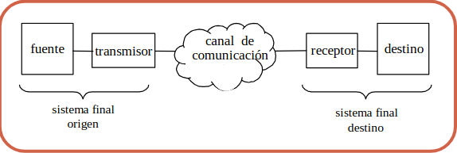
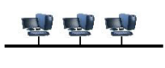
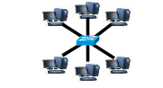
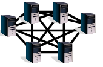
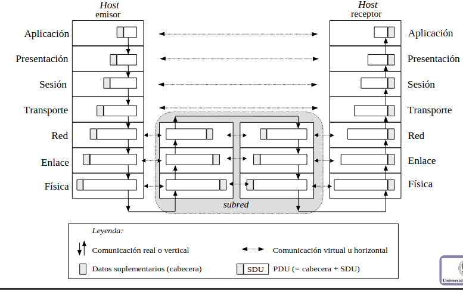
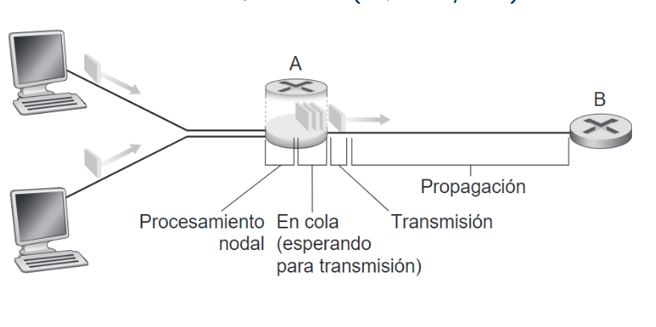

# Tema 1.Introducción a los fundamentos de redes

## 1.1.Sistemas de comunicación y redes

Un **sistema de comunicación** es una infraestructura sftware y hardware que permite el intercambio de información y tiene la siguiente estructura:

Donde la fuente es el punto de emisión de información, el transmisor modela la señal para que sea compatible con el canal de comunicación siguiendo el modelo que tenga la red implementado, el receptor y el destino haría un trabajo análogo a la fuente y el transmisor. 

Dentro del canal de comunicación encontramos una estructura de red que no es más que un sistema de comunicación con sistemas finales autónomos (capaz de procesar información) que facilita el intercambio _eficaz_ y _transparente_ de información.

Pero...¿qué razones tenemos para usar las redes? Algunas de ellas son la compartición de recursos, la escalabilidad, la fiabilidad y robusted que nos da seguridad de que los datos van a llegar o nos evita de estar incomunicados frente a desastres naturales o humanos y el ahorro de costes al usar computación distribuida (AC).

Como objetivos al tener una red, buscamos que presente una cierta __autonomía__ (capacidad para procesar información), una gran capacidad para __interconectar__ puntos mediante un sistema de comunicacióny la capacidad de __intercambiar__ información con eficacia y transparencia.

Una red clásica se basa en dos partes, el __hosts__ compuesto por todos los equipos finales o destinos, que a la vez también son fuentes, y una __subred__ que consta de toda la infraestructura útil para el tranporte de información como pueden ser _lineas de transmision_ y _nodos o elementos de conmutación_; esta última parte se corresponde con el transmisor, el canal y el receptor.

Centrandonos un poco más en los __medios de transmisión__ haremos un barrido de cuál ha sido el medio de transporte de datos. En un principio, se usaban _cables de pares_, disponían de un ancho de banda (cantidad de información transmitida en un instante de tiempo) de 4KHz debido a que se usaba para redes telefónica. Con forme avanzó la tecnología se comenzó a usar el _cable coaxial_ llevando más tarde a la utilización de _cables de par trenzado_ donde surgieron los tipos _UTP_,_STP_,_FTP_ y se desarrollo l aestrategia del _ADSL_. A día de hoy, se usa un medio lumínico a diferencia de los eléctricos que son más lentos, este medio e sla _fibra óptica_; es un medio muy utilizado debido a que no sufre interferencias y permite que varias señales circulen a la vez por el mismo canal pues si no tienen el mismo ángulo de aceptación no sufrirán interferencias.

Los sistemas de redes suelen estructurarse según distintas __topologías__, es decir, siguen un patrón diferente entre sus nodos, encontramos la física y la lógica:
    
    · En bus: Todos los dispositivos están conectados al mismo bus luego todos ven toda la información causando problemas de privacidad; además, el congestionamiento de la red es muy común asicomo la pérdida de información por interferencias. Es la más barata y sencilla.

    · En anillo: Cada dispositivo se coneca a dos más de manera que, para mandarle la información a ellos, se hará de forma inmediata. Si se busca mandar información a un tercero, se deben usar los demás dispositivos como routers de manera que seguirá habiendo congestión. 

    · En estrella: Todos los dispositivos se conectan a un router o switch central de manera que toda la información pasa por él. No obstante, cada conexión entre dispositivos distintos es directa pues el switch tiene una boca por dispositivo impidiendo que dos dispositivos envíen información a la misma boca. Es fácil de escalar y de manejar.

    · En árbol: Los dispositivos se dividen en niveles de manera que cada nivel del árbol representa un nivel de la realidad; de esta manera, dispositivos superiores reciben la información de inferiores y la redirigen a su destino. Es útil en la dirección de empresas.

    · Mallada: consiste en que un dispositivo esté conectado a varios de ellos dando lugar a que haya varios caminos para el mismo detino proporcionando mayor seguridad. 

    · Híbrida: Consiste en identificar los puntos fuertes de cada lugar donde se pone la red y utilizar una topología u otra según dichos puntos fuertes obteniendo la mejor red posible.

La redes se __clasifican__ de varias formas(En comprobación):

    · Según el tamaño y la extensión. PAN (carácter personal, engloba bluetooth, móvil,  ordenado...), LAN (Local) , MAN(Metropolitana como en una ciudad) y WAN (World como en un país o continente).

    · según la tecnología de tranmisión; puede usarse Difusión (todos mandan y todos reciben todo lo que pasa por la red) o Punto a Punto (la comunicación es entre dos dispositivos solamente).

    · Según el tipo de transferencia de datos. Simple (solo manda o solo recibe), Half-duplex (hace ambas cosas pero no de forma simultánea) o Full-duplex (permite recibir y mandar de forma simultánea).

## 1.2.Diseño y estandarización de redes

Cuando nosotros diseñamos una red, buscamos solucionar los problemas por capas luego seguiremos un __Modelo de referencia__ de los cuales existen muchos como _OSI_ o _TCP/IP_, nosotros nos centraremos en este último.

Donde los dos niveles más bajos están implementados en hardware.

Debemos saber que el hecho de que esté dividido en capas debe usarse para implementar funcionalidades distinta en capas distintas asicomo para minimizar el flujo de información entre capas.

Con respecto a cada capa, veamos algunos problemas que presentan:

    - A nivel físico, debemos ver como se comparten los datos, es decir, no siempre el bit será 5V. Debemos saber la codificación de canal; normalmente, se suele añadir redundancia ayudando a mejorar la seguridad.
  
    - A nivel de enlace, se encarga de cómo manejarse con el medio, es decir, si leo, si escucho, si limpio el medio,etc. Un ejemplo es de dos capas LLC(se encarga de comprobar que los paquetes están bien y MAC (buscarlo).
  
    - A nivel de red, ya soy capaz de transmitir cosas que no tienen error; el objetivo es poder llegar al extremo; para ello, debemos saber el direccionamiento (saber a quien mando) y el encaminamiento (si tengo varias formas de ir, debemos saber por donde ir y si es más rapido mejor).
  
    - A nivel de transporte, aqui nos encargamos de la fiabilidad, es decir, si hay congestión(acumulación de paquetes en la llegada de paquetes) se arregla, control de flujo (cómo de rapido voy); además, se encarga de la multiplexación de datos (en la entrada llegan paquetes con diversos servicios, luego debemos saber a qué aplicación mando los datos). A su vez, es la encargada de garantizar que todo llega bien asicomo que la entrega de los mensajes es ordenada.
 
    - A nivel de aplicación, es lo que quiero hacer visual pero hay que saber cómo los usuarios se van a comunicar entre ellos, es decir, las notificaciones, los mensajes entre ellos, la interfaz...

## 1.3.Terminología, conceptos y servicios

Durante el desarrollo de este punto, se han hablado del concepto de modelo de referencia, sobre el cual vamos a hacer una aclaración. Es algo abstracto que todo ingeniero informático desea implementar en la realidad, el que mas nos interesa es el modelo OSI; no obstante, es el modelo TCP/IP el que nos provee de una implementación. 

Tal y como se ve en la imagen anterior, el modelo OSI separa la Aplicación en Sesión, Presentación y Aplicación mientras que TCP/IP junta la capa de Enlace y Física en la capa de red subyacente, es decir, el HW.

Hagamos ahora una descripción de cada capa siguiendo el modelo OSI:

    - La capa de enlace solo se encarga del encaminamiento salto a salto, es decri, de la primera conexion
  
    - La capa de red(IP), va tmb salto a salto pero ya engloba todos los caminos entre todos los dispositivos (routers y usuarios). Cuando el paquete llega al router mira la tabla de direccionamiento y sigue al siguiente router hasta llegar al destino.
  
    - Las demas capas solo se centran en los dispositivos de partida y de llegada, la capa de transporte y la aplicación estan solo en los diapositivcos externos, lo demas esta en todos, incluso los intermedios.

___Vida útil de un dato___

Como se puede ver en esta imagen, cada dato está compuesto por la información relevante (dato) y por una cabecera; para realizar una comunicación de un dato que se lanza a través de la aplicación de un dispositivo es necesario que baje a la capa física. 
Esto ocurre con cada dato a transmitir, ya se haga con una comunicación vertical (tambíen llamada real) que consiste en la transmisión de datos entre dispositivos con aplicación; o con una comunicación horizontal, que consiste en que se transmitan datos entre distintos dispositivos pero entre los mismos niveles (Transporte-Transpote, Aplicación-Aplicación, Red-Red).

Cada vez que un dato pasa de un nivel a otro mas pequeño toma por parte de información el dato completo y le añade la cabecera aumentando así el tamaño del dato. Una vez que este ha llegado a la capa física, se manda a través de la red como un dato encapsulado (el proceso descrito se llama _encapsulamiento_).

Una vez que el dato ha llegado al siguiente nodo (router o dispositivo), se realiza el proceso contrario hasta comprobar que el dato es correcto. Una vez aquí, si el dato __no__ ha terminado su recorrido, se calcula la dirección a donde tiene que ser mandado con la tabla de direccionamiento y se repite de nuevo el mismo proceso ya descrito.

Hablando más internamente, los datos que pasan de un nivel a otro mas inferior se llaman _SDU_ y una vez que reciben la cabecera _PDU_. Diremos que dos entidades son __pares__ si son entidades iguales de la misma capa en nodos distintos.

*Definición*(vulgar):
Un __protocolo__ es la forma en la que hablan dos entidades pares, es decir, la forma en la que se mandan paquetes, mensajes, información sobre el traspaso...

Una __interfaz__ consiste en establecer cómo interactúan dos capas adyacentes en un mismo dispositivo, habrá _SAPs_ (puntos de acceso a servicio, elementos que tiene una capa para pedirle información a una capa inferior).

Una __arquitectura de red__ consta de todos los elementos de los que dispongo para establecer la estructura de la red.

___Retardos___

Cuando transmitimos un dato, se tarda un tiempo para poner los bits en el medio de transmisión (depende de la velocidad de la tarjeta de red) que llamaremos __tiempo de transmision__ que es $T_t=L/Vt$ donde L es el tamaño de paquete. 
Además, cuando ya he mandado el paquete este tarda un poco de tiempo en que llegue al sitio destino, este tiempo es llamado __tiempo de propagación__ es $\`T_p=d/V_t\`$, es decir, es proporcional a la distancia; esto último no deja de depender del medio en el cual se manda. 
Siguendo con lo comentado hasta ahora, cuando llega, tenemos que procesar el paquete (el nodo intermedio) y buscar a dónde se manda; de hecho, ese equipo intermedio tiene colas, donde se almacenan los paquetes a procesar luego tendrá que esperar a que se terminen de mandar los que llegaron antes,  llamémoslo __tiempo en cola__ y __tiempo de procesamiento__ que no será fijo. 
Despues de eso se mandarán por un interfaz.

___Tipos de servicios___

Hay varios tipos de servicios, los cuales se implementan en una capa según el modelo de referencia elegido; en el caso de TCP/IP se encuentra en el nivel de transporte y hay dos noveles de clasificacion:

    · Orientado a conexión o no, es decir, comprobamos si se puede llegar al destino o no; de esta manera, el orientado no mandará paquetes si el receptor no tiene conciencia de ello.

    · Confirmado o no confirmado. En el caso del primero, se garantiza que todos los bits que se envíen lleguen en buen estado y que todo funcione bien, pues en caso de que algo falle se rompería la conexión. El primero de ellos es conocido como fiable pues gestiona el control de conexión(), el control de errores (transmite los datos y el error que haya en ellos), el control de congestión (se refiere a la red, significa que las colas de lor routers están llenas, luego si entran muchos paquetes y salen pocos comienza el descarte de los mismos desbordando las colas; el origen debería mandar menos datos), el control de flujos(el equipo destino no escapaz de tener memoria libre para recibir información) y la entrega ordenada(en caso de mandar muchos paquetes, todos llegarían en orden inverso al que se manda). Como ejemplo de servicio fiable tenemos TCP, como no fiable está UDP.

## 1.4.Direccionamiento 

Los operadores en internet se organizan en jerarquías (tiers); el Tier 3 son los más cercanos a los usuarios y este es el último. Los de nivel 1 o Tier 1 son los que componen la estructura troncal de internet y deben estar entre dos continentes. 

Hay dos relaciones entre Tiers, relaciones de transito (entre operadores y niveles superiores) y de Peering (entre los de la misma capa). Tier 2 es de interfaz entre los otros dos y son más regionales.

El nivel de direccionamiento se divide en varias capas que para _ethernet_ se dividen en : (se usan direcciones MAC que son de la forma AA:BB:CC:DD...)
    
    - LLC
    - MAC
