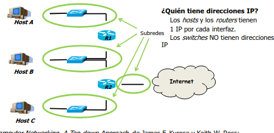

# TEMA 2. Capa de red

Haciendo un recordatorio sobre lo que ya hemos visto sabemos que si hay dos ordenadores con dos routers conectados por una red, si deseamos mandar un paquete, es necesario que este paquete atraviese las capase de forma vertical hasta la capa física para enviarse al siguiente dispositivo y repetir.

En este tema, nos centraremos en estudiar como un paquete cualquiera viaja de la __capa de Red__ a la __capa de Enlace__ dentro de un __mismo dispositivo__(en Ethernet, al resultado se llama dirección _MAC_). 

Para realizar este cometido necesitamos un __protocolo__ que me diga, dada una dirección _IP_, cuál es su dirección _MAC_ asociada.

## 2.1.Funcionalidades

Según el protocolo TCP/IP:
    
- Proporcionar el encaminamiento.
- Determinar cómo va a producirse la conmutación.
- Da pinceladas sobre los mecanismos de interconexión de redes.
- Siguiendo la abstracción OSI, debería proporcionar control de congestión

Un ejemplo de protocolo de red es _IP_.

## 2.2.Conmutación

Hablando un poco de historia, el término de __conmutación__ surgió cuando empezó la red de telecomunicaciones en las llamadas _centrales de comunicación_; lugares donde, para establecer una conexión debían cambiarse cables de sitio para dar paso a unas llamadas u otras consiguiendo retardos.

Esto era así pues cada individuo disponía de un cable de interconexión con una de las centrales de conmutación, cada usuario disponía de un único cable para él eliminando interferencias. No obstante, había muchos más usuarios que cables dentro de una central de conmutación, de ahí el intercambio de cables.

Una vez se conmutaban los cables y se producía la conexión por llamada, se decía que se había establecido un _camino_ que pasaría a llamarse __circuito__ más adelante.

Esto presentaba un problema claro, cuando un usuario no usaba su línea telefónica, nadie la usaba quedando inutilizada grandes períodos de tiempo; por tanto, era un método poco eficiente, poco escalable y poco fiable pues ante una guerra podría quedarse inutilizada de un ataque.

Una vez dicho esto, pasemos a hablar formalmente; a día de hoy, la __conmutación__ es la acción de establecer o determinar un camino que permita transmitir información extremo a extremo. De esto, derivan los esquemas de conmutación, formados por los __circuitos__ y los __paquetes__, ya sea por datagramas o circuitos virtuales.

### 2.2.1.Tipos de conmutación

Aunque ya hemos hablado de la conmutación de circuitos en la zona de historia, vamos a tratar la conmutación de paquetes, ya sea por datagrama o por circuito virtual.

La __conmutación de paquetes__ consiste en mandar datos, es decir, ceros y unos. En este caso, los elementos de conexión utilizados no son _centrales de conmutación_ sino que son _routers_ que usan colas para percibir y seguir el orden de llegada del paquete; además, de esta forma no se pierden bloques de datos o __paquetes__ (conjunto de datos que se manda a través de la red).
    
Hablemos ahora de la conmutación de paquetes por __datagrama__ partiendo de que uno de estos no es mas que un concepto proveniente de correos, consiste en que cuando el cartero recibe el paquete, este hará lo posible en que el paquete llegue a su destino; no obstante, si no lo consigue, no mandará mensaje de ello. Por tanto, el usuario solo sabrá que su paquete se ha enviado y nada más de él. Esta estrategia sigue el nombre de "_mayor esfuerzo_". Por ejemplo es seguida por el protocolo _IP_.

Normalmente, cada una de las capas recibe un nombre distinto para los paquetes divididos de la siguiente forma:
    
- Enlace -> trapa
- Red -> datagrama
- Transporte -> En TCP "segmento" - En UDP "datagrama"
- Aplicación -> mensaje

Como según la estrategia del _mayor esfuerzo_ no necesito saber si el paquete ha llegado, ni siquiera necesito comprobar si se ha realizado la conexión con el destino. Además, cada paquete es independiente de los demás luego, al realizar el _encaminamiento_ __paquete a paquete__ dos paquetes consecutivos pueden no tener el mismo camino y, de hecho, no llegar en el orden de lanzamiento.

Como si fuera poco, si quiero conocer el paradero del paquete, es necesario que esta funcionalidad la implemente otra capa superior.

En ocasiones, cuando el paquete es excesivamente grande, es necesario __fragmentar__ y gracias a que los paquetes se tratan de formas independientes, la división puede no realizarse en el origen y sí en un router. Añadido a esto, cada fragmento es independiente y el router desconoce qué fragmento de qué paquete que ha procesado o no es. Eso sí, una vez llega al destino, se produce sí o sí el ensamblado y sólo en este momento.

Como curiosidad, los paquetes tienen un dato origen que no es útil durante el encaminamiento y direccionamiento, su utilidad reside en la posibiidad de mandar respuestas. Por último, como el medio de transmisión es compartido, habrá una competición por el mismo a la hora de que los paquetes circulen dando paso a la necesidad de crear un mecanismo que resuelva estas colisiones.

Pasando al otro tipo de conmutación, es decir, la realizada con __circuitos virtuales__. En este caso, consiste en reservar los recursos que se van a usar durante el trayecto del paquete estableciendo así el camino del mismo. Esto puede conllevar la reserva de colas de un router permitiendo que la comunicación sea más rápida.

Aunque los recursos no son dedicados, virtualmente ocurre algo distinto pues la idea es establecer el camino del paquete durante su traspaso. Cabe recalcar que se llama virtual porque se realiza en el momento de forma dinámica; en este caso, todos los fragmentos del paquete siguen el mismo camino.

En ambos casos, todo lo que tiene que ver con recuperacion de paquetes se hace en la capa de transporte (OSI). 

## 2.3.Protocolo IP

Este protocolo no dispone de muchas funcionalidades:
    
- Asignar direcciones IP y gestionarlas.
- Dirigir el encaminamiento salto a salto asegurando que se llega a los extremos.
- Proporcionar mecanismos de fragmentación de paquetes devido al MTU(máximo tamano de paquete ne la red).

Al se un protocolo de mayor esfuerzo, los paquetes se mandan y se trata que lleguen a su destino pero si esto último no ocurre, no se provee de ningún mecanismo de recuperación; no osbtante, el protocolo sí manda un mensaje de error a través del protocolo _ICMP_.

Antes de meternos de lleno en las versiones, vemos a definir algunos términos como:

- Handshake: hace referencia a un intercambio de mensajes concreto entre dos entidades.
- Protocolo: hace referencia a cómo dos entidades de la misma capa se transmiten información.
- Router: se puede entender como un ordenador que dispone de una cantidad de tarjetas de red donde cada una de ellas dispone de una dirección _IP_. Estas direcciones _IP_ simplemente son interfaces de redes a las que se conecta. Además, se encarga de dividir redes e interconectarlas entre sí, luego cada "pata" del router es una red distinta; en ocasiones dispondrá de redes inalámbricas.

### 2.3.1.IPv4

Es una versión del protocolo _IP_ que está especificada en el _RFC 791_ y permite conectar redes, subredes y superredes.

En el encaminamiento, cada equipo dispone de una terjeta de red proporcionando una dirección _IP_ distinta; es vía datagrama perdiendo mucha de su fiabilidad pues no comprueba que lleguen los paquetes. Es importante aclarar que, pese a que nosotros nos referimos a los lugares destino con los nombres de dominio (_youtube_, _twitter_,...) a lo que realmente le mandamos la información es a la tarjeta de red que dispone de la dirección _IP_ asociada a la red por la que nos comunicamos. De hecho, el domino está asociado a varias direcciones _IP_ dependiendo del servidor del dominio que esté más cerca.

Debido a esto último, no requiere que se establezca conexión evitando incluso el 'handshaking' entre origne y destino. 

Una vez el paquete pasa a la capa de Red y obtiene su cabecera (PDU) lo llamamos datagrama; no obstante, permite la fragmentación y al paquete fragmentado es a lo que realmente llamaremos paquete en el ámbito de este protocolo de interconexión de redes.

___Direccionamiento___

Con respecto al direccionamiento del modelo, cada dirección dispone de __32 bits__ separados en __4 bytes__ por puntos, es decir, es de formato __A.B.C.D__ donde cada letra es un byte. 

Siempre se interpretarán de la misma forma, una cantidad de bits de la izquierda representarán la red y el restante representará el dispositivo que está conectado a la red. 

Para ello usamos las __máscaras__ que suelen estar formadas por el mismo número de bits que la dirección _IP_ y no son más que una cantidad, _n_, de bits a 1 seguidos de ceros hasta completar el tamaño. De esta manera, aplicando la función lógica _AND_ entre la dirección _IP_ y la máscara se obtiene la red a la que se conecta el dispositivo.

Por ejemplo:

- 192.168.1.5 -(bin)--> 11000000.10101000.00000001.00000101
- Mascara = /24 -(dec)--> 255.255.255.0 --> 11111111.11111111.11111111.000000000
- Aplicamos la AND lógica, luego me quedo con los 24 bits iniciales de la izquierda.
- Resultado(red a la que me conecto): 11000000.10101000.00000001.00000000 --(dec)->192.168.1.0=dir.real

La dirección que hemos obtenido en el ejemplo es importante, pues sólo la red dispone de esa dirección haciéndola única ya que no se asigna ningún equipo y es útil para encaminamiento. De la misma manera, la dirección 192.168.1.255 esta reservada como dirección de difusión, es decir, cualquier equipo la vería. Esto es útil para saber la localización de un servidor, pues la reacción del servidor ante un paquete delatará su posición.

Volviendo al tema del direccionamiento y habiendo entendido ya las máscaras, vamos a ver los distintos rangos en los que se clasifican las $2^{32}$ direcciones de las que disponemos:

Se dividen en clases:
    
- Clase A: disponen de cabecera 0xxxxxxx.\_\_\_x con rango [0.0.0.0/8 - 127.255.255.255/8]. Donde la máscara son 8 bits dando lugar a que haya $2^{7}$ redes con $2^{24}$ equipos por red.
- Clase B: disponen de la cabecera 10xxxxxx.\_\_\_x con rango [128.0.0.0/16 - 191.255.255.255/16]. Donde la máscara son 16 bits dando lugar a que haya $2^{14}$ redes con $2^{16}$ equipos cada una.

- Clase C: disponen de la cabecera 110xxxxx.\_\_\_x con rango [192.0.0.0/24 - 223.255.255.255/24]. Donde la máscara son 24 bits dando lugar a $2^{21}$ redes con $2^{8}$ equipos por red.

- Clase D: Aunque estas redes no estaban en el origen son las que disponen de la cabecera 1110xxxx.\_\_\_x con rango [224.0.0.0 - 239.255.255.255]. Esta clase suele usarse para mutidifusión y no dispone de una máscara pues no se usan para redes IP; cada dirección identifica un grupo de equipos, que son ciertos grupos de redes, un ejemplo el IGMP. Suele usarse para la televisión por suscripción como Movistar+. Luego para que le suministrador mande un paquete a todos los equipos primero iral al router de multidifución.

- Clase E: Estas serían las que quedan, es decir, disponen de una cabera 11110xxx.\_\_\_x con rango [240.0.0.0 - 255.255.255.255]. Tampoco disponen de máscara y es una red experimental, es decir, se usa para probar proyectos; a efectos prácticos, no se utiliza.

En conclusión, para crear redes y asignarlas a equipos se usan sólo las tres primeras clases.

Hasta ahora hemos estado hablando de direcciones _públicas_ que, como hemos podido denotar, se asignan públicamente... pero qué ocurre con las direcciones _privadas_. Solo se encuentran en intranets por lo que, en distintas intranets (redes de dominio privado) sí que se pueden repetir. En este último caso, es el usuario quien la asigna.

Siguiendo con las direcciones _IP_ públicas podemos distinguir una dirección importante asociada al _local loop_, es decir, la dirección que representa a mi propia máquina; por tanto, si busco conectarme al _localhost_ obtendre la conexión al servidor de mi propia máquina. 

Antiguamente, esta dirección era única y era _127.0.0.1_; sin embargo, hoy en día es cualquier dirección de la forma _127.x.x.x_. Esta dirección e propia de cada equipo.

___Direccionamiento sin clase___

Este tipo de direccionamiento consiste en solucionar el problema del desperdicio de direcciones _IP_ por parte de la clasificación en clases, ya que al ser públicas son únicas en todo el mundo. 

COnsiste en utilizar una máscara diferente de las habituales dando lugar a que haya menor número de equipos por cada red pudiendo así utilizar un entorno de redes _IP_ más reducido. 

Cabe denotar que, aunque la máscara no sea múltiplo de 8, se sigue usando la sintáxis de separación en bytes. Simplemente, cambia la manipulación de los rangos respentando, eso sí, que la primera direeción es la de red y la última es la de difusión.

Por ejemplo, si disponemos de 50 dispositivos de uso propio:
    
- 50 dispositivos --> 6 bits para su representación.
- 32-6 = 26 bits para la red.
- Luego tendremos 26 bits de máscara.
- Suponiendo que empecemos a trabajar en la dirección 192.0.1.64(dirección de red), acabaremos en la dirección de difusión 192.0.1.127.

Luego claramente, hemos desperdiciado un menor número de direcciones _IP_ publicas.

COmo hemos partido una red de clase C(en realidad da igual la clase), hemos conseguido lo que se conoce como __subred__; de forma análoga, juntando redes de otros tipos conseguimos las llamadas __superredes__, esto último se consgue quitandole un bit a la máscara duplicando el número de equipos.

Realicemos un ejemplo:

Supongamos que tenemos un número de euqipos y tenemos que asignar la mejor red:
    
- Equipos:700
- Número de dirección de dispositivos: 702=equipos+direción de red+dirección de difusión
- Bits necesarios: 10
- 32-10=22 bits de máscara
- Rango= [192.168.0.0/22-192.168.3.255]

___Direccionamiento privado___

Como primera solución a la falta de direcciones públicas se ha comentado el _direccionamiento sin clase_ como primera solución; no obtante, vamos a dar otra solución más útil, el direccionamiento __privado__.

Este direccionamiento consiste en utilizar un rango de direcciones concebido como __privado__ y que sólo podrá usarse en intrarredes, es decir, dentro de una empresa y sin comunicación con el exterior. 

Esto es así porque se permitirá la repetición de estas direcciones _IP_ __privadas__ en redes __privadas__ distintas. Hay distintos rangos para cada clase:

- Clase A: [10.x.y.z-final]
- Clase B: [172.16\_\_\_31.y.z-final]
- Clase C: [192.168.y.z-final]

Estas redes no tienen conexión con la red pública de forma directa y usan la máscara que convenga en cada momento.

___NAT___

Si desde una red privada se quiere mandar algo a una red pública es necesario disponer de algún mecanismo de traducción de redes que pase de una red pública a un privada y viceversa; este protocolo es conocido como _NAT_.

Supongamos que disponemos de un PC(192.168.1.2) concectado a un router(192.168.1.1-33.33.33.33) de nuestra casa conectado con un seridor(66.66.66.66) y mandamos un paquete que seguira el camino de ida y vuelta hasta el servidor. Dicho camino se divide en cuatro pasos:

1. PC-router: Una petición http esta formada por una cabecra http y por datos. La cabecera dispone de:
    - Dirección IP origen(source): 192.168.1.2 + 1075 (puerto origen o sport)
    - DIrección IP destino(destination): 66.66.66.66 + 80 (puerto destino o dport)

    Normalmente, cuando uso un cliente, el sistema operativo asocia un número de puerto por encima de 1024 para cualquier proceso http.
2. Router-dispositivo: Se modifica el paquete ligeramente con las mismas partes:
    - IPs: 33.33.33.33 + 12345. El puerto cambia para que el dispositivo de destino sepa a donde devolver, necesariamente, la dirección debe ser pública.
    - IPd: 66.66.66.66 + 80 que no cambia pues marca al servidor.

3. Dispositivo-router: El servidor no conoce que se está haciendo NAT.      
    - IPs: 66.66.66.66 + 80
    - IPd: 33.33.33.33 + 12345
    
4. Router-PC: Se deshace la traducción pasando la información a la red privada:    
    - Ips: 66.66.66.66 + 80
    - IPd: 192.168.1.2 + 1075

Si nos fijamos en el cambio del paso 1 al paso 2, el puerto origenha cambiado, esto se hace para poder distinguir la red pues solo conocemos la red por la máscara pero no el dispositivo al que mandamos la información. Además, la comunicación en la red pública, necesariamente debe ser mediante direcciones _IP_ públicas.

Por ahora, desconocemos como se hace el cambio de dirección pública a privada. Esto se realiza mediante una tabla y hay varios procedimientos; si cambio el origen y vuelvo a este se llama _SNAP_ o _SNAPT_(cambiamos también el puerto).

Para realizar esta traducción, el router dispone de una tabla que esta construida de la siguiente manera:

- Cada entrada se divide en dos columnas: IPs + sport - IPs' + sport' donde se guarda, para cada dirección privada cuál es su dirección pública más cercana.

Este proceso se llama __enmascaramiento__ pues el dispositivo que esta fuera desconoce lo que hay en la red privada.

Veamos alguno de los problemas de este protocolo; se ve claramente que un atacante prodría mandar un paquete a un router con conexión privada simplemente buscando uno que disponga de protocolo _SNAT_; de esta manera, sabiendo la información de traducción, se prodría introducir un paquete.

COmo solucion a este problema, podemos poner la dirección de destino y el puerto de destino en una columna más de la tabla de enmascaramiento, debido a que estas dos informaciones son las que determinan un flujo de paquetes; esto provoca que la dirección _IP_ del atacante y la original no sea la misma no permitiendo el paso de paquetes al interior con otra dirección _IP_ de origen.

Uno de los protocolos se llama _NAT_ __estricto__ y otro comprueba qué IP's le ablan a través de la red pública.

___DNAT(Destination NAT)___

El caso típico es disponer de un PC que actua como servidor en la red privada donde hay disponible un router que conecta con internet y dentro de internet un equipo que actua como cliente.

Siguiendo los mismos pasos:
        
1. Cliente-router: Paquete con cabecera IP y cabecera TCP (si es TCP) y sus datos:
    - IPs: 66.66.66.66 + 1050 (*SO)
    - IPd: 33.33.33.33 + 23456 suponiendo que el servidor usa el puerto 80
2. Router-server: Cambios en la cabecera
    - IPs: 66.66.66.66 + 1050
    - IPd: Servidor privada 192.168.1.2 + 80

Hemos traducido a un puerto de destino distinto pero en el inicio ha cambiado la dirección de destino como como la dirección pública del router más cercano.

3. Vuelta de camino.      
    - IPs: 192.168.1.2 + 80
    - IPd: 66.66.66.66 + 1050
4. Llegando al cliente
    - IPs: 33.33.33.33 + 23456
    - IPd: 66.66.66.66 + 1050

La tabla de enmascaramiento es completamente la misma, con distinta información pero con los mismos campos.

Realmente, el problema surge de cómo decirle al router a qué servidor va el paquete pues eso no está en el propio paquete. Para solucionarlo, debemos fijar la tabla a mano en el router. _SNAT_ permite generar la tabla automáticamente, de ahí que suela venir por defecto.

___Encaminamiento___

Se divide en tres partes, prerouting, routing y postrouting. Básicamente consiste en, dado un paquete mandado y que llega a un router, ver cómo pasarlo a otro destino cercano.

Este proceso se basa en las llamadas __tablas de encaminamiento__; estas tablas se encuentran en todos los dispositivos que aparrecen en una nube de redes de conexión.

Estas tablas estan compuestas de varias entradas donde cada una de ellas tiene varios campos (columnas). Los estudiaremos según su importancia.

Los más importantes son tres:
    
- Red de destino: es la encargada de determinar el destino de un paquete de manera que, si quiero mandar a ese destino elegiré la regla de la tabla de encaminamiento que disponga de esa red.Este campo dispone de un valor comodín conocido como dirección "default" que representa cualquier dirección de cualquier red; suele usarse para determinar que un paquete necesita salir de una subred, irá acompañada del router más cercano como pasarela.
- Máscara: es necesaria para conocer la red del dispositivo pues, en ocasiones, la red de destino puede llegar a ser una dirección IP concreta.
- Siguiente salto o pasarela: hace referencia a la dirección del siguiente dispositivo de conexión por el que debe pasar el paquete para llegar a su destino. Para este valor hay valores por defecto como "\*" que representa que la red de destino está directamente conectada al dispositivo.

Otros campos son:
    
- Interfaz: es simplemente la tarjeta gáfica dle dispositivo.
- Protocolo: representa el protocolo de envío y recepción de mensajes que sigue la red  (tcp).
- Coste: dependiendo del protocolo será un valor u otro (en RIP es el número de routers a cruzar).

A su vez, cada __entrada__ o __regla__ de una tabla de encaminamiento está clasificada en tres tipos:

1. Rutas directas. Suponiendo que nos encontramso en una red cualquiera, por ejemplo en forma de arbol inverso como el laboratorio, estas entradas son aquellas que simbolizan las reglas que no necesitan de una pasarela para que el paquete llegue a su destino; dicho de forma directa, las direcciones que se encuentran dentro de la misma subred. En el caso del laboratorio, serán los ordenadores que se encuentren en la misma red 33.X.Y.0 donde X es la isla e Y es el grupo. 

2. Redes indirectas. Son las reglas que simbolizan aquellas redes, y sólo redes, a las que sabemos llegar haciendo uso del siguiete salto. Estas redes engloban todas excepto las directas y la de salida a Internet pues siempre, en este caso, usaremos el siguiente salto para mandar el paquete.
    
3. Ruta de acceso a internet. También llamada con más rigor ruta por defecto que dispone de máscara /0 y cuyo siguiente salto será la dirección ip_operador; de esta manera, si no se sabe a donde ir pues no se cumple ninguna regla, se utilizará esta última. Esta ruta por defecto tiene el nombre default.

Las __rutas directas__ tienen la importancia de permitir que los paquetes lleguen a los dispositivos pues al eliminar alguna de ellas, impediríamos que cualquier paquete pueda entrar al dispositivo desde esa red pues se desconocería el router necesario para ello. También aparecen e este tipo la red host, es decir, la dirección _IP_ 127.0.0.1/32.

Supongamos ahora una casuística muy común, en la tabla de encaminamiento de un router aparecen tres entradas con red destino para las cuales se hace cierta la comprobación de la dirección de un paquete; es decir, al realizar la operacion _AND_ de la dirección _IP_ destino del paquete con la máscara de la regla, siempre ocasiona un averificación. 

En estos casos, siempre se tomará la regla que disponga de un __número de máscara mayor__, es decir, que acote en mayor número el número de dispositivos a direccionar. De esta manera, se impulsa la velocidad de transmisión en la red.

Por último, vamos a ver las formas en las que se puede **rellenar** una tabla, es decir, imponer las reglas de puente(**forward**). Hay dos formas:
    
- Estática: el programador introduce a mano cada uno de los tres tipos de reglas en los dispositivos que sean necesarios implementando la conexión entre los mismos.
- Dinámica: un protocolo se encarga de realizar dicha conexión; permite que la red pueda cambiar a lo largo de su funcionamiento.

De esta forma, con la forma __estática__ estamos suponiendo que nunca cambiará la conexión entre dispositivos, lo cual es un error muy grave.

___Protocolos  de intercambio de información de encaminamiento___

Erróneamente también llamados "protocolos de encaminamiento", no son los encargados de encaminar los paquetes, simplementes fuerzan a los dispositivos de conexión de red a realizar un pequeño intercambio de información para poder realizar las *tablas de encaminamiento* de forma automática.

Antes de estudiarlos, es necesario conocer la organización de _Internet_ partiendo de que no es un sistema centralizado sino que se compone de varios __Sistemas Autónomos__ que son redes gigantescas gestionadas por una única entidad; dentro de cada uno de estos sistemas es la entidad líder la encargada de gestionarlo. 

No obstante, entre dichos _sistemas autónomos_ deben ponerse de acuerdo con el __Sistema de Pasarela Exterior__(EGP). En este caso, los _EGP_'s utilizan el protocolo _BGP_ que permitn realizar cambios de prioridades a ciertas entidades.

Conociendo un poco el interior de los _Sistemas Autónomos_ de forma general, utilizan __protocolos de pasarela interior__(IGP), los cuales pueden usar en su interior varios protocolos de los cuales estudiaremos dos:
    
1. RIP(Routing Information Protocole). También conocido como "protocolo de vector distancia" debido a que toma como criterio de camino a elegir aquel que requiera un menor número de saltos. Entrando más en detalle, es un protocolo que opera sobre UDP puerto 250 en la capa de aplicación. SU método de construcción de caminos es mandar paquetes cada 30 segundos a los demás dispositivos para repartir su información. 

2. OSPF.También conocido como "Camino más corto antes", es un protocolo que dispone de un mecanismo de elección de camino basado en coste diferente tomando una constante de proporcionalidad. En la prática se implementa mediante el algoritmo de Dijsktra.

El protocolo **RIP** sufre del *problema de la convergencia lenta* donde no sabe responder frente a la caída de un router, sobretodo el problema se agranda cuando el caído es el primero de todos pues no se corregirá el número de saltos de aquellos dispositivos que no estén directamente conectados con el router dañado. Como dato, no se guarda un salto mayor a 16 considerando que este valor ya es un valor infinito.

Sin embargo, dispone de una solución denominada *poison reverse* donde si no se sabe llegar al destino se responde con un paquete diciendo que el salto es infinito provocando que los routers no sepan encaminar.

Con respecto al protocolo **OSPF** sabemos que la constante de proporcionalidad usual viene dada por la siguiete ecuación:

$$ Coste= \frac{1}{ancho de banda}$$

___Fragmentación___

Recordemos un poco la definición de __datagrama__; es un paquete _IP_ que duspone de una cabecera y un conjunto de datos; dentro de la cabecera, contiene 5 líneas de 32 bits (20Bytes) obligatorias. Hay situaciones poco comunes donde se añade una nueva línea aumentando el tamaño del datagrama. 

En la cabecera aparecen una serie de campos, de los cuales los más importantes son:
    
+ Versión(V)
+ Tamaño de la cabecera(LC)
+ TS: es el campo encargado de marcar los datagramas para que, una vez lleguen al destino se sepa que se debe hacer una operación con ellos; en caso de que no se haga nada el campo pasa a tomar un valor correcto de forma automática.
+ Longitud total del datagrama
+ Identificador para conocer, en caso de fragmentación, qué paquetes son de qué datagrama y poder recomponerlo.
+ Desplazamiento(offset)
+ TTL: es el número de saltos máximo que puede dar un paquete en la red para evitar paquetes navegando en la red de forma indefinida. En cada salto, este campo se reduce en una unidad, si llega a cero, el paquete se descarta.
+ Protocolo: contiene un identificar de algún protocolo que se usa en ese datagrama; normalmente, estos protocolos están contenidos en el protocolo IP.
+ COmprobación: es un campo donde aparece el complemento a 1 del datagrama de manera que al llegar al destino se realizará la suma, luego si el resultado es todo a 1 el paqeute será correcto; en otro caso, se descarta.(El protocolo IP lo descarta pero no produce ningún mensaje de aviso a nivel de red, esto lo suele hacer ICMP si está implementado).
+ Dirección IP origen del datagrama, es decir, quién lo manda.
+ Dirección IP destino del datagrama, es decir, a quién se manda.
+ Opciones.
+ Relleno; este campo esta compuesto de tantos ceros como sea necesario para que el paquete tenga un tamaño múltiplo de 32.

Después de tener lista la cabecera, que en ocasiones no tendrá campos rellenos pues será una petición y el destino los rellenará antes de contestar, podemos acoplar los datos que queremos mandar.

En ocasiones, al mandar un datagrama por una red, este supera el tamaño máximo de información que puede soportar la red (__MTU__, dependiente de la tarjeta de red de los dispositivos conectados), luego debemos fragmentarlo para poder mandar dicha información. Cabe recalcar, que una vez fragmentado, cada uno de los fragmentos, llamados __paquetes__, son independientes entre sí. 

Esto es de fácil entendimiento pues no todos los paquetes deberán seguir la __misma__ ruta dentro de la red, cada uno puede ir por un camino distinto. Lo que sí conservan es el identificador de datagrama para que, una vez en el destino, se puedan recomponer. De hecho, si pasado un cierto tiempo no se ha recibido todo el paquete en el destino, la parte que se haya recibido es descartada y será otra capa del modelo OSI la encargada de mandar un mebnsaje de aviso.

En lugar de explicar el proceso, plantearemos una casuística de examen que más adelante complicaremos, ya que todos los datagramas siguen este proceso de la misma manera:

*Ejercicio*

Supongamos que disponemos de un cierto datagrama _IP_ a mandar por una red con _MTU_ de 1500B. Sabemos que el datagrama _IP_ está compuesto por una cabecera de 20 Bytes y un cuerpo de datos de 4180 Bytes. Resuelva la fragmentación del datagrama que pasa de un dispositivo A a un dispositivo B por dicha red.

*Solución*

Como el tamaño del paquete es mayor que la _MTU_ debemos fragmentarl en menos paquetes _IP_ que dispondrán de una cabecera _IP_ y su cuerpo de datos de, como mucho, 1480 Bytes (1500B - 20B de la cabecera). Como en este caso la fragmentación se realiza en el dispositivo A esto puede llegar a causar la mala idea de que se realiza en el principio del camino; esto no es así, la fragmaentación se realiza en el punto en el que se necesite y no se recompone el paquete hasta llegar al destino.

El paquete fragmentado contiene una serie de campos que debemos conocer como:
    
+ Identificador: contiene el identificador del datagrama del que proviene con intención de que, una vez llegado al destino, este conozac qué fragmentos se deben unir con el paquete que acaba de llegar.
+ More fragments: contiene un 1 si hay mas fragmentos del datagrama después de él o 0 si es el útlimo.
+ Offset: contiene el Byte del datagrama por el que comienza el paquete, permitiendo así que haya un orden a la hora de montar de nuevo el datagrama a través de los fragmentos.

Volviendo al problema, el primer fragmento quedaría:
    
- Cabecera -> 20B
- Datos -> 1480B
- id -> id\_datagrama
- Offset -> 0
- MF -> 1

Como no hemos mandado aún todo el paquete, quedan 2700 B, mandamos otro fragmento:

- Cabecera -> 20B
- Datos -> 1480B
- id -> id\_datagrama
- Offset -> 1480
- MF -> 1

De nuevo, siguen faltando 1220B por mandar, asique hacemos otro fragmento, ya el último:
    
- Cabecera -> 20B
- Datos -> 1220B
- id -> id\_datagrama
- Offset -> 2960
- MF -> 0

*Complicación*

Supongamos ahora que, nuestros fragmentos deben ser enviados a un nuevo dispositivo C a través de una red con _MTU_ de 1000B con la intención de obtener todo el datagrama en este último dispositivo.

*Solución*

Con motivo de facilitar la comprensión, se usará $pi$ para cada paquete ya fragmentado en el orden en el que se ha fragmetado:
    
+ Con p1:        
    - Creamos un primer subpaquete con las siguientes características:
        · Cabecera -> 20B
        · Datos -> 980B
        · id -> id_datagrama
        · MF -> 1
        · Offset -> 1
        
    - Como faltan 500B de p1 por mandar, creamos otro subpaquete:
        · Cabecera -> 20B
        · Datos -> 500B
        · id -> id_datagrama
        · MF -> 1
        · Offset -> 1

+ Con p2:
    - Cremos el primer subpaquete:  
        · Cabecera -> 20B
        · Datos -> 980B
        · id -> id_datagrama
        · MF -> 1
        · Offset -> 1480
    - Vuelven a quedar 500B luego hacemos otro subpaquete.
        · Cabecera -> 20B
        · Datos -> 500B
        · id -> id\_datagrama
        · MF -> 1
        · Offset -> 2460
+ Con p3:
    - Creamos el primer subpaquete sabiendo que MF debe aparecer a 1, pues el elemento que fragmenta sabe que quedan mas fragmentos del datagrama original:
        · Cabecera -> 20B
        · Datos -> 980B
        · id -> id\_datagrama
        · MF -> 1\*(esto el router lo sabe porque es él quien hace la división)
        · Offset -> 2960
    - Como quedan 240B debemos hacer otro subpaquete que será, ahora sí, el último del datagrama:
            · Cabecera -> 20B
            · Datos -> 240B
            · id -> id\_datagrama
            · MF -> 0
            · Offset -> 3940

Es importante recalcar que la fragmentación no suele ser equitativa pues cada paquete es independiente del anterior. La respuesta, en caso de que se nos pida sigue el mismo proceso; pero, si pasamos de una red con menor _MTU_ a una con mayor _MTU_ no será necesaria la fragmentación y menos la unión de paqutes pues ya sabemos que esto no se realiza en este protocolo(esto es cierto también para la pregunta).

### 2.3.2.IPv6

Es otro modo de direccionamiento que aumenta el número de direcciones públicas en el mundo; a diferencia de _IPv4_, las direcciones _IP_ son de 128 bits aumentando así el numero de direcciones a 340 sextillones de direcciones disponibles. 

Las direcciones vienen expresadas en __hexadecimal__ y son de la forma FFFF:FFFF:FFFF:FFFF:FFFF:FFFF:FFFF:FFFF. 

### 2.3.3.Subredes

Dada una red diremos que una __subred__ es una conexión entre varios dispositivos determinada por siwtches, luego si dos routers comparten switch, tendrán la misma red aunque las direcciones de los equipos sena distintas. 

Estas conexiones no dejan de ser redes, pero básicamente lo que tenemos es una estructura de red donde cada conexión de las que ya se han explicado forman una subred. Por tanto, dos sitches que estan conectados entre sí determinan la misma red (los switches, al ser nivel 2 no disponen de dirección _IP_).

## 2.4.Asociación con la capa de enlace

En este apartado conoceremos algunos de los protocolos que ayudan al protocolo _IP_ en distintos niveles: enlace, aplicación, red.

Haremos un breve repaso de la __capa de enlace__, es la encargada de realizar lo saltos punto a punto, es decir, de un router a su siguiente sin tener en cuenta el destino final del paquete. Pensando mas concretamente en _Ethernet_, cada paquete dispondrá de una dirección __MAC origen__(router que manda) y una dirección __MAC destino__(router, siguiente salto, que recibe). Si realizamos otro salto, las direcciones citadas se actualizan.

### 2.4.1.Protocolo ARP

También llamado " Address Resolution Protocole", es un protocolo estrictamente necesario para el protocolo _IP_ pues se nos presenta el siguiente problema; en el nivel de enlace, cuando debemos buscar a qué router mandar el paquete necesitamso la dirección de enlace, es decir, la dirección __MAC__ y sólo disponemos de la dirección _IP_ de dicho router destino.

Este problema lo soluciona este protocolo mandando un _ARP request_ por difución a nivel de enlace(FFFF...FF) pregutnando por la dirección __MAC__ de la dirección _IP_ que conocemos; de esta manera, el router se dará por aludido y responderá a través de la misma red de difusión proporcionando la dirección __MAC__ asociada(_ARP reply_). Realmente, la respuesta suele hacerse de forma directa a la dirección __MAC origen__, pero para nosotros, se hará por difusión.

Realizar este proceso en cada paquete que pasa por el router sería un coste inimaginable, entonces los routers disponen de una caché a nivel de enlace que guarda dichas _MAC_ que más se usan. Pasado un tiempo, si no se ha utilizado la dirección _MAC_ esta se borra y deja paso a otras direcciones.

Los paquetes _ARP_ están formados por los siguientes componentes:
    

ARP tiene un protocolo asociado que antes se usaba mucho y se llama RARP que es el protoclo a la inversa, es decir, dispongo de una direccion MAC y quiero saber la dirección IP, situacion que no es habitual; pero es útil por ser el precursor de BOUT que a su vez es el precursor de DHCP.

### 2.4.2.Protocolo ICMP

Este protocolo es el encargado de avisar cuando un paquete, dentro del protocolo _IP_, no llega al destino o no lo hace correctamente. 

Cuando hay una situación de error, _ICMP_ manda un mensaje al origen del paquete con el motivo por el cual se ha ocasionado el problema; este paquete dispone de algunos campos:
    
- Comprobación; sigue la misma dinámica que en la cabecera de un datagrama.
- Tipo; es  el tipo de error que se ha producido.
- Código; es el código asociado al error que se ha producido.

Este protocolo actúa a nivel de __red__ y está encapsulado en el protocolo _IP_. Como curiosidad añadida a la anterior, si nos encontramos en una situación de uso de _NAT_, el paquete no entra en la red privada luego se queda en el router que hace la traducción.

Por lo general, cuando se informa de un error, acompañan al paquete los 64 primero bytes del paquete que ha originado el problema, es decir, 20B de la cabecera _IP_ junto con 44B de datos que sirven en la comprobación. De esta manera, el paquete que manda _ICMP_ contiene su cabecera _ICMP_ junto con la repetición de la cabecera _IP_ del paquete problemático y parte del paquete que ha ocasionado el problema.

### 2.4.3.Protocolo DHCP

Este protocolo que actúa a nivel de aplicación es un protocolo de configuración de host __dinámico__; para llegar a unoa red cualquiera necesitamos tener asociada una dirección _IP_ dentro de esa red, la máscara de la red, el siguiente router y el _DNS_. 

La situación es la siguiente; supongamos que llegamos a una red nuevo, no disponemos de dirección _IP_ luego nuestra dirección _IP_ es la dirección 0.0.0.0. Normalmente, habrá un servidor de red que sea el encargado de alquiilarme una dirección _IP_ por un tiempo renovable.

Para obtener la dirección _IP_, el protocolo manda desde nuestro PC un mensaje de _DHCP Discover_ a la dirección de difusión con el objetivo de que dicho servidor nos conteste con un mensaje _DHCP offer_ donde aparecen, la dirección _IP_ del servidor que es necesaria para la comunicación, y la dirección _IP_ que nos ofrece el servidor y __no__ es definitiva.

Tras esto,iente manda una petición con la dirección _IP_ que le gustaría tener (suele ser una que ya se usó en otro momento) con un mensaje _DHCP request_ a lo que el servidor responderá con un mensaje _DHCP ACK_ aceptando la dirección propuesta si no hay otro dispositivo que la tenga o imponiendo una dirección _IP_ distinta si la pedida esta ocupada.

Todo este proceso se realiza en difusión; noobstante, eso no siempre es así, pues a partir de conocer la _IP_ del servidor tras el paquete _DHCP offer_ la comunicación puede hacerse de forma particular. Cada paqeute _DHCP_ que se manda por la red dispone de un __identificador__ apra conocer si el mesaje va para mi dispositivo o no ya que el protocolo asigna uno a cada comunicación establecida.

Como ya se ha dejado entrever, _DHCP_ es un protocolo de alquiler o "leasing", es decir, cuando pedimos una dirección _IP_, el servidor de la red me la alquila por un tiempo (determinado por la red) para poder evitar que la dirección _IP_ ocupada permanezca ocupada debido a errores de desconexión del equipo. Si pasado ese tiempo no se ha vuelto a hacer una petición de permanencia en la red, el equipo conectado pierde su dirección _IP_, y por tanto, su conexión con la red.
