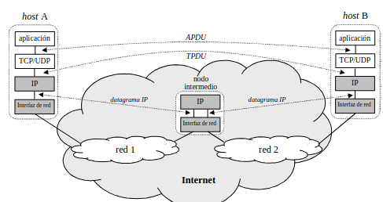

# Tema 3.Capa de Transporte

## Objetivos

En este tema donde se estudiará la capa de __transporte__ se tiene como objetivos los siguientes puntos:

1. Servicio de multiplexación y demultiplexación.
2. Servicio orientado a conexión frente a servicio no orientado a conexión
3. Transferencias de datos fiables.
4. Control de flujo.
5. Control de congestión.
6. Implementación en Internet.

Además, se realizará un estudio detallado de los protocolos de transporte conocidos como __UDP__(_User Datagram Protocole_) y __TCP__(_Transimition Control Protocole_).

## 3.1.Introducción

Hasta ahora hemos visto que el nivel de __enlace__ se encarga sólo de la comunición _salto a salto_ sin preocuparse de quién es el destino final del paquete ni quién es el origin inicial del paquete.

Por otro lado, indagamos un poco en la comunicación _extremo a extremo_ utilizando la comunicación _salto a salto_ con el nivel de __red__ con protocolos como el _Protocolo IP_.

En este tema veremos cómo se realiza la comunicación _extremo a extremo_ sin pensar en la comunicación _salto a salto_ pues ciertamente no se produce.

Para recordar un poco la terminología, cada paquete del encapsulamiento recibe un nombre:
    
- Enlace: frame.
- Red: datagrama.
- Transporte: datagrama(UDP) ó segmento(TCP).
- Aplicación: mensaje.

Refiriendonos con pinceladas al protocolo __UDP__, debemos denotar que se encarga de la transmisión a nivel de transporte al igual que __TCP__ con la diferencia de que __UDP__ no tiene como principio la fiabilidad de la transmisión, es decir, es un protocolo que no garantiza que los paquetes lleguen correctamente; sino que, busca que la comunicación sea lo más veloz posible. De hecho, __UDP__ mandará los paquetes aunque el dispositivo esté apagado, no realiza ningún protocolo de 'hand-shaking'.

Por su parte, __TPC__ sí que es fiable pues realiza un protocolo de 'hand-shaking' con el objetivo de asegurar los paqeutes; además, establece una conexión concertada con un sólo dispositivo. Para ser fiable, realiza comprobaciones sutiles para conocer el estado del paquete, pero... ¿por qué se realizarían comprobaciones si el fallo de un cable es mínimo? El motivo es claro, para evitar fallos por __congestión__.

Una de las soluciones que propondrá el protocolo será realizar un control de __flujo__ para regular el envío de paquetes cuando los buffers de los dispositivos comiencen a llenarse.

___Esquema de comunicación extremo a extremo___

 

Como nota, todos los servicios estudiados se basan en la multiplexación-demultiplexación de los paquetes.

## 3.2.UDP

También conocido como _User Datagram Protocole_, es un protocolo de nivel de __transporte__ referenciado en _RFC 768_ encargado de la comunicación _extremo a extremo_ con funcionalidad ___best_effort___, es decir, no es fiable.

La fiabilidad de _UDP_ es tan reducida que en caso de que el paquete no llegue, simplemente la capa de _transporte_ no avisará a la aplicación de que se ha producido algún error, sino que será otra capa la que se encargará de controlar esta casuítica. Esto nos puede recordar al protocolo _IP_ que también trabajaba con _datagramas_.

Además, ligado a que no es fiable y a que es un servicio no orientadoa conexión encontramos que no hay garantías de __entrega ordenada__ ni __control de congestión__.

Esto primero hace alusión a que los paquetes que se van mandando no tienen por qué llegar al destino en el orden mandado; de hecho, como no se fragmentan los paquetes, realmente no es algo imprescindible.

Por su parte el hecho de que no haya _control de congestión_ viene de que _UDP_ busca ser lo más veloz posible luego se mandarán tantos paquetes como se puedan mandar.

En resumen, las características de _UDP_ son, sabiendo que es _best-effort_:
    
1. No es fiable.
2. No es orientado a conexión.
3. No asegura entrega ordendad.
4. No proporciona control de congestión.

___Paquetes UDP(datagramas)___

Los paquetes se dividen en _cabecera_ y _datos_.

En el caso de _UDP_ cada paquete está compuesto por una _cabecera_ de 8 Bytes repartidos de la siguiente manera:
    
- Puerto origen (2 Bytes): determina el puerto desde el cual se manda el datagrama UDP. Permite que el receptor, en caso de recibirlo, pueda realizar su respuesta. Como mucho podrá haber 65535 puertos, de los cuales algunos están reservados para servicios importantes.
- Puerto destino (2 Bytes): determina el puerto hasta el cual debe llegar el datagrama una vez enviado. Como mucho podrá haber 65535 puertos, de los cuales algunos están reservados para servicios importantes.
- Longitud UDP (2 Bytes): determina el número de bytes que ocupa el datagrama, concretamente, la cabecera junto con los datos.
- Comprobación (2 Bytes): contiene un 'checksum' para saber si el paquete mandado es el que debe recibir el dispositivo, es decir, no sirve para comprobar que el paquete esté correcto. Dentro de este campo se encuentra la cabecera y la pseudocabecera (la cabecera IP), donde encontramos los siguientes campos:    
    + IP origen: dirección IP del dispositivo que manda el datagrama.
    + IP destino: dirección IP a la que debe llegar el datagrama.
    + Protocolo que se usa, por ejemplo, ICMP.
    + Longitud UDP, para conocer si se ha recibido todo el paquete.

De este último campo, se puede deducir que cada datagrama _UDP_ está encapsulado en un datagrama _IP_.

_Datagrama UDP_

Con respecto a los __puertos UDP__, se dividen en dos rangos:
    
- [0-1024]: guardados para protocolos importantes donde el usuario que lo usa tiene privilegios de administrador.

    
- [1024 - 65535]: destinados para el uso común de usuarios.

## 3.3.TCP

También conocido como _Transmition Control Protocole_ es un protocolo de transmisión a nivel de _transporte_, al igual que _UDP_, especializado en la conexión _punto a punto_ lo que significa que al realizar una transmisión, no es capaz de mandar paquetes a distintos dispositivos a la vez, pues para mandar un paquete debe asegurar la conexión con el dispositivo. Por tanto, __no__ es un servicio __multicast__.

Otra de las grandes diferencias es que los datos sí que se mandan __ordenados__; para garantizar ese orden se hará uso de un campo de la cabecera que indicará el byte por el que empieza el __segmento__. 

Junto a esto, dispone de un buffer donde se almacenan los paquetes en orden, es decir, se reserva espacio para paquetes que están entre otros dos dentro del buffer; de manera que, cuando llegue, habrá un hueco de su tamaño en el buffer entre dichos dos paquetes que intercala.

Y por último, es un mecanismo __full-duplex__, es decir, permite recibir y mandar paquetes a la vez, dispone de __mecanismos de detección y recuperación__ causados por errores basados en __ACK's acumulativos__ y __timeouts adaptables__ y realiza __piggybacking__, es decir, al mandar un paquete necesario aprovecha para mandar algún que otro paquete que avance en la comunicación.

En resumen, las características de _TCP_ son:

1. Es fiable
2. Es orientado a conexión.
3. Comunicación punto a punto.
4. No es un servicio multicast.
5. Proporciona entrega ordenada.
6. Dispone de mecanismos de detección de errores y recuperación.
7. Realiza piggybacking.
8. Es full-duplex.

Al igual que _UDP_, _TCP_ dispone de __segmentos__, similar a los _datagramas UDP_ donde aparece una cabecera _TCP_ de 20 Bytes seguida de los datos a mandar.

La __cabecera__ se divide en los siguientes campos:

- Puerto origen: determina quién manda el paquete para poder facilitar la respuesta. Como mucho hay 65535 puertos, hay alguno de ellos reservados para protocolos importantes.
- Puerto destino: determina a qué dispositivo debe llegar el segmento. Como mucho hay 65535 puertos, dentro de los cuales hay algunos reservados para protocolos importantes.
- Número de secuencia: uno de los campos más importantes encargado de la comprobación del orden de llegada de los segmentos; además, determina el byte inicial del segmento que se ha decidido dentro del buffer del dispositivo de llegada. Tomará un papel importante en la sincronización de la conexión.
- Número 'acuse': es útil en la comprobación del estaod del paquete, pues refleja hasta que bit se espera recibir correctamente, una vez cumplido esto, se asume que todo lo recibido hasta ese byte será correcto, de ahí que sean acumulativos.
- Hlen: determina el tamaño de la cabecera TCP.
- Reservado: es un mecanismo de protección del protocolo a futuro, ya que si se añadieran campos se haría ahí.
- UAPRSF: son una serie de bits útiles para la comunicación que sirven como flags de estado:
    + U o bit de urgente: su utilidad es para hacer que un segmento no cumpla el orden del buffer (FIFO) y se procese antes que todos. Suele usarse en caso de que haya que solventar algún problema en la conexión.
    + A o bit de ACK: (preguntar al profesor)
    + P o bit de push: sirve para evitar la espera debido a que el segmento no esté lo más lleno posible, pues un segmento no se manda hasta que esté lleno.
    + R o bit de reset: se usa para que uno de los dispositivos de la conexión fuerce al otro a resetear la conexión si se ha detectado algún fallo.
    + S o bit de sincronización: determina que los paquetes mandados tienen el objetivo de realizar la sincronización de la conexión.
    + F o bit de fin: determina que ese paquete con el bit encendido es el último de la conexión.
 - Ventana de receptor: se encarga del control de flujo, es decir, la ventana de control de flujo máxima es de 65535 bits; básicamente, determina la velocidad mácxima a la que se puede trabajar.
 - Comprobación: contiene un 'checksum' del paquete, en este caso sí que es una comprobación de corrección de todo el paquete.
 - Puntero de datos urgentes: determina el Byte a partir del cual se encuentran los datos urgentes.

Después de todo esto se encuentra un campo opcional y los datos.

___Segmento TCP___

Con respecto a los __puertos TCP__, se dividen en dos rangos:
    
- [0-1024]: guardados para protocolos importantes donde el usuario que lo usa tiene privilegios de administrador.

    
- [1024 - 65535]: destinados para el uso común de usuarios.

Por último, una conexión _TCP_ se determina por las parejas (puerto,_IP_) origen y destino.

### 3.3.1.Funcionalidades TCP

A lo largo de este apartado se discutirán las funcionalidades que sí provee _TCP_ a diferencia de _UDP_.

#### 3.3.1.1.Control de conexión

Una conexión _TCP_ se basa en tres partes donde __no se puede determinar que sean fiables las fases extremo__ ya que están basadas en el protocolo _IP_:

1. Establecimiento de la conexión o apertura.
2. Intercambio de datos.
3. Cierre de la conexión.

___Establecimiento de la conexión___

Esta parte es un proceso llamado _three-ways handshake_ donde se siguen los siguientes pasos:
    
1. El cliente siempre empieza la conexxión con la apertura activa, donde se manda un paquete de solicitud con el bit SYN(1) y numero de secuencia(x), por ahora, aleatorio.
2. El servidor que recibe la solicitud realiza la apertura pasiva respondiendo con un paquete ACK, con número 'acuse'(x+1) especificando que ya sabe hasta que bit espera recibir, y aprovechando el 'piggybacking' manda el sincronismo opuesto con bit de SYN(1) y número de secuencia(y).
3. El cliente devuelte un ACK confirmando la sincronización de los números de secuencia con número de 'acuse'(y+1).

_Proceso de apertura_

Como no se puede asegurar que este intercambio sea fiable al estar basado en el protocolo _IP_, el cliente dipone de un contados o __timeout__ que determina a partir de que momento se vuelve a intentar la conexión, echando por los suelos el trabajo que ya se ha realizado.

Debido a esto disponemos de varias casuísticas:
    
1. Casuística normal.
2. Caso de intento de apertura simultánea: es un caso poco habitual pues no se da ccuando la conexión es cliente-servidor, sino cuando es cliente-cliente. Se resuelve simplemente mandando cada uno la respuesta ACK con el 'acuse' correspondiente.

    
3. Caso de sincronismo con retraso: este caso es más habitual y ocurre cuando hay un retraso en la red provocando que se descarte un segmento de apertura cuando sí que se ha mandado y ha llegado; esto es ocasionado por el 'timeout'. La solución es de nuevo no tener en cuenta la respuesta del servidor y mandar otra apertura activa para iniciar de nuevo la conexión.

___Intercambio de datos___

Durante este proceso simplemente se produce una "conversación" donde sólo tma importancia el __número de secuencia__. 

El número de secuencia inicial es un valor denominado __ISN__(_Inicial Secuence Number_) que teóricamente se elige el azar y se usa para evitar confusiones con otras conexiones.

El ISN es elegido por el sistema (cliente o servidor). El estándar sugiere utilizar un contador entero incrementado en 1 cada 4 µs aproximadamente. En este caso el contador se da la vuelta (y el ISN reaparece) al cabo de 4 horas 46 min.

No obtante, pese a ser un mecanismo de elección fiable no protege frente a ataques de manera que s epuede calcular pudiendo suplantar alguna de las entidades de la conexión.

Por otro lado, una vez ya está avanzada la conexión, el número de secuencia va aumentando de forma parecida al _offset_ del protocolo _IP_ de manera que, en cada paquete, este número aumenta el tamaño del paquete recibido.

___Cierre de la conexión___

Esta parte también se basa en un proceso _three-ways handshake_ que sigue los siguientes pasos:
    
1. Alguno de los dispositivos de la conexión realiza el cierre activo mandando un paquete de sincronización con bit de FIN(1) y un numero de secuencia(x).
2. El otro dispositivo, haciendo el cierre pasivo, responde con un segmento ACK con numero de 'acuse'(x+1) y aprovecha el 'piggybacking' para mandar un segmento con número de secuencia(y) y bit de FIN(1).
3. El dispositivo que inició el cierre responde con un segmento con número de 'acuse'(y+1).

El primero paso puede ser dado por el servidor o el cliente, esto dependerá de la implementación de la aplicación bajo la que se trabaja.

Asimismo, si una conexión dura menos que un tiempo conocido como (nombre¿?), la conexión no se cierra hasta que pase ese tiempo.

Al igual que en la apertura, el hecho de que se usen __timeouts__(_MSL_ o _Maximun Segment Lifetime_) para descartar intentos que han tardado bastante ocasiona que haya casuísticas problemáticas:

1. Caso normal.
2. Caso de intento de cierre simultáneo: es un caso poco común análogo a la apertura con intento simultáneo; de hecho, tiene la misma solución extrapolada a los cierres.
3. Caso de sincronismo con retraso: se ocasiona cuando durante el cierre activo se avisa del fin de la conexión, ocasionando que si hay un retraso en la red, el dispositivo del cierre pasivo continúe mandando información. Esto se soluciona de forma similar a la apertura con sincronismo con retraso. (preguntar al profesor)

_Casuísticas_

Por útlimo, hablaremos del concepto de __tamaño máximo de segmento__ o _MSS_, que es útil para determinar cuánto puede ocupar la parte de datos de _TCP_ al crear un paquete, pues al haber encapsulamiento, al mandar un paquete _IP_ hay una parte de cabecera y una parte de datos _IP_ donde está englobado todo el segmento _TCP_. Como la parte de datos _IP_ es de 1480 Bytes y la cabecera _TCP_ son 20 Bytes, obtenemos que el _MSS_ será de 1460B.

#### 3.3.1.2.Control de errores.

Acompañado del control de flujo mejoraran el rendimiento.

La idea general del control de errores es utilizar un buffer en el receptor de los mensajes para garantizar la entrega ordenada y ayudarse de los __números de secuencia__ para poder establecer este control de errores.

Este control se basa en usar los __numeros de secuencia__ para insertar cada paquete que llega en su situación correspondiente en el buffer.

___Funcionamiento del buffer___

Este objeto es manupulado por dos entidades:
    
1. Aplicación: esta entidad lo único que hace es tomar los paquetes que ya hayan llegado al buffer en orden, es decir, de la parte confirmada de la cola. Posteriormente, el paquete se procesa en la aplicación y se generará la respuesta.
2. Receptor: se encarga de ir añadiendo los paquetes en orden y de generar los paquetes de respuesta(_ACK's_). Cada vez que llega un paquete se almacena en el buffer como si fuera una cola _FIFO_ mejorada para poder mantener el orden.

Si nos damos cuenta, el buffer no es más que una ventana deslizante donde en cada deslizamiento se ha procesado un paquete por la aplicación o se ha añadido un paquete por el receptor.

Este buffer es único de cada conexion _TCP_; no obstante, hemos visto que la conexión por _TCP_ es punto a punto, luego no hay problema.

Volviendo al control de errores, sigue un esquema _ARQ_, es decir, se responde a los paquetes antes de que se pida, para ello hay una serie de eventos a tener en cuenta. 

Llegamos ya a la parte importante del __control de errores__, cuando se manda un paquete _TCP_ a un receptor ya hemos visto que se inicia un contador o _timeout_ que se encarga de determinar cuando _retransmitir_ un paquete por suposición de que se haya perdido. 

Esto último es muy importante pues, el __control de errores__ se basa en dos partes:

1. Generación de ACK's positivos y acumulativos (generación de paquetes de respuesta y confirmación).
2. Timeout adaptable

##### 3.3.1.2.1.Generación de ACK's(Tahoe)

La generación de ACK's no es más que la generación de paquetes de respuesta que dependerá de una serie de eventos producidos en la comunicación. Presenta dos características:
    
1. ACK's acumulativos: con cada ACK estamos determinando hasta qué byte de la comunicación hemos recibido correctamente, esto se hace con el número de acuse. Por tanto, el emisor, que recibe la respuesta, entenderá que hemos recibido correctamente hasta ese byte y procederá a mandar el siguiente.
2. ACK's positivos: con cada ACK estamos determinando hasta qué byte hemos recibido correctamente pero nunca qué bytes han llegado dañados o no han llegado, de hay que sean positivos.

Siguiendo en la estructura _ARQ_ y trabajando de nuevo sobre el buffer del receptor de responde de una manera o de otra dependiendo de una serie de eventos:
    
    (Etiqueta)
- Evento 1: supongamos que el receptor recibe un paquete y que ese paquete es consecutivo a lo que ya sabemos que está bien; para eitar hacer una comunicación "pregunta-respuesta" retrasamos el ACK iniciando un temporizador de 500 ms donde tomados varias casuísticas:
    + Si nos llega el paquete consecutivo hacemos Evento 2.
    + Si nos llega un paquete no consecutivo realizamos Evento 3.
    + Si se acaba el temporizador mandamos el ACK del único paquete que nos ha llegado.

    (Etiqueta)
- Evento 2: supongamos que tras el Evento 1, dentro del temporizador nos ha llegado un paquete consecutivo, entonces mandamos un ACK acumulativo confirmando que han llegado bien ambos paquetes.

Hasta ahora todos los eventos son positivos y fáciles de resolver, veamos algunos eventos más:

- Evento 3: supongamos que dentro del temporizador o fuera del mismo recibimos un paquete desordenado, es decir, no es consecutivo a lo que ya tenemos en el buffer, entonces procedemos como sigue:
        
    0. Obviamos el temporizador de 500 ms.
    1. Insertamos el paquete en el buffer en el lugar correspondiente con su número de secuencia.
    2. Generamos un ACK inmediatamente con el número de acuse confirmando hasta donde el buffer mantiene el orden, es decir, el primer byte del primer hueco.
    
    Cabe destacar que en el evento 3 se acumulan tantos ACK's en la misma posición como paquetes desordenados se reciban.

 - Evento 4: Si recibimos un paquete que cubre un heco haciendo que el buffer vuelva a ser continuo, se manda un ACK inmediatamente con la posición final del tramo continuo.

 - Evento 5: cuando pasamos de una ventana deslizante de 0 bytes disponibles, es decir, el buffer está lleno y debemos esperar a que la aplicación procese paquetes; a una ventana positiva, se manda un paquete ACK inmediatamente.

En definitiva, el ACK siempre se manda con el __número de acuse__ igual al primer byte del primer hueco del buffer.

Por último, cabe recalcar que la __duplicación de ACK's__ no consiste en mandar dos ACK's seguidos sino que se mandan varios ACK's con un mismo _número de acuse_.

#### 3.3.1.2.2.Timeouts

Los __timeouts__ son elementos muy importantes dentro de la comunicación _TCP_ y son temporizadores que regulan cuándo la comunicación fluye de manera correcta y cuándo la comunicación puede tener algún fallo.

Cuando se agota el temporizador impuesto por el __emisor__ en una pregunta y respuesta, es decir, se ha preguntado pero la respuesta no se ha recibido en ese tiempo; entonces y sólo entonces, el __emisor__ retransmitirá de nuevo la pregunta.

Por tanto, si definimos por _RTT_(__Round Trip Time__) como el tiempo que tarda una pregunta-respuesta; lo más favorable es que el _timeout_ tome el valor del _RTT_; no obstante, el _RTT_ no es fijo.

Veamos el por qué de esta asociación:
    
 - Si el temporizador es menor que el RTT, entonces se retransmitirán la mayoría de los paquetes impidiendo una comunicación fluida y en ocasiones provocando el reinicio de la conexión.
 - Si el temporizador es mucho mayor que le RTT, entonces un paquete perdido no será notificado hasta que pase un gran tiempo haciendo que la comunicación sea muy lenta y haya pérdida de recursos.

__Cálculo y deducción del timeout__

Partiendo de una comunicación cualquiera disponemos de varios conceptos que nos van a determinar el _RTT_:

 - Tiempo de transmisión: tiempo que se tarda en poner el paquete en la red, depende de la velocidad de transmisión(Vt) de la tarjeta de red y se calcula con la expresión:

$$T_t=frac{T}{Vt}, T=tamaño$$

- Tiempo de propagación: tiempo que tarda un paquete en llegar al siguiente salto, depende del medio de transmisión y de l alongitud del calble.
- Tiempo de procesado: tiempo que tarda un paquete dentro de una cola de un router en ser procesado por el mismo, depende de los routers y de la carga de red.

Todo esto debe repetirse desde cada transmisión salto a salto hasta lllegar al destino. Además, en un _RTT_ se tiene en cuenta también la vuelta. 

Añadido a esto, como todos los elementos son variables, se deduce que el _RTT_ no es fijo.

Por tanto, hemos llegado a la siguiente conclusión:
    
- El timeout debe ser ligeramente mayor que el RTT.

Además, en la práctica, no se usa el $RTT_{medido}$, es decir, el _RTT_ real; sino que se usa un $RTT_{filtrado}$.

$$RTT_{filtrado}=\alpha RTT_{viejo} + (1-\alpha)RTT_{medido}, \alpha \in  \[0,1\]$$

Pasamos ahora al cálculo del __timeout__ que usará el concepto de derivación que tambíen estará filtrada:
    
$$Desviacion_{filtrada}=(1-x)Desviacion_{vieja}+x|RTT_{medido}-RTT_{filtrado}|, x\in \[0,1\]$$

Donde llegamos, ya sí, a la fórmula del cálculo del __timeout__:

$$Timeout=RTT_{filtrado}+4Desviacion_{filtrada}$$

Por último un comentario sobre el _Algoritmo de Karn_, simplemente se basa en duplicar el __timeout__ cada vez que este expira.

#### 3.3.1.3.Control de flujo.

El __control de flujo__ es un mecanismo de __atrás hacia delante__ donde el receptor es el que le dice al emisor la cantidad de datos que se pueden mandar:
    
- Si el buffer del receptor está muy vacío, se manda un mensaje de aumento de paquetes enviados.
- Si el buffer del receptor está muy lleno, se manda un mensaje de disminución de paquetes enviados.

En caso de que esta regulación no se haga, podría darse el caso en el que se llene el buffer y se descarten paquetes para no congestionar la red; entonces, estaríamos perdiendo información.

Este sistema es lo que se conoce como __esquema crediticio__. 

__Gestión del mecanismo__

Esta gestión se realiza mediante un campo de ventana de la cabecera _TCP_, un campo de 16 bits donde se dicen cuántos bytes hay libres haciendo uso de la base 2. Por tanto, cada número en binario _n_, representa $2^n$ bytes libres.

Es en este caso donde se resuelve el Evento 5 y donde se puede producir; cuando se llena el buffer, se manda un ACK con una ventana de libres valor 0; ante esta situación, el emisor debe dejar de mandar paquetes y esperar a que se reciba el paquete de _ACK_ del evento 5.

No obstante, recibir este paquete puede llegar a ser muy oprimista, luego cuando se recibe el _ACK_ de buffer lleno, el emisor inicia un temporizador de espera(__temporizador de persistencia__); si este se termina, mandará un byte de datos esperando recibir un _ACK_ de respuesta como en una comunicación normal. 

Si es así se reestablece la conexión y se había perdido el _ACK_ de ventana libre; si no se recibe el _ACK_ significa que el receptor no está listo para trabajar paquetes.

Cambiando de tercio, en ocasiones se mandan mucho paquetes de forma consecutiva, tras su procesamiento se irán recibiendo los _ACK's_ correspondientes. Entre dos _ACK's_ consecutivos ya se han leído varios paquetes pero puede que no hayan llegado algunos que están en transmisión.

En estos casos, la __ventana ofertada__ no podrá ser la ventana del campo de la cabecera _TCP_ sino la siguiente:
    
$$V_{real}=V_o-b , b=Bytes_{tránsito}$$

Por ahora, hemos tomado un valor teórico, pero ya sabemos que suele ser matizado en la práctica pues hemos considerado un caso extremo; en la prácita, se toma un valor intermedio de manera que todo funcione más o menos bien y no perdamos mucha calidad.

#### 3.3.1.4.Control de congestión

El __control de congestión__ es un problema del tipo __adelante-atrás__ causado por la __insuficiencia de recursos__ durante la transmisión de un paquete; es decir, cuando alguno de los buffers de los routers está completamente lleno y descartamos paquetes.

Podemos ya intuir, que la velocidad de _TCP_ depende de este control, asicomo que es el emisor quien decide cómo transmitir.

En la versión "Tahoe" se manifiesta mediante la __pérdida de ACK's__ donde la solución que se propone es limiter de forma adaptable el tráfico generado.

___Proceso TCP___

Para explicar cómo _TCP_ actúa frente a estas cosas vamos a utilizar un ejemplo. Sabienso que el emisor dispone de dos ventanas:
    
- Ventana del Receptor -> usada en el control de flujo, con tamaño variable según el campo ventana recibido.
- Ventana de Congestión -> es inicializada a 1 (número de segmentos), aunque realmente toma los Bytes que ocupa cada paquete TCP.

El proceso de comunicación _TCP_ tiene tres fases desde el punto de vista de la congestión una vez que ya se ha iniciado el intercambio de paquetes:

1. Inicio lento: En un inicio, se mandan tantos apquetes como nos permita la ventana y se establece el intercambio como se ha visto. Además, la ventana de congestión(CW) se actualiza a CW+(bytes confirmados). Esto es así hasta que sobrepasamos un umbral determinado por el protocolo.

2. Prevención de congestión: En cada ráfaga de envío de paquetes se mandan tantos Bytes como haya en la ventana de congestión; por cada confirmación la ventana aumenta de la siguietne forma: 

$$CW=CW+frac{1}{CW}$$
   
    De esta manera, conseguimos que cada CW bytes mandados y confirmados, la ventana aumente sólo en una unidad. Por último, en esta fase puede ocurrir una excedencia de timeout, en ese caso volvemos a la fase 1 y reducimos el umbral a la mitad.

*Gráfica comparativa del aumento de CW con respecto al número de transmisiones*

Para calcular la velocidad de transimisión de _TCP_ bastará con deducir que se mandan $frac{CW}{T}$ paquetes donde $T$ es el tamaño de un paquete _TCP_ por cada _RTT_ luego el rendimiento o velocidad será:

$$throughput=frac{CW}{RTT}$$

### 3.3.2.Extensiones TCP

Por ahora, hemos estado hablando de la versión _Tahoe_ que presenta algunas incompletitudes, muchas de ellas causadas por el inicio lento; de aquí surgieron los sabores de _TCP_:

- Reno: distingue entre fallo por exceder un timeout o la duplicacion de ACK's masiva:
    + Si hay excedencia de timeout -> mismo proceso que Tahoe.
    + Si hay duplicación masiva de ACK's -> el valor de la ventana ofertada apsa a la mitad en la fase de prevención prolongando dicha fase.
- newReno: distingue más situaciones y se adapta mejor a las necesidades de la ransmisión.
- Vegas: en lugar de tener en cuenta los ACK's tieene en cuenta el RTT:
    + Si el RTT aumenta -> reduce la ventana.
    + Si el RTT disminuye -> aumenta la ventana.
- Cubic: dispone de dos ventanas para la congestión, una dependeinte de los ACK's y otra dependiente de los RTT y hace una mezcla de ambas.

Por ahora, estamos suponiendo que todos los errores que se dan son por congestión, pero esto no tiene por qué ser así en redes inalámbricas, redes donde el porcentaje de error es un 10%; la versión _Westwood_ es la encargada de adaptarse a estas redes.

Esta última versión no es más que una adaptación de *TCP* a las redes actuales, que son __inalámbricas__. Para ello, se modifican una serie de conceptos que se suelen imponer en el campo _condicional_ de la _cabecera TCP_:

- **Ventana escalada**: es el más imporatane, consiste en que la ventana de control de congestión que sí es emitida en los mensajes hacia el emisor puede multiplicarse por un factor haciéndola más grande aumentando así la eficiencia de la transmisión.

    Como el campo opcional sólo dispone de 14 bits podremos aumentar el tamaño tantas veces como $2^{bits a 1}$ de ese campo.
- **Estimación del RTT**: no se le ha dado mucha importancia en clase y consiste en disponer de una opción _TCP_ de sello de tiempo, en todos los segmentos.
- **PAWS** o _Protect Against Wrapped Sequence Number_: permite imponer un sello de tiempo y dispone de un rechazo de segmentos duplicados, medida de seguridad muy usada en transmisiones inalámbricas.
