# Tema 4. Seguridad en redes
---
## Índice

1. Introducción
    1. Aspectos de seguridad.
    2. Tipos de ataques.
2. Cifrado
    1. Tipos de cifrado.
    2. Algoritmos de cifrado.
3. Distribución de claves secretas
    1. Intercambio de Diffie-Hellman

4. Autenticación

5. Funciones Hash

6. Firma Digital y Certificados Digitales

7. Protocolos Seguros
---

## 4.1.Introducción

Nuestro objetivo dentro de una comunicación entre dos extremos es que dicha cominucación sea __segura__; para ello uno de los tips imprescindibles es que nuestra _red de comunicaciones_ sea __segura__. 

Para cumplir este objetivo deberemos garantizar que se cumplen una serie de aspectos que llamaremos __aspectos de seguridad__.

### Definición

Un aspecto de seguridad es una característica que cumple un elemento para acersarse más a ser seguro.

### Tipos de aspectos de seguridad

Los aspectos de seguridad que veremos son:

- __Confidencialidad__: consiste en que el contenido de la información sea comprensible solo por las __entidades autorizadas__ para ello. No obstante, otras entidades podrán ver los paquetes siempre y cuando estén cifrados.

- __Autenticación__: es un mecanismo que prohíbe el acceso a cualquier tipo de información privilegiada si no se dispone de posibilidad a ello o una acreditación que conceda ese privilegio.

- __Integridad__: deberemos asegurar que los datos que se manden lleguen al destino sin ser manipulados, es decir, tal y como se mandaron. Para evitar que surja la posibilidad de que se cometan estos delitos se usan las funcionas _hash_ y los compendios, que detectarán cualqueir modificación ocasionada al paquete de información.

- __No repudio__: consiste en evitar que un participante en una transacción consiga liberarse de su acto. Es decir, en caso de hacer cualquier transacción se dispone de un registro de transacciones parecido a una _auditoría_.

- __Disponibilidad__: consiste en que los recursos que se ofrecen al público que cumplan todo lo anterior estén disponibles a los usuarios la mayor parte del tiempo posible. Esto puede reducirse a que el sistema sea fiable.

- __Control de accesos__: Ligado a la [autenticación](#autenticación) consiste en controlar que la [disponibilidad](#disponibilidad) de los recursos sea solo a _entidades autorizadas_.

Controlando que todos estos aspectos se cumplan en cada uno de los niveles del __modelo__ ___TCP/IP___ conseguiremos que nuestra red sea algo más segura; no obstante, siempre tendrá debilidades.

### Tipos de ataques

A modo de divulgación existen una serie de ataques, algunos de ellos son:

<a id="sniff"><a/>
- __Sniffing__: consiste en espiar una conversación obteniendo la información de sus paquetes sin alterarlos.
- __Spoofing__: consiste en una suplantación de identidad, es decir, mandar un paquete dañino a otro dispositivo dentro de una conversación tratando de suplantar la identidad de alguno de los participantes.
- __Man in de middle__: consiste en introducir un dispositivo que intercepte señales y, por tanto, paquetes para realizar cualquier tipo de maldad, es un ejemplo de [sniffing](#sniff).
- __DDoS__ o _Distruibuted Denial of Service_: consiste en provocar la denegación de un servicio, normalmente, a una persona autorizada.
- __Malware__: son los más conocidad y suelen ser elementos software que provocan daños en el sistema al que entran, alguno son: _troyanos, gusanos, spywares, bacdoors_.

Para conseguir defenderse de estos ataques se inventaron los __mecanismos de seguridad__.

### Mecanismos de seguridad

Algunos mecanismos de seguridad los veremos más adelante y son:

- Cifrado
- Autenticación con clave secreta
- __Intercambio de Diffie-Hellman__: consiste en realizar un intercambio de claves, esto no es tan trivial como parece pues todo esto debe ser legal y disponer de una prueba segura ante un juez en caso de vulnerabilidad de algunos aspectos legales.
- Funciones Hash
- Firma Digital
- Certificados digitales

## 4.2.Cifrado

__NOTA__: En esta sección supondremos que todos y cada uno de los algoritmos de criptografía funcionan y estudiaremos si bajo esa condición los distintos protocolos que usan esa criptografía funcionan.

Sabemos que el termino cifrado se entiende como una transformación realizada a una serie de datos para que __solo__ aquel que dispone de la forma de descifrarlo conozca el contenido, a esto lo llamamos __cifrado de datos__.

El _cifrado de datos_ se basa en la existencia de un algoritmo de cifrado/descifrado que puede ser, o no, el mismo que es conocido por los extremos y solo por ellos. Realmente, la dificultad de vulnerabilidad de este mecanismo reside en __cómo de compleja es la clave de cifrado/descifrado que se use__, que, de nuevo, pueden no ser la misma.

### Tipos de cifrado

A la hora de cifrar los datos hay dos posibilidades:

| | Clave | Función |
| :---: | :---: | :---: |
| Simétrico | Misma | Distinta |
| Asimétrico | Distinta | Misma |

- __Cifrado simétrico__: son algoritmos que siguen el estandar _DES_(_Data Encryption Standard_) donde se usa una clave $k$ tanto para cifrar como para descifrar. Por ejemplo, un algoritmo muy típico se basa en realizar permutaciones y funciones _XOR_ llegando a realizar una sustitución como resultado; por tanto, el resultado siempre será el mismo si la entrada es la misma.

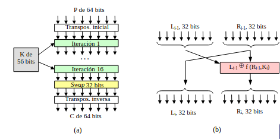
*Ejemplo de algoritmo simétrico con resultado por sustitución*

#### Algoritmos

Con respecto al _cifrado simétrico_ hay dos tipos de algoritmos de los cuales desarrollaremsos sus características:

+ __DES__: no es más que un esquema de sustitución monoalfabético que usa palabras de 56 bits como claves elevando la posibilidad de violación del protocolo a $2^{56}$ combinaciones posibles de la clave. 
    Como es un algoritmo de sustitución, dada una entrada fija, la salida está siempre determinada, y es la misma.

    Para arreglar la posibilidad de descifrado, se utiliza un esquema reentrante, es decir, la salida de aplicar una transformación se involucra en la creación del difrado de la siguiente palabra a cifrar(como ya sabemos se cifran palabras de 64 bits en palabras de 64 bits).

    De esta forma el extremo que recibe el mensaje codificado simplemente tendrá que conocer la última entrada usada para codificar y aplicar el proceso inverso.
    
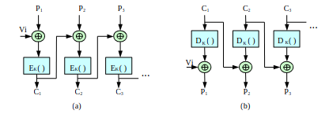
    
+ __DES doble__ y __3DES__: no son nuevos algoritmos sino que son versiones del anterior que proporcionan robustez al algoritmo. Proponen el uso de dos funciones de cifrado distintas de manera que una es la inversa de la otra aplicándolas según el [esquema](#desdoble) y manteniendo la funcionalidad original.

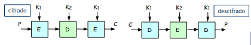

+ __IDEA__: es un algoritmo que sigue la misma idea, a ojos de usuario, que __DES__ donde dada una palabra de 64 bits se codifica produciendo una salida de 64 bits; la clave que se usa para codificar es una palabra de 128 bits aumentando la complejidad de violación del protocolo en $2^{56}$ combinaciones de símbolos.

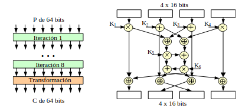

- __cifrado asimétrico__: consiste en disponer de dos claves por usuario:
    + Pública ($K_{pub_{usr}}$): que es conocida por todos los usuarios.
    + Privada ($K_{priv_{usr}}$): que sólo es conocida por el usuario(_usr_).
La correspondencia entre la clave pública y la privada es biyectiva, es decir, para una clave pública sólo hay una clave privada y viceversa.

La regla para cifrar y descifrar es la siguiente:
> Si ciframos con una(pública o privada) los mensajes, el destinatario deberá descifrarlos con la otra(si pública entonces privada y viceversa).

Con estos tipos de cifrado, si un usuario cifra con su clave privada estará otorgando autenticación a la transacción; no obstante, el receptor no puede aportar esa autenticación en esta situación.

#### Algoritmos

El único algoritmo que hemos estudiado aquí es el algoritmo __RSA__ para el que se necesitan los siguientes materiales:

- Dos números primos $p$, $q$ de gran tamaño.
- $n=p\cdot q$
- $z=(p-1)(q-1)$
- $d \in N$ que sea primo relativo de $z$.
- Calculamos $e\in N$ tal que $ed mod(z)=1$

Con esto tomamos:

- $K_{pub}=(e,n)$
- $K_{priv}=(d,n)$
- Cifrado: $C=P^e mod(n)$
- Descifrado: $P=C^d mod(n)$

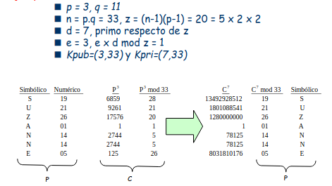

## 4.3.Intercambio de claves secretas, algoritmo de Diffie-Hellman

Para establecer una conversación privada mediante cifrado, es necesario que haya una distribución de claves secretas de manera que ambas entidades dispongan de la misma y puedan cifrar y descifrar para ellos solos, con este motivo se creó el algoritmo de __Diffie-Hellman__.

### Algoritmo

Sean A y B dos entidades que se quieren comunicar de forma cifrada, el algoritmo se basa en unos pasos:

1. A elige números $x,n,g$.
2. A manda la tripla $(n,g,g^xmod(n))$
3. Cuando B recibe la tripla anterior, elige un número $y$.
4. Tras esto B manda un mesaje a A con el contenido $g^ymod(n)$.

Ahora la clave que van a tomar cada uno de ellos es:

$$(g^{xy}mod(n))=(g^xmod(n))^y=(g^ymod(n))^x$$

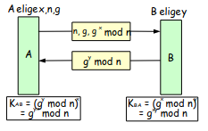

Este algoritmo es susceptible de ataque por __man-in-the-middle__ que se limitara a establecer esta conexión con cada uno de los extremos con un nuevo número $z$ haciendo que la comunicaciń funcione perfectamente y ninguno de los extremos perciba su existencia.

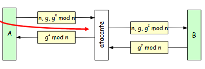

## 4.4.Autenticación

Cuando hablamos de __autenticación__ nos referimos en poder determinar al receptor que el emisor es el que se supone que es.

La forma más sencilla para identificar un usuario es guardar en la base de datos del servidor las claves de cada uno de los usuarios; de esta manera, para autenticar a un usuario, este debería mandar el usuario y la clave.

Aunque sea muy vulnerable a espías es un protocolo que se usa en muchos servicios y que con el tiempo se ha ido mejorando, una mejora es el envío de información por túneles cifrados.

### Algoritmos

Vamos a tratar de proporcionar autenticación sin necesidad de mandar la clave del usuario, el algoritmo que veremos será el esquema __reto-respuesta__:

Dados dos usuarios, A que quieren autenticarse en B:
1. A manda un mensaje con su identificador de usuario.
2. B recibe la petición y manda a A un __reto__, un número aleatorio.
3. A calcula algo con ese reto y su clave para posteriormente mandarlo a B.
4. B recibe la respuesta y, como B tiene la clave de A, puede calcular lo mismo; si coinciden tenemos la autenticación.
5. Si no coincide se ha producido una violación de autenticación.
6. De la misma manera que B autentica A, A autentica B(se repite el proceso al revés).

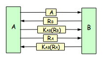

No obstante, este algoritmo tiene dos __problemas__:

- Ataques por repetición: supongamos que durante el proceso descrito un espía intercepta la señal y toma el reto y el resultado producido. Repitiendo esto muchas veces dispondrña de solución a la mayoría de los retos de B. 

    De esta manera, si el espía pide acceso a B, como tiene la solución al reto, suplantando la identidad del usuario que espiaba, contesta correstamente al reto y puede acceder.

- Ataques por reflexión: el mismo espía de antes, dado un reto que ha mandado B al espía, este responde mandando el mismo reto adelantando el paso (6.) del proceso para recibir la respuesta del reto que le preguntaron y así poder acceder al servicio.

Ambos ataque disponen de la misma __solución__, todo el problema está causado por la repetición del dominio del reto de A y del reto de B; entonces, bastará con tomar dominios que no se intersequen, es decir, aplicar el principio de __nonce__.

## 4.5.Funciones Hash

Las funciones hash son herramientas que se utilizan para proporcionar __integridad__; de hecho, sirven mucho para comprobar que los datos de un paquete no han sido modificados.

Gracias a que son unidireccioneales, es decir, no son inyectivas es imposible conocer el mensaje del cual se ha obtenido el resumen o imagen hash, dicho resumen tiene un tamaño fijo.

Cabe recalcar, que un resumen no es más que una reducción de información sobre algo de mayor tamaño, luego si a mensajes de gran tamaño obtenemos un resumen muy pequeño estamos perdiendo información; no obstante, ese resumen nos valdrá para asegurar la corrección de los datos mandados.

Otra propiedad de las funciones hash es que proporcionan invulnerabilidad frente a ataques de colisión, pues dado un mensaje M y otro $M' \neq M$ no puede cumplirse que su resumen sea el mismo.

### Casuística

Supongamos que mandamos algo cifrado y además le sumamos al mensaje su resumen; esto es vulnerable simplemente podemos suplantar el mensaje con otro y poner el resumen de ese otro. 

Básicamente, si mandamos $M+MD5(M)$, al atacante le bastaría con cambiar $M$ por $M'$ para realizar el ataque.

Luego para que esto no pase lo que haremos será mandar el mensaje y el resumen de la clave privada entre las dos entidades concatenado con el mensaje. De esta manera usando la unicidad de la clave privada podemos corroborar que el mensaje será el adecuado.

El resumen que hemos citado se llama ___HMAC___.

### Funciones hash típicas

Hay dos funciones hash típicas:

- __MD5__: dado un mensaje $P$ de $K$ dígitos, siendo la longitud del mensaje múltiplo de 512(en caso contrario rellenamos con ceros hasta que lo sea). Seguimos unos pasos:
    1. Dividimos el mensaje en submensajes de 512 bits.
    2. Aplicamos la función hash al primero de ellos haciendo uso de un mensaje de inicialización como randomizador.
    3. Para aplicar la función hash al siguiente submensaje tomamos la salida del submensaje anterior como randomizador y aplicamos las función hash. Esto se repite hasta que se acabe el mensaje.

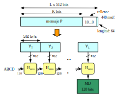

Como resultado final conseguimos un resumen de 128 bits; de hecho, cada aplicación de la función hash es un resumen de 128 bits.

[TODO]:pregutar por el nombre del randomizador, explicar protocolo en general.

- __SHA-1__: Sigue la misma idea que __MD5__ sólo que en este caso el resultado final es de 160 bits asicomo cada aplicación de la función hash da un rasultado de 160 bits.

La diferencia entre ambos radica en la función hash interior, que, como informáticos, no nos interesa.

## 4.6.Firma digital y certificados digitales

### Firma digital

Una __firma digital__  intenta ser un sustituto de una firma escrita para poder garantizar el __no repudio__ en nuestras acciones dentro de un sistema.

Con las firmas digitales conseguimos:
- Autenticación por parte del receptor de la identidad del emisor.
- No haya repudio por parte del firmante.
- El emisor obtenga la garantía de no falsificación.

El __no repudio__ se puede conseguir de dos formas:

#### Firma con clave secreta o __Big Brother__(_BB_)

El protocolo se basa en usar una entidad en la que todos los usuarios confían y vigilará las transacciones de todos los usuarios. 

Se puede entender como un buen _man-in-the-middle_ donde si, A y B son dos entidades tales que A quiere mandar un mensaje a B, el _BB_ formará parte de la comunicación siendo un puente entre ellos que guardará cada una de las transacciones realizadas.

Realmente, el _BB_ es un servidor que almacena las calves compartidas de él con los usarios; de manera que, si A quiere mandar un mensaje a B, A cifra su mensaje y lo manda a _BB_ quien lo descifra, registra y vuelve a cifrar con la clave de B para mandarlo al destinatario junto con alguna información más que será la firma digital del _BB_ que autenticará el proceso.

- A manda $(A,K_A(B,R_A,y,P))$:
    + Identificador (A)
    + Cifrar con la clave $K_A$
    + B, es el destino
    + $R_A$ resumen para dar la integridad
    + t, instante de tiempo
    + P, texto plano    
- Esto es recibido por el _BB_ quien reenvía el mensaje a B cifrado con la clave de B $K_B(A,R_A,t,p),K_BB(A,t,P)$
    + $K_BB$ es una clave que sólo tiene el _BB_ y es un método de seguridad pues todo lo cifrado con dicha clave es la firma digital para que quede constancia de quién ha hecho la tansacción

#### Firma digital con clave asimétrica o __Doble Cifrado con certificados digitales__

Si queremos entender cómo funciona esto deberemos expicar lo que es un certificado digital; no es mas que un conjutno de datos entre los que se encuentran:
- Identidad del usuario que lo usa.
- Clave pública del usuario que lo utiliza.
- Período de validez.
- Datos.
Todo esto permanece firmado por la __autoridad de certificación__, de la cual conocemos la clave pública al actualizar los programas que usan certificados digitales.

Cabe recalcar que un certificado digital __no__ proporciona nada por sí solo; no obstante, puede llegar a proporcionar todo los aspectos que queramos a excepción de la integridad siempre y cuando lo usemos.

> El certificado digital es una herramienta.

Voviendo al doble cifrado con certificados digitales, supongamos que una entidad A quiere mandar un mensaje a B:
- Si A cifra con su clave privada, entonces todo el mundo puede descifrarlo pero conseguimos autenticación.
- Si A cifra con la clave pública de B, entonces solo B puede descifrar el mensaje consiguiendo confidencialidad.
- Si A cifra con su clave pública, entonces solo A puede descifrar lo cual no sirve para nada.

Siguiendo este esquema queda ya claro que lo que haremos es conseguir autenticación y confidencialidad, independientemente del orden de cifrado. Entonces, cifraremos usando la clave privada de A y la clave pública de B. 

No obstante, esta conposición de cifrados no siempre funciona pues debe cumplirse el requisito de que A y B sean dueños de las claves correspondientes que se están usando. Es aquí donde entra en juego el __certificado digital__ y el __autoridad de certificación__.

## 4.7.Protocolos seguros

La __seguridad__ se divide realmente en dos tipo:

- __Perimetral__: consiste en el uso de _firewalls_,_sistemas de detección de intrusiones_ o _sistemas de respuesta_.
- __Seguridad en protocolos__: consiste en usar protocolos para garantizar esa seguridad:
    + Capa de aplicación disponemos de _PGP_ o _SSH_.
    + Capa de sesión (entre aplicación y transporte) disponemos de _TSL_, _TLS_...
    + Capa de red disponemos de _IPSec_ para la conexión por _VPN_.

### 4.7.1.Pretty Good Privacy

Sea $P$ el texto plano, seguiremos los siguientes pasos:
1. Generar un compendio mediante _MD5_, que llamaremos $R=MD5(P)$, usando la _firma digital_ $FD=K_{priv_A}(R).
2. Comprimir la información, no tiene mayor utilidad que reducir la cantidad de datos mandados, que llamaremos $Z$.
3. Ciframos $Z$ mediante _IDEA_ añadiendo la clave de _sesión_ cifrada con la clave publica del emisor(_B_), es decir, $C=IDEA_K(Z)+K_{pub_B}(K)$.
4. Mandamos este mensaje $C$ codificado con _B64_ que es una codificación, no un cifrado, es decir, $M=B64(C)$.

De esta manera haciendo el proceso inverso con los materiales y claves correspondientes, el receptor será capaz de obtener toda la información.

Este protoclos nos otorga:
- Confidencialidad al cifrar con la clave pública del receptor.
- Integridad.
- Autenticación al cifrar con la clave privada del emisor.
- Podría conseguirse no repudio en caso de usar un certificado digital mediante alguna de las técnicas que ya hemos visto.

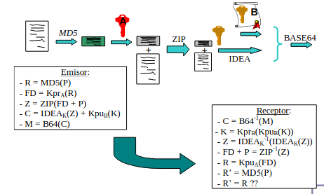

### 4.7.2.Transport security Layer

Estudiaremos _SSL_ pese a que ambos protocolos tienden a ser lo mismo, uno de ellos es la implementación de una empresa y otro es el que se ha estandarizado. De hecho, aunque pueden usarse para lo mismo, sus códigos no son compatibles.

En realidad, _SSL_ no es un protocolo sino una familia de protocolos:
1. __Handshake Protocol__: se encarga de negociar el algoritmo de cifrado, la función hash que se va a usar para la integridad, autenticar el servidor de autenticación con su certificado digital... Cabe recalcar que el cliente no se autentica y que a partir de esto el cliente genera la clave de sesión y habitualmente se usa _Diffie-Hellman_ para ello, pero tambíen pueden generarse aleatoriamente y pasarlas al servidor cifradas con la clave pública del mismo.
2. __Record Protocol__: se encarga de encapsular los protocolos y ofrece un canal seguro para la transimisión con privacidad, autenticación e integridad. Es un protocolo de registro(nombre que reciben los mensajes enviados por este protocolo) luego es el que permite mandar las cosas.
3. __Change Cipher Spec Protocol__: se encarga de notificar cambios en el cifrado.
4. __Assert Protocol__: informa sobre errores en la sesión.

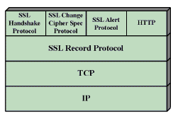

En este protocolo no hay debilidad frente a _man-in-the-middle_ pues mediante el certificado digital se autentican las claves mandadas por _Diffie-Hellman_ luego si un mensaje no viene autenticado el mensaje será rechazado.

### 4.7.3.IPSec

El objetivo de este protocolo es __garantizar autenticación, integridad y privacidad__ a nivel _IP_.

Este protocolo consiste en crear túneles unidireccionales donde los datos circulan cifrados. Con esto nos referimos a una conexión cerrada extremo a extremo donde solo los extremos pueden conocer la información mediante cifrado. Además, por si fuera poco, estos paquetes son encapsulados en otro paquete _IP_ para evitar la vulnerabilidad, es decir, podría asemejarse a meter un sobre dentro de otro sobre, al primero de todos se le puede tocar pero al interior no.

El hecho de que sean unidireccionales provoca que cuando se quiera conseguir una comunicación _pregunta-respuesta_ sean necesarios dos túneles; luego, es poco escalable.

A este problema se le añade el descontento de los más fieles a _IP_ con respecto al establecimiento previo de conexión con el extremo, ya que _IP_ no lo realiza e _IPSec_ requiere del mismo para poder implementarse.

Para este protocolo se usan tres procedimientos:
1. __Asociación de seguridad__: consiste en establecer una clave secreta mediante _Diffie-Hellman_ y _autenticación_ por certificados digitales. La identificación de los extremos se realiza mediante la _IP origen_ del mensaje y unparámetro de seguridad de 32 bits que llamaremos _Security Parameter Index_.
2. __Garantía de autenticación e integridad__: haciendo uso de _Cabeceras de autenticación_.
3. __Garantía de autenticación e integridad y privacidad__: haciendo uso de los protocolos de _Encapsulado de seguridad de la carga_.

Como se puede preveer, sólo se usará uno de dos útlimos procedimientos pue susarlos los dos sería redundante.

Independientemente de cual de los dos se use, _IPSec_ tiene dos modos de operación:
1. __Modo Transporte__: consiste en estableces una asociación _extremo-extremo_ entre el origen y el destino ya sea con seguridad o sin ella. Es decir, un túnel seguro o no seguro.
2. __Modo túnel__: consiste en delegar el _túnel_ entre dos servidores que dan acceso a redes locales cada uno; de esta manera, los clientes se comunican mediante los servidores para llegar a los clientes de la otra red.

Una desventaja del __modo túnel__ es que, aunque los servidores establezcan una comunicación segura, una vez que el paquete semueve por la red local vuelve a ser vulnerable a ataques.

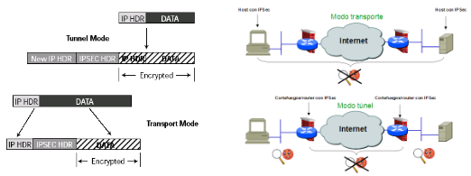
