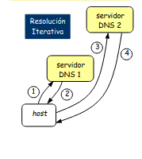
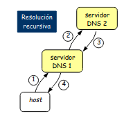
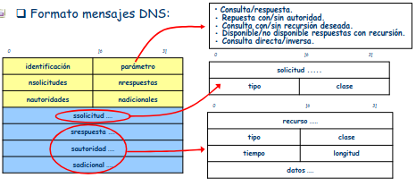
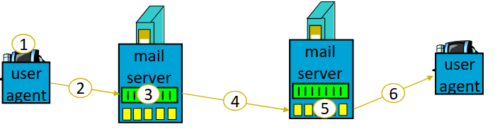
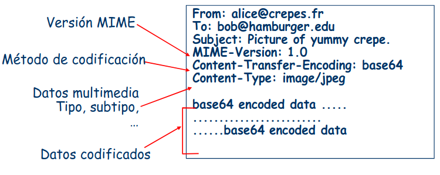
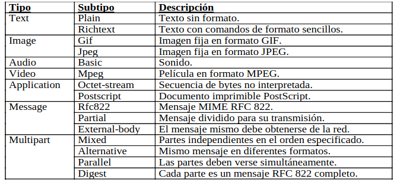
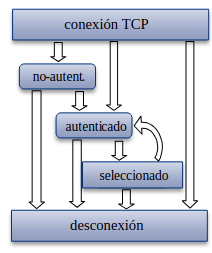
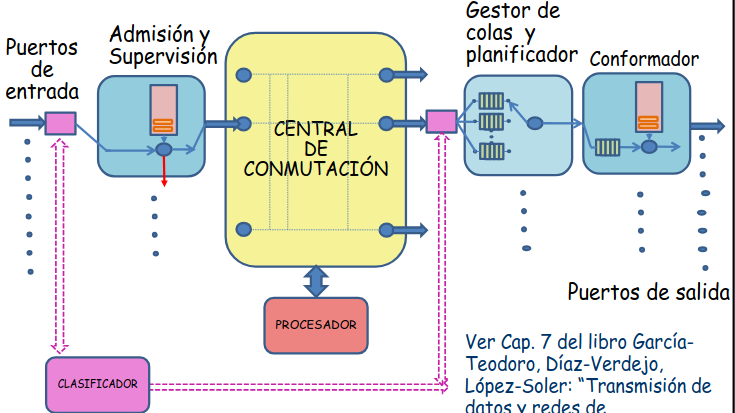

# 5. Capa de aplicación 

---
## Índice

1. [Introducción a las aplicaciones de red](#p1)
2. [Servicio de Nombres de Dominio](#DNS)
3. [Navegación WEB](#NWEB)
4. [El correo electrónico](#CE)
5. [Aplicaciones multimedia](#AM)

---

<a id='p1'></a>

## 5.1.Introducción a las aplicaciones de red

Como conocimiento inicial propongo examinar cómo están, hasta ahora, colocados los distintos protocolos que hemos ido citando y trabajando:


Trabajaremos bajo el modelo _cliente-servidor_ para estudiar el funcionamiento de las distintas aplicaciones de red; el motivo es claro, cualquier otro paradigma será una múltiple aplicación de este inicial.

El paradigma _cliente-servidor_ consiste en disponer de un proceso que será servidor, o de un servidor como tal, que siempre estarña en funcionamiento con una _IP pública_ que será permanente(al menos eso es lo habitual).

Para entender dónde y cómo se guardan los servidores, es necesario hablar un poco sobre __redes corporativas__ son aquellas formadas por varias subredes (grosso modo) que siguen la siguiente estructura:
- Un switch inicial o troncal que dará la conexión entre las demás subredes y la _granja de servidores_.
- Switches de nivel 3 que nacerán del switch troncal y servirán de reductores de busqueadas de _IPs_. Son capaces de resolver algunos problemas de la capa de red.
- Switches de nivel 2 que se conectan con estos de nivel 3, son de la capa de enlace y conectan ya con lo sdispositivos.
- Dispositivos de la red o clientes; funcionan de forma intermitente, pueden tener una _IP dinámica_, es decir, su _IP_ cambia tras un tiempo de no uso y además sera privada.

Como ya se ha comentado, en lugar de disponer los servidores en las localizaciones en las que vaya haciendo falta (surgirá el problema de mantenimiento no escalable de la red), se dispondrán todos en una localización específica llamda __granja de servidores__; esta granja se conecta sólo con el __switch troncal__ con el objetivo de mejorar las conexiones de manera que solo se debe ajustar bien este canal.

Bajo este paradigma no se contempla que los _clientes_ puedan comunicarse entre sí; no obstante, otros como _P2P_ o _publicador-subscriptor_ sí que hay comunicación entre ellos.

Lo más normal es que se siga la siguiente idea:

- El cliente inicia la comunicación enviando peticiones al servidor mediante la API socket(es un ejemplo que trabajamos nosotros pero se limita a la necesidad de cualquier API para poder comunicar el sistema operativo y la red).
- El servidor recibe peticiones de los clientes, las resuleve y manda las respuestas; para poder mandar las respuestas es necesario que los mensajes de petición dispongan de in identificador, en nuestro caso será una _IP_ y un _puerto_.


## 5.1.1.Intefaz socket

La definición de la interfaz ocket no es parte de ningún protocolo, hay dos implementaciones:
- Berkeley Soket Distribution.
- Winsock.
- Transport Layer Interface.

Nosotros nos centraremos en la implementación _BSD_.

Para nosotros, un _socket_ será un puntero(dirección de memoria) a una tabla donde se encuentran definidas las estructuras de posible uso de cada socket. Dichas tablas se encuentran en el sistema operativo y la estructura del socket está compuesta pro los siguientes campos:

- Familia: determina el tipo de _socket_ que se elige según el protocolo de red que se use; en caso de ser _TCP_ este campo tomará el valor _PF_INET_.
- Servicio: nos ayuda a determinar las operaciones que usemos para trabajar con los sockets, es decir, con esto decimos para qué necesitamos el socket.
- IP local: es lo mismo que $IP_{src}$
- IP remoto: es lo mismo que $IP_{dst}$
- Puerto local
- Puerto remoto

De la misma manrea, debido a la estructura que tiene, un _socket_  estará relacionado con alguna conexion, para lo cual hay tres tipos:
- TCP: donde disponemos de una conexión por el tipo de protocolo asicomo de la $IP_{src}, IP_{dst}, sport, dport$ para cada una de las conexiones.
- UDP: no disponemos de conexiones proporcionadas por el protocolo, luego no tendremos concepto de conexion, es decir, un _socket UDP_ nos permitirá mandar y recibir independeintemente del origen y destino.
- raw: son muy a bajo nivel y son útiles para poder conocer las cabeceras de los mensajes.

___Funciones posibles___

- Bind: se encarga de pedir al sistema operativo usar un determinado puerto, requiere el socket que usamos. Para determinar la dirección que queremos se sigue la estructura _sockaddr_in_ pero para _TCP_ suele usarse una estructura un tanto más compleja:

```
int bind (int socket, struct sockaddr *myaddr, int addresslen)

    struct sockaddr_in {        //INET socker addr info
        short sin_family;       //familia de aplicación: AF_INET
        u_short sin_port;       //puerto:16 bits
        struct in_addr sin_addr;//dir IP de 32 bits
        char sin_zero[8];       //no usada
    };

    struct in_addr{
        u_long s_addr;          //Dir IP de 32 bits
    }

```

En ocasiones, la codificación de la arquitectura de un cliente puede no ser la codificación de la red, es decir, un cliente podría usar codificación _big-endian_ mientras que la red podría estar usando _little-endian_. Para solucionar estos problemas se crearon las funciones:

- hton: convierte el orden de los bytes del hosts al orden de los bytes de la red.

```
hton(s/l)();
```

- ntoh: convierte el orden de los bytes de la red al orden de los bytes del hosts

```
ntoh(s/l)();
```

Siguiendo con las funciones más importantes disponemos de las siguientes:

- Connect: se encarga, dado un _socket_ ya creado, determina la dirección _IP_ de conexión y el puerto remoto.
    + Si el socket es 'SOCK_STREAM', connect comienza una conexión _TCP_ con el servidor exigiendo simultaneidad de los procesos(que los procesos se pongan de acuerdo apra ir a la vez).
    + Si el socket es 'SOCK_DGRAM', connect no comienza una conexión pues trabajaremos ocn _UDP_, sólo especificará la dirección _IP_ y el puerto remoto.

```
int connect(int socket, struct sockaddr *toaddr, int addresslen);
```

- Listen: se encarga de poner un socket en modo pasivo en el servidor y definir el número de solicitudes de conexión pendientes que se encolarán.

```
int listen(int sockfd, int maxwaiting);
```

- Accept: se encarga de deterner el flujo del programa y esperar hasta que llegue una solicitud de conexión en el servidor, devuelve un socet nuevo conectado para comunicarse con los clientes.

```
int accept (int sockfd, struct sockaddr *fromaddrptr, int *addresslen);
```
- Send(to): ambas funciones sirven para enviar datos, la primera de ellas se usa cuando al conexión ya estña iniciada mientras que la segunda se usa cuando no hay conexión.

```
int send(int sockfd, char* buff, int bufflen, int flags);
int sendto(int sockfd, char *buff, int bufflen, int flags, struct sockaddr *toaddrptr,int addresslen);
```

- Recieve(from): ambas surven apra recibir datos, la primera de ellas se usa cuando la conexión ya está iniciada mientras que la segunda cuando no hay conexión.

```
int recv (int sockfd, char *buff, int bufflen, int flags);
itn recvfrom(int sockfd, char *buff, int bufflen, int flags, struct sockaddr *fromaddrptr,int addresslen)
```

___Otras funciones de utilidad___

- read, write y variantes; sirven para enteder los sockets como ficheros.
- GetHostByName: consiste en una función donde dado un nombre de dominio, esta función nos devuelve la dirección _IP_ asociada.
- GetServByName: hace lo mismo que la anterior con el puerto y el protocolo usado.
- GetProtoByName: consiste en obtener el identificador del protocolo simplemente nombrando al mismo.

## 5.1.2.Tipos de servidores

Para clasificar los servidores hay dos clasificaciones:
- Orientación a conexión: los dividiremos en orientados y no orientados; un servidor será orientado a conexión cuando necesite establecer una conexión para poder realizar la comunicación. En el caso de ser orientado a conexión, para estabelcer las conexiones necesitará un __socket de control__ que recibirá las peticiones de comunicación para después usar un __socket de datos__ para realizar la comunicación en sí.
- Con respecto a la concurrencia:
    + Iterativos: cuando no puede atender dos peticiones de forma "simultánea", es decir, primero uno y luego otro.
    + Concurrentes: cuando puede antender más de una petición haciendo uso de la concurrencia.

___Iterativo no orientado a conexión___


Como es no orientado será _UDP_.

___Iterativo orientado a conexión___


Como es orientado será _TCP_.

___Concurrente orientado___


El funcionamiento del dibujo amarillo es el más sencillo, consiste en lo siguiente:
    - Para cada petición recibida se crea un nuevo proceso que resolverá la petición.
En el caso del dibujo azul, realmente no hay concurrencia, sino qeu el servidor se encarga de manejar varios _sockets_ de forma iterada; cuando hay algún cambio en uno de los _sockets_ se resuelve ese cambio. Lasventajas de esta forma más compleja son las siguientes:
+ No se crean procesos luego no necesitamos más memoria ni CPU.
+ Hay un único flujo de ejecución.

___Multiprotocolo___


En este caso, el servidor está pendiente de un _scoket_ que seguirá el protocolo _UDP_ y, por otra parte, de un conjunto de _sockets_ que servirán para el protocolo _TCP_.

___Multiservicio___

Simplemente se encargan de ofrecer múltiples servicios con concurrencia.


De aquí destacamos el __superservidor__(d); es similar al tipo (c) pero donde cada exclavo llama a un nuevo programa que será el que resolverá la petición. El tuperservidor no meneja protocolos sino que se encarga de estar pendiente de los puertos, luego abrirá un proceso por cada protocolo que necesite.

Como ventaja más importante, el superservidor no ejecuta los procesos, luego no debe abarcar todos los códigos que vayan a ser ejecutados.

## 5.1.3.Estimación de retardos

Para ello, usaremos la teoría de colas mediante un modelo $M/M/1...$ donde un retardo vendrá dado  por la sguiente expresión:

$$R=\frac{\lambda T_s²}{1-\lambda T_s}$$

donde $T_s$ es el tiempo de servicio que sigue un distribución exponencial y $\lambda$ representa el ratio de llegada de solicitudes.

## 5.1.4.Definición de una aplicación

Para definir una aplicación es necesario definir:
- Mensajes
    + Peticiones
    + Métodos
- Sintáxis, es decir, la definición y estructura de los campos en le mensaje; en aplicación, normalemnte serán orientados a texto. Como se dividen en campos, estos campos pueden ser de varios tipos:
    + Presentes y con tamaño fijo.
    + No siempre presentes y con tamaño variable; ene ste caso, inicialmente toman un tamaño para que, en la conexión, si se necesita más espacio se aumente de forma normal.
- Semántica; consiste en dar significado a los campos.
- Reglas; determinan los comportamientos de los procesos ante el envío y respuesta de mensajes.

Normalmente, las reglas se expresan como grafos o diagramas de estados.

Se usan distintos protocolos:
- De dominio público o propietarios
- En banda y fuera de banda.
    + En banda: usan el mismo puerto para la información de control y los datos.
    + Fuera de banda: usan puertos distintos para cada cosa.
- Stateless o state-full.
    + Stateless; realizan la respuesta independientemente del estado anterior, es decir, no guardan información del estado.
    + State-full; guarda información del estado anterior, de manera que la respuesta dependerá de dicho estado.
- Persistentes y no persistentes.
    + Persisitentes; para realizar acciones se usa siempre la misma conexión.
    + No persistente; para realizar acciones diferentes no se usa la misma conexión.

Por último, diremos que una aplicación no es elástica si la velocidad de transmisión es aproximadamente estable en un valor constante.

Como broche final de este punto, hablaremos un poco sobre las características de las aplicaciones:
- Tolerancia a pérdidas de datos: algunas lo pueden permitir, otras necesitan una tranferencia 100% fiable.
- Exigencia de requisitos temporales: Las aplicaciones que no sean elásticas requieren retardo acotado para que sean efectivas.
- Demanda de ancho de banda: algunas aplicaciones requieren un envío de datos a una tasa determinada, otras no.
- Nivel de seguridad: los requisitos de seguridad para las distintas aplicaciones son muy variables.

<a id='DNS'> </a>
## 5.2.Servicios de Nombres de Dominio

Un nombre de dominio no es más que un direccionamiento en la red sobre dominios y subdominios para llegar a una máquina.

Siendo "." el directorio raíz que nunca se suele poner pues se conoce y está gestionado por la _ICANN_, se impone la siguiente estructura para los _DNS_:

$$Machine.D_n.D_{n-1}.\ldots.D_1.$$

Donde $D_i$ es el dominio de nivel $i$ cumpliendo que $D_{i+1} \subset D_i$. Además, al dominio $D_1$ se le suele llamar _TLD_ o __dominio genérico__. 

### Dominios conocidos inicialmente

- .com: organizaciones comerciales
- .edu: instituciones educativas
- .gov: instituciones gubernamentales
- .mil: grupos militares
- .net: proveedores de Internet
- .org: organizaciones diversas diferentes a las anteriores
- .arpa: propósitos exclusivos de infraestructura de INternet
- .int: organizaciones establecidad por tratados internacionales entre gobiernos
- .xy: indicativos de la zona geográfica

### DNS es un protocolo

Realmente el srvicio _DNS_ es un protocolo de localización de servidores que realiza la traducción $IP \leftrightarrow DNS$ con el objetivo de facilitar las comunicaciones entre máquinas.

Para explicar el protocolo usaremos 3 niveles de servidores:
- Servidores raíz que hay 13 por todo el mundo y representan la parte inicial de Internet y pueden comunicarse con todos los demás servidores de bajos niveles al tener "Internet" una estructura de árbol de zonas.
- Servidores de dominio o _TLD_, son servidores que se encuentran en las zonas y comunican el servidor raíz y los servidores locales. En ocasiones, disponen de cachés donde guardan algunas traducciones para agilizar el proceso.
- Servidores locales, comunican las máquinas con los demás servidores, realmente toda la misión de conocer la traducción se delega en estos que realizarán todo lo posible por conocer dicha información.

Hemos citado las __zonas__, esto son dominios consecutivos que se le asignan a un servidor de _DNS_, se dividen en dos categorias:
- Servidor de autoridad; es el que contiene la base de datos con las correspondencias entre _URL_ e _IP_. En ocasiones podrá delegar en alguno de los hijos perdiendo autoridad sobre esa subzona. 
- Servidor de no autoridad; no necesariamente deben tener la respuesta sobre toda su zona, en ocasiones la tendrán cacheada y contestarán asumiendo el riego de no tenerla actualizada.

Además, hay dos posibles roles:
- Servidor primario, conoce todas las _IP's_ y su traducciones.
- Servidor secundario, no es capaz de almacenar las traducciones pero cuando se pone en marcha, solicita todas ellas al servidor primario.

Estas definiciones dan a entender que esta clasificación es de los servidores de autoridad aunque el profesor no tiene muy claro que sea así.

___Pasos del protocolo___

Cuando un _PC_ local realiza una petición sobre un _DNS_, esta petición se intenta resolver dentro del propio ordenador con un __resolutor local__; en caso de que no se conozca la traducción, y solo en ese caso, se delegará la solicitud al servidor local asociado al _PC_.

Una vez que ya se ha delegado en el servidor local, esta resolución puede hacerse de dos formas; pero siempre comenzarán solicitando la información al servidor raíz:
- __Iterativa__: con esta respuesta, el servidor local carga con todo el trabajo; cuando el servidor raíz da la respuesto sobre a quién tiene que redirigir la solicitud(pues el servior raíz conoce quién sabe qué cosas) el servidor local preguntará, hay dos opciones:
    + El servidor preguntado conoce la traducción, en cuyo caso hemos acabado.
    + El servidor preguntado conoce quién puede conocer la traducción, en cuyo caso se debe volver a preguntar.

Como podemos ver, este tipo de resolución es mucho más costoso para el servidor local pero mucho más ligero para el servidor raíz, que es el que maneja todo el flujo de la red.



- __Recursivo__: en este caso el servidor raíz no da la respuesta sobre quién hay que preguntar sino que devuelve la traducción directamente; cuando el servidor raíz recibe la petición, ocurre lo siguiente:
    + Localiza a quién de sus hijos(pensando en árboles) tiene que preguntar por la traducción.
    + La traducción queda relegada a dicho hijo que, si conoce la traducción la devuelve y si no la pide al hijo que puede conocerla. Esto se repite hasta que se sabe y todo vuelve al raíz.
    + Una vez que el raíz conoce la solución, la devuelve al solicitante.

Es claro que, este proceso es poco utilizado por la gran carga que provoca en el servidor raíz.



POr útlimo, cuando el servidor local tiene la traducción, se la envía a la máquina que la ha solicitado terminando el protocolo.

### Gestión de la base de datos DNS

Hasta ahora, hemos pensado que toda la información la tiene el servidor raíz, pero normalmente no es así sino que la base de datos está distribuida en una serie de servidores cooperativos que almacenan una parte de la misma; los llmaremos __BIND__.

De esta manera, cada _BIND_ es el encargado de una zona de la red, dicha zona contendrá una serie de nombres de dominio consecutivos de los que el _BIND_ contendrá toda la información.

Siguiendo con las características se cumple que:
- Debe haber, al menos, un servidor de autoridad por cada zona.
- En cada zona hay servidores primarios o secundarios.
- En cada solicitud pueden ocurrir las siguientes cosas:
    + Respuesta con autoridad, es decir, el servidor que responde a la solicitud tiene autoriada sobre la zona en la que se encuentra el nombre solicitado y devuelve la _IP_.
    + Respuesta sin autoridad, es decir, el servidor que responde no tiene autoridad sobre la zona en la que se encuentra el nombre solicitado, pero lo tiene en la caché.
    + No conoce respuesta, el servidor preguntará a otros servidores de alguna de las dos formas.
- Todo dominio de la red está asociado a, al menos, un registro __Resource Record__ que contiene una tupla con 5 campos:
    + Nombre del dominio: nombre del dominio al que se refiere el RR.
    + Tiempo de vida: tiempo de validez de un registro, está asociado a la caché.
    + Clase: en internet siempre toma el valor _IN_.
    + Tipo: denota ciertas características como si tiene autoridad(_SOA_), contiene un servidor de nombres(_NS_), define una dirección _IPv4_(_A_), define un servidor de correo electrónico(_MX_), define un "alias" para el _DNS_(_CNAME_), contiene información del tipo de máquina y sistema operativo(_HINFO_) o contiene información del dominio(_TXT_).
    + Valor: contenido que dependerá del valor del tipo.

### Mensajes DNS




<a id='NWEB'></a>
## 5.3.Navegación WEB

Una página web se define como un fichero _HTML_ formado por una serie de objetos como otrso ficheros(enlaces), imágenes, Java applets, ficheros de audio... Donde cada objeto se direcciona por una URL que tiene la siguiente estructura:


**(//(user(:password)@)dominio(:puerto)(/path)(/recurso)(?solicitud)(/\#fragment))**


Dichas páginas webs se rigen por le protocolo _HTTP_ mediante el modelo cliente servidor donde el cliente solicita, recibe y muestra los objetos en la red y el servidor se encarga de enviar los objetos web en respuesta a las peticiones.

### Clasificación

Las páginas webs se clasifican en dos tipos:
- Estáticas que son aquellas donde hay un archivo _HTML_ que se manda tal cual con un contenido invariable y tiene como inicio de _URL_ la subcadena "www".
- Dinámicas, que se pueden camuflar como estáticas usando redirección a estas mediante _URLs_ estáticas. Estas sí que pueden proporcionar contenido variable y tiene como inicio de _URL_ la subcadena "wpd". Este tipo de págians webs permiten:
    + Ejecutar scripts que cambien el contenido de la base de datos.
    + Permite usar lenguajes que cambien la página web según una entrada u otra
    + ...

Dichos scripts podrán ejecutarse en el servidor o en el cliente siendo más eficiente esta última pues retira carga del servidor.

### Características de HTTP

Aparecen enumeradas debajo:
- Usa los servicios de _TCP_ en el puerto 80.
- Es un servicio _stateless_ aunque veremos que se servirá de uso de _cookies_ para conseguir una simulación de los estados.
- Hay dos tipos d e servidores:
    + Persistentes: Permiten enviar múltiples objetos sobre una única conexión _TCP_ demanera que no se pierde tanto tiempo en establecer conexiones.
    + No persistentes: Para mandar cada objeto es necesario establecer una nueva conexión.

___Peticiones HTTP___

Normalmente reciben el nombre de métodos:
- _Request o get_, solitita un recurso(diap 58).
- _Response_, incluye un código de tres cifras aclarando el estado de la respuesta, la fecha de solitidu, el sevidor que responde, la última modificación, longitud del contenido(diap 59)... El código se rige por lo siguiente:
    + 1xx: significa que el mensaje es meramente informativo.
    + 2xx: significa _OK_.
    + \{4,5\}xx: significa _ERROR_.
    + 3xx: significa _EN CURSO_.

Los métodos más comunes son:
- _Options_: solicita información sobre las opciones disponibles.
- _Get_: se encarga de pedir una página y recibirla.
- _Head_: se encarga de pedir una página y devuelve la cabecera de la solicitud.
- _Post_: es una solicitud al servidor para que acepte y subordine a la _URL_ especificada, los datos incluidos en la solicitud.
- _Put_: solicita al servidor poder sobreescribir una página web.
- _Delete_: solicita al servidor borrar una _URL_ de la página web.

Estas dos últimas opciones no suelen permitirse.

___Cabeceras del protocolo___

Hay tres tipos que no se desarollarán en detalle, para ello, consultar las diapositivas:
- Atributos comunes para peticiones y respuestas:
    + Tipo de contenido: descripción MIME de la información contenida.
    + Tamaño del contenido (bytes).
    + Codificación del contenido.
    + fecha de la operación.
- Atributos específicos para peticiones del cliente:
    + Accept: lista de tipos MIME(recursos distintos a texto) que acepta el cliente.
    + Authorization: clave de acceso de un cliente para poder acceder a un recurso protegido.
    + From: opcional y contiene la dirección de correo electrónico del usuario.
    + If-Modified-Since: permite modificaciones condicionales.
    + Referer: URL del documento de ese enlace.
    + User-agent: tipo y versión del cliente.
- Atributos específicos de la respuesta del servidor _HTTP_:
    + Allow: lista de comandos opcionales que se pueden realizar.
    + Expires: fecha de expiración del objeto mandado.
    + Last-modified: decha local de modificación del objeto devuelto.


___Pasos del protocolo___

1. El cliente _HTTP_ solicita un objeto identificado por su _URL_.
2. EL cliente consulta al resolver el _DNS_ por la dirección _IP_ del recurso.
3. El _DNS_ contesta la _IP_ del servicio.
4. El ciente abre una conexión _TCP_ al puerto 80 de dicha _IP_.
5. El cliente manda una operación _GET_ junto con más información necesaria.
6. EL servidor responde mandando el fichero por la misma conexión _TCP_.
7. Si es persistente, se pueden seguir soliciando objetos.
8. Se cierra la conexión _TCP_ y se liberan lo srecursos del servidor.
9. El cliente es capaz de visualizar el contenido.

### Servidores caché

Los servidores caché son aquellos que se interponen en las conexiones, normalmente por zonas, que contiene un almacenamiento dinámico sobre aquellas páginas que ya se han buscado dentro de esta zona. 

De esta manera, si se pide otra vez alguna de las conocidas el servidor caché la enviará como respuesta.

En caso de que alguno de los objetos que contiene le servidor caché esté desactualizado no mandará  la respuesta al cliente (duda sobre qué hará).

### Cookies

Las __cookies__ son pequeños ficheros de texto que se intercambian los clientes y lso sevidores _HTTP_; realmente es un parche a los protocolos _stateless_ que les permiten guardar algunso estados.

Estos archivos son almacenados dentro de los clientes en lugares "remotos" que "solo" conoce el protocolo.

Siguen el siguiente proceso:
- Si es la primera vez que el usuario accede a un determinado documento de un servidor, el servidor proporciona una cookie que contiene datos que relacionarán posteriores operaciones.
- El cliente almacena la cookie en su sistema para usarla después. En los futuros accesos a este servido, el navegador podrá proprocionar la cookie original, que servirá de nexo entre este acceso y los anteriores.
- Todo este procesos se realiza aytomáticamente sin intervención del usuario.

Una de las aplicaciones más comunes son los __sistemas de compra electrónica___.

Todos estos campos de los que se ha hablado por los cuales se conserva dicho estado en una cookie se encian en una cabecera _Set-Cookie_ de manera que cuando se accede a una _URL_ que verifica el par dominio/path registrado, el cliente enciará automáticamente la información de los diferentes campos de la cookie con la nueva cabecera _HTTP Cookie_.

Es útil para restringir el acceso a recursos, no obstante no debemos olvidar que _HTTP_ no es un protocolo seguro; ya que es vulnerable a ataques por repetición.

<a id='CE'></a>
## 5.4.El correo electrónico

El correo electrónico es un servicio que todos conocemos y la mayoría usamos, consta de los siguientes elementos:
- _Mail User Agent_ o correo electrónico del cliente.
- _Mail Server_ o servidor de correo electrónico.
- Protocolo de envío que será _SMTP_ o _Simple mail Transfer Protocole_.
- Protocolos de descarga, como pueden ser _POP3_, _IMAP_ o _HTTP_.

El agente de usuario o _MUA_ es el encargado de componer, editar y leer mensajes de corro del buzón. Este solo se comunicará con su servidor _MS_ asociado, no con el destinatario. 

Mientras tanto, el _MS_ se encarga de reenviar los mensajes de los clientes y almacena los mesajes que debe de recibir su cliente.

___SMTP___

Este protocolo se basa en la ejecución de dos programas que están ambos incluidos en cada _MS_:
- __Cliente SMTP__: se ejecuta en el _MS_ que está enviando el correo.
- __Servidor SMTP__: se ejecuta en el _MS_ que está recibiendo el correo.

En definitiva todo el protocolo se basa en relegar en los _MS_; de manera que, cuando un cliente necesite mandar un correo, lo enviará a su _MS_ correspondiente con el objetivo de que este lo reenvíe al _MS_ del computador destino.

Una vez que un servidor recibe un correo, lo almacena hasta que su cliente asociado pide acceder a él, y es entonces y solo entonces cuando el _MS_ manda el mensaje al cliente.

Algunas otras características de _SMTP_ son:
- Se rige bajo _TCP_ en el puerto 25.
- Es un protocolo orientado a texto.
- Es un protocolo orientado a conexión, _in-band_ y _state-full_ implicando tres fases:
    + _Handshaking_.
    + _Transferencia de mensajes_.
    + Cierre.
- La interacción entre el cliente _SMTP_ y el servidor _SMTP_ se realiza mediante comandos(texto ASCII) o respuestas(código de estado y frases explicativas).
- Dispone de códigos de 3 cifras al igual que _HTTP_ para indicar el estado del mensaje o la transacción por al que se pregunte.

___Pasos del protocolo___

1. El usuario origen compone el mensaje dirigido a una dirección de correo con su _MUA_.
2. Se envía con _SMTP_ el mensaje al servidor _MS_ del usuario origen que lo sitúa en la cola de mensajes salientes.
3. El cliente _SMTP_ abre una conexión _TCP_ con el servidor de correo _MS_ del usuario destino.
4. El cliente envía el mensaje sobre la conexión _TCP_.
5. EL servidor de correo electrónico del usuario destino ubica el mensaje en el _mailbox_ del usuario destino.
6. El usuario destino, cuando esté activo pues no es necesario para iniciar la transacción, invoca su _MUA_ para leer el mensaje usando alguno de los protocolos(_POP3,IMAP o HTTP_).



__Nota__: Para ver algunos comandos de _SMTP_ podemos ver las diapositivas 78 y 79.

### Extensiones MIME

Las _MIME_ o _Multipurpose Internet Mail Protocol Extensions_ no cambian nada respecto a la arquitectura de correo anterior, sino que van encaminadas a que los correos puedan soportar:
- Texto en conjuntos de caracteres distintos de _US-ASCII_.
- Adjuntos que no son de tipo texto.
- Cuerpos de mensajes con múltiples partes.
- Información de encabezados con conjuntos de caracteres distintos de _ASCII_.

Es importante no confundir los mensajes del protocoloc onel formato de almacenamiento y para ello se proporciona la siguiente imagen sobre el formato de un correo:



Las extensiones _MIME_ proporcionan una serie de cabeceras en las que se encuentran los siguientes elementos:
- Versión de MIME: identifica la version de _MIME_ y si no existe se considera que el mensaje es texto normal en inglés.
- Descripción del contenido: es una cadena de texto que describe el contenido del mensaje, es necesaria para que el destinatario sepa si desea descodificar y leer el mensaje o no.
- _ID_ del contenido: es un identificador único que usa el mismo formato que la cabecera estándar _Message-ID_.
- _Content-Transfer-Encoding_: indica la manera en que está encuelto el cuerpo del mensaje para su transmisión, ya que podría haber porblemas con la mayoría de los caracteres distintos de texto. Hay 5 tipos de codificación.
- Tipo de contenido: especifica la naturaleza del cuerpo del mensaje. Muchos de los tipos de datos aparecen en la siguiente tabla:



Además de tipos de datos, se guarda el tipo de aplicación que es un tipo general para los formatos que requieren procesamiento externo no cubierto por ninguno de los otros tipos. No obstante, dentro de ellos hay subtipos, concretamente:
+ _Octet-stream_: es simplemente una secuencia de bytes no interpretacos, tal que a su recepción, un agente usuario debería presentarla en pantalla sugiriendo al usuario que se copien en un archivo y solicitando un nombre de archivo.
+ _Postscript_: se refiere a un lenguaje de _scritpting_. 

Otro tipo imporatante es el tipo de mensaje que permite qu eun mensaje esté encapsulado por completo dentro de otro. Este esquema es útil para reenviar correo electrónico. Hay tres subtipos:
+ _rfc822_: se usa para encapsular un mensaje _RFC 822_ completo en un mensaje exterior.
+ _partial_: permite dividir un mensaje encapsulado en pedazos y enviarlos por separado. Los parámetros hacen posible ensamblar correctamente todas las partes en el destino.
+ _external-body_: se usa para mensajes muy grandes donde simplemente se da una dirección de _FTP_ y el agente receptor puede obtenerlo de la red cuando quiera.

Otro tipo es el tipo _multipart_ que permite que un mensaje contenga más de una parte, con el comienzo y el din de cada parte bien delimitados. Como ya venía pasando, vemos los subtipos:
+ _mixed_. permite que cada parte sea diferente.
+ _alternative_: indica que cada parte contiene el mismo mensaje expresado en un medio o codificación diferente.
+ _parallel_: cuando todas las partes deben "verse" simutáneamente.
+ _digest_: es util cuando sejuntan muchos mensjaes en un mensaje compuesto.

### Protocolos de acceso

Como ya vimos anteriormente hay varios protocolos de acceso, de los cuales veremos algunos.

___POP3___

Es un protocolo que está pensado para trabajar en __local__, se encarga de descargar correos.

Cuando descarga un correo, lo almacena en un fichero del cliente y borra el correo dle servidor; básicamente, delega la responsabilidad de no perderlo en el cliente.

Dispone de tres fases de protocolo:
- __Autorización__: aquí el cliente se autentica con el _MS_ para poder acceder al correo; en caso de que las credenciales sean correctas se devolverá `+OK` y en otro caso `-ERR`.
- __Transacción__: en esta fase, el clietne selecciona los mensajes que quiere obtener y los que quiere borrar con los comandos `retr id` y `dele id`. Lo habitual es cada vez que se coge un correo, este se elimina.
- __Actualización__: se realiza después de la desconexión del cliente.

__Nota__: algunos de los comandos aparecen en la diapositiva 89, no obstante, el más importante es _NOOP_ pues muchos protocolos lo usan para mantener la conexión viva, ya que si pasa cierto tiempo _TCP_ cierra la conexión.

___IMAP4___

Es un protocolo que pese a trabajar con el correo como si fuese __local__ está pensado para trabajar en __remoto__.

Dispone de una serie de estados y dependiendo del estado en el que no s encontremos a nivel de aplicación podremos hacer unas cosas u otras.



1. Inicialemente, no sencontramos en el estado de _no autenticado_, en este estado podremos autenticarno o desconectarnos. Los comandos que podemos usar son:
    + LOGIN
    + AUTHENTICATE
2. Si nos hemos autenticado nos encontraremos en _autenticado_ donde podremos elegir un buzón y pasar a _seleccionado_ o desconectarnos. Los comandos que podemos usar son:
    + SELECT
    + CREATE
    + DELETE
    + LIST
    + ...
3. Si hemos pasado a _seleccionado_, podremos mandar una serie de mensajes u otros como por ejemplo _Capability, Noop o Logout_ que se pueden enviar siemrpe. Para pasar entre estados hay que mandar un cierto mensaje. Los comando que se pueden usar son:
    + CHECK
    + CLOSE
    + SEARCH
    + ...

Una forma muy útil de autenticar si el que ha recibido el correo es quien debe hacerlo podremos mirar si el campo _X-Original-To_ coincide cone l campo _Delivered-To_, es decir, el campo para el que se mandó en origen coincide con el campo que guarda quién lo ha conseguido.

Una desvetaja clara de _IMAP_ es que hay una cuota en el servidor referente al espacio máximo ocupado. Lo normal es qu elos correos no se borren inmediatamente, sino que se marcan con un flag de borrado y el servidor es el enecargado de borrarlos cuando quiere.

Ventajas de _IMAP_:
- Permite la organización en carpetas en ele lados dle servidor _MTA_.
- Mantiene información entre sesiones asociando flags a los mensajes.
- PErmite la descarga de partes de los mensajes.
- Permite acceder con varios clientes, esto tambień lo permite _POP_ pero no en modo descargar y guardar.

### WebMail

Consiste en cuando un cliente se conecta a un servidor web de correo. De manera que cuando el clietne se conecta, la parte intermedia de la conexión puede ser como nosotros queramos, incluso se puede enviar la información con _JSON_.

Preguntar funcionamiento.

Ventajas de _Web MAIL_:
- Dispone de una organización total en el servidor, es accesible desde cualquier cliente con _HTTP_.
- COn respecto a la seguridad, dispone de un uso extendido de _HTTPs_.

__Nota__: en la diapositiva 95 aparecen una serie de puertos importantes que debemos saber.

<a id='AM'></a>
## 5.5.Aplicaciones multimedia

En un inicio, trabajaban sobre _UDP_ por motivos de velocidad, pero ahora, como hay tanto ancho de banda pueden permitirse el uso de otros protocolos.

En cualquier caos, todolo lo que sea multimedia tiene asociado la __calidad de servicio__ que no es más que el hecho de que los datos tengan ciertos requisistos de retardo.

Realmente, _IP_ no estaba pensado para calidad de servicio (ni en su origen ni en la actualidad), ya que es un protocolo de __máximo esfuerzo__, es decir, intenta que todo llegue bien pero no lo garantiza.

Existen aplicaiones conversacionales, son aquellas que tienen unos requisitos de retardo estrictos, para que no sufra la conversación, es decir, pasado un tiempo si no ha llegado el mensaje puede que incluso se corte la conversación. No obstante las aplicaciones se dividen en tres tipos:
- De flujo de audio y vídeo almacenado, como las plataformas de _streaming_.
- De flujo de audio y vídeo en vivo, como twitch.
- De audio y vídeo interactivo, como Skype.

Las características fundamentales son:
- Disponen de un elevado ancho de banda.
- Son relativamente tolerantes ante pérdidas de datos, excepto las aplicaciones conversacionales como ya hemos dicho.
- Exigen _Delay_ acotado, en ocasiones este _delay_ es estricto.
- Exigen _Jitter_, es decir, fluctuación del retardo, acotado.
- Se pueden beneficiar del _multicast_ es decir, de realizar digfusiones, de hecho en eso están basadas las aplicaciones como twitch. Cabe recalcar que el _multicast_ solo se puede implementar por _UDP_ pues como _TCP_ es orientado a conexión debe conocer cuál es el destino.

Para entender el problema del _Jitter_, vamos a pensar en una comunicación con un retardo de 10 segundos cada vez que se manda un mensaje; este retardo se va acumulando lo que ocasiona que haya parones en la reproducción, por ejemplo cuando un vídeo se queda cargando. Estos parones es a lo que se conoce como _Jitter_.

### Calidad de servicio

Con respecto a la __calidad de servicio__(_QoS_), cuando disponemos de ella en un router, seremos capaces de establecer prioridades sobre unos paquetes sobre otros.

Un ejemplo de router que soporta calidad de servicio es el siguiente:



Dichos routers se componen de los siguientes elementos:
- Boca de entrada: es el puerto por el que llegan los mensajes.
- Control de admisión: sirve para dar garantías de calidad de servicio y no dejar pasar más flujo a partir de un momento dado.
- Central de conmutación: es útil para deciir por qué puerto se realiza rl encaminamiento, esto se encuentra en todos los routers. También está presente en los _switch_, donde el hardware es más rápido.
- Gestor de colas y planificador: es la única manera de que se garantice el retardo, es decir, es necesario que el ancho de banda llegue de alguna forma, básicamente que el flujo siga una estructura. Para ello se siguen los sigueintes conceptos:
    + Colas de prioridad: consisten en meter el tráfico en la cola que le corresponda para permitir esa prioridad entre paquetes. Normalmente, se usan prioridades estrictas impidiendo colisiones.
- Condormador de tráfico: garantiza que le flujo no agote todos los recursos.

Por ahora, solo sabemos tratar de impedir el retardo, pero en caso de que se produzca, cómo gestionamos que no ocurra _Jitter_. Para ello se usa el gestor de colas y planificaión donde si la cola se empueza a llenar, el retardo aumentará y se comenzarán a descartar paquetes. En definitiva se sigue la lógica de descartar aquellos paquetes que tengan un retardo superior a la cota establecida.

Veamos ahora el funcionamiento de la planificaión, es decir, si un flujo va a una cola u a otra. Para ello, se usa el campo _TOS_(_Type of Service_), es un campo de la cabecera _IP_; de manera que, cuando se tranmite un flujo hay alguien que dice que a ciertos flujos hay que darle un valor de _TOS_ para indicar que un paquete es de cierto tipo.

Realmente, los routers comunes no miran los _TOS_; pero, si hay algún router que use _QoS_, puede que permita estos campos.

Como añadido, hay algunos routers que dispnen de _WMM_ que tiene 4 tipos de prioridades: conversacional, vídeo, interactivo, best effort. COn esto podemos configurar nuestro router para que unos flujos tengan más prioridad que otros, pero es necesario identificar dichos flujos. Para ello, debe haber alguien que los marque, con lo que usamos el _TOS_ para marcar los paquetes.
