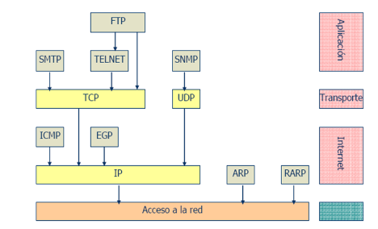
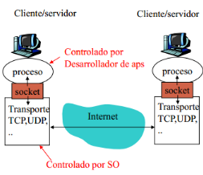
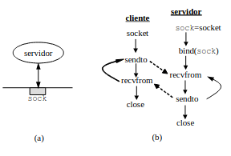
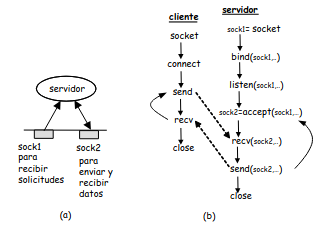
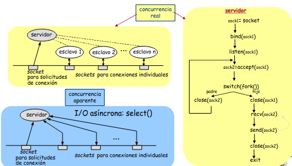
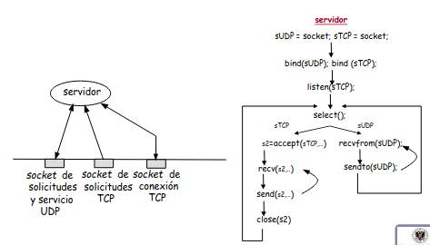
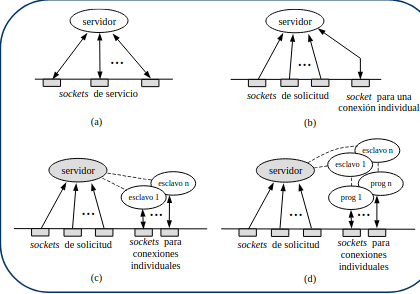

# 5. Capa de aplicación 

---
## Índice

1. [Introducción a las aplicaciones de red](#p1)

---

<a id='p1'></a>

## 5.1.Introducción a las aplicaciones de red

Como conocimiento inicial propongo examinar cómo están, hasta ahora, colocados los distintos protocolos que hemos ido citando y trabajando:



Trabajaremos bajo el modelo _cliente-servidor_ para estudiar el funcionamiento de las distintas aplicaciones de red; el motivo es claro, cualquier otro paradigma será una múltiple aplicación de este inicial.

El paradigma _cliente-servidor_ consiste en disponer de un proceso que será servidor, o de un servidor como tal, que siempre estarña en funcionamiento con una _IP pública_ que será permanente(al menos eso es lo habitual).

Para entender dónde y cómo se guardan los servidores, es necesario hablar un poco sobre __redes corporativas__ son aquellas formadas por varias subredes (grosso modo) que siguen la siguiente estructura:
- Un switch inicial o troncal que dará la conexión entre las demás subredes y la _granja de servidores_.
- Switches de nivel 3 que nacerán del switch troncal y servirán de reductores de busqueadas de _IPs_. Son capaces de resolver algunos problemas de la capa de red.
- Switches de nivel 2 que se conectan con estos de nivel 3, son de la capa de enlace y conectan ya con lo sdispositivos.
- Dispositivos de la red o clientes; funcionan de forma intermitente, pueden tener una _IP dinámica_, es decir, su _IP_ cambia tras un tiempo de no uso y además sera privada.

Como ya se ha comentado, en lugar de disponer los servidores en las localizaciones en las que vaya haciendo falta (surgirá el problema de mantenimiento no escalable de la red), se dispondrán todos en una localización específica llamda __granja de servidores__; esta granja se conecta sólo con el __switch troncal__ con el objetivo de mejorar las conexiones de manera que solo se debe ajustar bien este canal.

Bajo este paradigma no se contempla que los _clientes_ puedan comunicarse entre sí; no obstante, otros como _P2P_ o _publicador-subscriptor_ sí que hay comunicación entre ellos.

Lo más normal es que se siga la siguiente idea:

- El cliente inicia la comunicación enviando peticiones al servidor mediante la API socket(es un ejemplo que trabajamos nosotros pero se limita a la necesidad de cualquier API para poder comunicar el sistema operativo y la red).
- El servidor recibe peticiones de los clientes, las resuleve y manda las respuestas; para poder mandar las respuestas es necesario que los mensajes de petición dispongan de in identificador, en nuestro caso será una _IP_ y un _puerto_.



## 5.1.1.Intefaz socket

La definición de la interfaz ocket no es parte de ningún protocolo, hay dos implementaciones:
- Berkeley Soket Distribution.
- Winsock.
- Transport Layer Interface.

Nosotros nos centraremos en la implementación _BSD_.

Para nosotros, un _socket_ será un puntero(dirección de memoria) a una tabla donde se encuentran definidas las estructuras de posible uso de cada socket. Dichas tablas se encuentran en el sistema operativo y la estructura del socket está compuesta pro los siguientes campos:

- Familia: determina el tipo de _socket_ que se elige según el protocolo de red que se use; en caso de ser _TCP_ este campo tomará el valor _PF_INET_.
- Servicio: nos ayuda a determinar las operaciones que usemos para trabajar con los sockets, es decir, con esto decimos para qué necesitamos el socket.
- IP local: es lo mismo que $IP_{src}$
- IP remoto: es lo mismo que $IP_{dst}$
- Puerto local
- Puerto remoto

De la misma manrea, debido a la estructura que tiene, un _socket_  estará relacionado con alguna conexion, para lo cual hay tres tipos:
- TCP: donde disponemos de una conexión por el tipo de protocolo asicomo de la $IP_{src}, IP_{dst}, sport, dport$ para cada una de las conexiones.
- UDP: no disponemos de conexiones proporcionadas por el protocolo, luego no tendremos concepto de conexion, es decir, un _socket UDP_ nos permitirá mandar y recibir independeintemente del origen y destino.
- raw: son muy a bajo nivel y son útiles para poder conocer las cabeceras de los mensajes.

___Funciones posibles___

- Bind: se encarga de pedir al sistema operativo usar un determinado puerto, requiere el socket que usamos. Para determinar la dirección que queremos se sigue la estructura _sockaddr_in_ pero para _TCP_ suele usarse una estructura un tanto más compleja:

```
int bind (int socket, struct sockaddr *myaddr, int addresslen)

    struct sockaddr_in {        //INET socker addr info
        short sin_family;       //familia de aplicación: AF_INET
        u_short sin_port;       //puerto:16 bits
        struct in_addr sin_addr;//dir IP de 32 bits
        char sin_zero[8];       //no usada
    };

    struct in_addr{
        u_long s_addr;          //Dir IP de 32 bits
    }

```

En ocasiones, la codificación de la arquitectura de un cliente puede no ser la codificación de la red, es decir, un cliente podría usar codificación _big-endian_ mientras que la red podría estar usando _little-endian_. Para solucionar estos problemas se crearon las funciones:

- hton: convierte el orden de los bytes del hosts al orden de los bytes de la red.

```
hton(s/l)();
```

- ntoh: convierte el orden de los bytes de la red al orden de los bytes del hosts

```
ntoh(s/l)();
```

Siguiendo con las funciones más importantes disponemos de las siguientes:

- Connect: se encarga, dado un _socket_ ya creado, determina la dirección _IP_ de conexión y el puerto remoto.
    + Si el socket es 'SOCK_STREAM', connect comienza una conexión _TCP_ con el servidor exigiendo simultaneidad de los procesos(que los procesos se pongan de acuerdo apra ir a la vez).
    + Si el socket es 'SOCK_DGRAM', connect no comienza una conexión pues trabajaremos ocn _UDP_, sólo especificará la dirección _IP_ y el puerto remoto.

```
int connect(int socket, struct sockaddr *toaddr, int addresslen);
```

- Listen: se encarga de poner un socket en modo pasivo en el servidor y definir el número de solicitudes de conexión pendientes que se encolarán.

```
int listen(int sockfd, int maxwaiting);
```

- Accept: se encarga de deterner el flujo del programa y esperar hasta que llegue una solicitud de conexión en el servidor, devuelve un socet nuevo conectado para comunicarse con los clientes.

```
int accept (int sockfd, struct sockaddr *fromaddrptr, int *addresslen);
```
- Send(to): ambas funciones sirven para enviar datos, la primera de ellas se usa cuando al conexión ya estña iniciada mientras que la segunda se usa cuando no hay conexión.

```
int send(int sockfd, char* buff, int bufflen, int flags);
int sendto(int sockfd, char *buff, int bufflen, int flags, struct sockaddr *toaddrptr,int addresslen);
```

- Recieve(from): ambas surven apra recibir datos, la primera de ellas se usa cuando la conexión ya está iniciada mientras que la segunda cuando no hay conexión.

```
int recv (int sockfd, char *buff, int bufflen, int flags);
itn recvfrom(int sockfd, char *buff, int bufflen, int flags, struct sockaddr *fromaddrptr,int addresslen)
```

___Otras funciones de utilidad___

- read, write y variantes; sirven para enteder los sockets como ficheros.
- GetHostByName: consiste en una función donde dado un nombre de dominio, esta función nos devuelve la dirección _IP_ asociada.
- GetServByName: hace lo mismo que la anterior con el puerto y el protocolo usado.
- GetProtoByName: consiste en obtener el identificador del protocolo simplemente nombrando al mismo.

## 5.1.2.Tipos de servidores

Para clasificar los servidores hay dos clasificaciones:
- Orientación a conexión: los dividiremos en orientados y no orientados; un servidor será orientado a conexión cuando necesite establecer una conexión para poder realizar la comunicación. En el caso de ser orientado a conexión, para estabelcer las conexiones necesitará un __socket de control__ que recibirá las peticiones de comunicación para después usar un __socket de datos__ para realizar la comunicación en sí.
- Con respecto a la concurrencia:
    + Iterativos: cuando no puede atender dos peticiones de forma "simultánea", es decir, primero uno y luego otro.
    + Concurrentes: cuando puede antender más de una petición haciendo uso de la concurrencia.

___Iterativo no orientado a conexión___



Como es no orientado será _UDP_.

___Iterativo orientado a conexión___



Como es orientado será _TCP_.

___Concurrente orientado___



El funcionamiento del dibujo amarillo es el más sencillo, consiste en lo siguiente:
    - Para cada petición recibida se crea un nuevo proceso que resolverá la petición.
En el caso del dibujo azul, realmente no hay concurrencia, sino qeu el servidor se encarga de manejar varios _sockets_ de forma iterada; cuando hay algún cambio en uno de los _sockets_ se resuelve ese cambio. Lasventajas de esta forma más compleja son las siguientes:
+ No se crean procesos luego no necesitamos más memoria ni CPU.
+ Hay un único flujo de ejecución.

___Multiprotocolo___



En este caso, el servidor está pendiente de un _scoket_ que seguirá el protocolo _UDP_ y, por otra parte, de un conjunto de _sockets_ que servirán para el protocolo _TCP_.

___Multiservicio___

Simplemente se encargan de ofrecer múltiples servicios con concurrencia.



De aquí destacamos el __superservidor__(d); es similar al tipo (c) pero donde cada exclavo llama a un nuevo programa que será el que resolverá la petición. El tuperservidor no meneja protocolos sino que se encarga de estar pendiente de los puertos, luego abrirá un proceso por cada protocolo que necesite.

Como ventaja más importante, el superservidor no ejecuta los procesos, luego no debe abarcar todos los códigos que vayan a ser ejecutados.

## 5.1.3.Estimación de retardos

Para ello, usaremos la teoría de colas mediante un modelo $M/M/1...$ donde un retardo vendrá dado  por la sguiente expresión:

$$R=\fraq{\lambda T_s²}{1-\lambda T_s}$$

donde $T_s$ es el tiempo de servicio que sigue un distribución exponencial y $\lambda$ representa el ratio de llegada de solicitudes.

## 5.1.4.Definición de una aplicación

Para definir una aplicación es necesario definir:
- Mensajes
    + Peticiones
    + Métodos
- Sintáxis, es decir, la definición y estructura de los campos en le mensaje; en aplicación, normalemnte serán orientados a texto. Como se dividen en campos, estos campos pueden ser de varios tipos:
    + Presentes y con tamaño fijo.
    + No siempre presentes y con tamaño variable; ene ste caso, inicialmente toman un tamaño para que, en la conexión, si se necesita más espacio se aumente de forma normal.
- Semántica; consiste en dar significado a los campos.
- Reglas; determinan los comportamientos de los procesos ante el envío y respuesta de mensajes.

Normalmente, las reglas se expresan como grafos o diagramas de estados.

Se usan distintos protocolos:
- De dominio público o propietarios
- En banda y fuera de banda.
    + En banda: usan el mismo puerto para la información de control y los datos.
    + Fuera de banda: usan puertos distintos para cada cosa.
- Stateless o state-full.
    + Stateless; realizan la respuesta independientemente del estado anterior, es decir, no guardan información del estado.
    + State-full; guarda información del estado anterior, de manera que la respuesta dependerá de dicho estado.
- Persistentes y no persistentes.
    + Persisitentes; para realizar acciones se usa siempre la misma conexión.
    + No persistente; para realizar acciones diferentes no se usa la misma conexión.

Por último, diremos que una aplicación no es elástica si la velocidad de transmisión es aproximadamente estable en un valor constante.

