# 2.Autómatas finitos y expresiones regulares

Como motivación a la hora de estudiar un autómata finito, vamos a ver parte de su importacia:

    · Es útil como software de diseño y verficación de circuitos digitales.
    · Tiene un papel importante en la construcción de analizadores léxicos de compiladores; como veremos pueden usarse en la comprobación léxica de palabras de un lenguaje.
    · Añadido a lo anterior, se usa como software de análisis de grandes conjuntos de textos con el fin de buscar palabras, estructuras...
    · En la corrección de sistemas con un número finito de estados diferentes juegan un papel importante.

## 2.1.Autómata finito determinista.

Si buscamos una intuición, no es más que un "aparato" que sigue una secuencia finita de estados buscando llegar a un estado de fin. Este no tiene memoria, es decir, cumple la propiedad de __pérdida de memoria__ luego será útil en la comprobación de que una palabra pertenezca o no a un lenguaje de tipo 3. 

*Definición*:
Un autómata finito es una cuádrupla $M=(Q,A,\delta,q_0,F)$ donde $Q$ es un conjunto finito llamado _conjunto de estados_, $A$ es un alfabeto llamado _alfabeto de entrada_, $\delta$ es una aplicación que parte del conjunto $(QxA)$ donde a cada dupla le asigna otro estado, $q_0$ es un estado conocido como _inicial_ y; por último, $F$ es un subconjunto de estados llamado _estados finales_.

De forma más intuitiva, cuando nosotros recibimos una palabra, para comprobar que pertenece al lenguaje, partimos de la palabra al completo y el estado inicial. 
A partir de aqui, buscamos aplicar $\delta$ tantas veces como sea posible de manera que, mientras estemos en un estado válido y no estemos en un estado final, seguiremos aplicando $\delta$. 
En ocasiones llegaremos a un estado de error; en estos casos, diremos que la palabra no pertenece al lenguaje generado por el autómata.

*Definición*:
Dado un _autómata de estados finitos determinista_, definimos el **lenguaje generado por el autómata** como el conjunto de palabras generadas por el alfabeto del autómata y que él mismo da por válidas, lo denotaremos $L(M)$ donde $M$ es el autómata.

___Diagrama de Transición___

Para que trabajar con autómatas sea más sencillo, usaremos __diagramas de transición__ que son grafos donde; cada nodo representa un estado, cada arco del grafo representa la aplicación $\delta(q,a)=p$ donde $q,p$ son estados y $a$ una palabra y los estados finales estarán rodeadas por dos cículos como en la imagen.

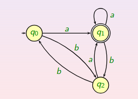

Veamos ahora algunas notaciones que nos ayudarán a agilizar el proceso de cálculo. Dado un autómata $M=(Q,A,\delta,q_0,F)$:

*Definiciones*:

Definimos la __descripción instantánea__ como la dupla $(q,a)$ donde $a$ no es una letra, sino una palabra del alfabeto $A$.

Definimos la __configuración incial__ como, dada una palabra cualquiera, la dupla formada por dicha palabra y el estado inicial.

Definimos la __relación de paso de cálculo__ entre dos configuraciones como:
                $((q,au)\vdash(p,u)\leftrightarrow\delta(q,a)=p)$

Donde repetimos los elementos que ya conocemos y $a\in A^\*$

En caso de querer escribir que partiendo de una configuración llegamos a otra en una cantidad finita de pasos, usaremos el símbolo $\Vdash$ (en clase se usa $\vdash$ con un asterisco en la parte superior). 
A su vez, se puede usar $\delta^\*(p,u)=q$ para representar lo ya definido. Esto útlimo tiene las propiedades:

Si $q \in Q$:

i) $\delta^\*(q,\epsilon)=q$

ii) $\delta^\*(q,au)=\delta^\*(\delta(q,a),u)$

Gracias a esto último, ya podemos dar una definición alternativa de __lenguaje aceptado por un autómata__ como:

$$L(M)=\{u \in A^\* : \delta^\*(q_0,u) \in F\}$$

Como añadido, para facilitar la comprensión, diremos que el autómata finito es __determinista__ si y sólo si, para cada estado del grafo están determinados todos los pasos de cálculo.

## 2.2. Autómatas finitos no deterministas

Un autómata finito no determinista(AFND) es una quíntupla $M = (Q,A,\delta,q_0,F)$ donde los elementos son los mismos que con los autómatas finitos deterministas y la única diferencia está en el codominio de $\delta$ que en este caso es $P(Q)$.

De forma intuitiva, son aquellos autómatas finitos donde existen pasos de cálculo cuyo estado resultante no esta determinado. Es decir, dependiendo de cómo se den los pasos posibles en un camino de decisiones del autómata, se dará un resultado u otro; de hecho, lo más normal es que haciendo dos imágenes de los mismos datos se obtengan distintos resultados. 

Estos tipos de autómatas presentan algoritmos fáciles pero que no se pueden programar debido a que no está determinada la decisión que se toma en cada caso. En caso de necesitar una implementación, se suelen implementar con algoritmos de búsqueda que aumentan su eficiencia pero permiten que se obtenga un programa determinista.

De forma gráfica, podemos intuir que un diagrama de estados finitos es un autómata no determinista cuando dado un estado junto a sus entradas, existen dos entradas que producen dos estados distintos; por ejemplo, en la imagen de abajo, vemos que frente a la dupla $(q_0,0)$ hay dos posibles resultados: $q_1$ o $q_0$. 

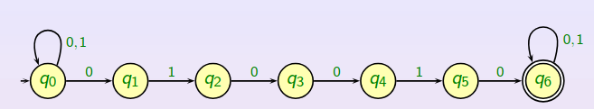

Otra característica que se ve en la imagen es que puede darse el caso en el que, a partir de una entrada y en un estado, no dispongamos de estado siguiente como ocurre con $\delta(q_2,1)$.

Dada una palabra de un lenguaje, diremos que la palabra es aceptada por el autómata cuando existe algún camino de elecciones posibles de manera que, al acabar la ejecución, se ha leído toda la palabra y acabamos en un estado final. Cabe recalcar que basta con que exista uno y sólo uno. De la misma manera, diremos que una palabra es rechazada cuando no existe ningún camino por el cual la palabra resultaría aceptada.

En definitiva, el autómata finito no determinista se rige por lo siguiente: "Si la respuesta a la comprobación es __sí__, puede que en algún momento diga __sí__; pero si la respuesta es __no__, siempre dirá __no__."

Hay ocasiones donde puede ser útil disponer de un estado de error, es decir, de un estado en el cual una vez dentro ya no podremos salir notificando así que hay un error. En el ejemplo inferior se muestra este estado de error, que en ocasiones puede albergar a todos los estados que no están definidos evitando así cualquier ambigüedad.

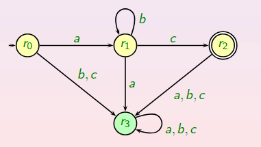

### 2.2.1.Proceso de cálculo

Sea $M=(Q,A,\delta,q_0,F)$ un autómata finito no determinista, damos algunas definiciones:

__Descripción instantánea__

La descripción instantánea no es más que un elemento de $QxA^\*$ denotado por $(q,u)$. Básicamente es la representación del estado en el que nos encontramos en un momento de cálculo determinado.

__Configuración inicial__

Dado un estado $u \in A^\*$ su configuración inicial consiste en simular cómo comenzaría el proceso de comprobación de pertenencia a un lenguaje de la palabra $u$, es decir, $(q_0,u)$.

__Relación paso de cálculo__

La relación de paso de cálculo entre dos configuraciones instantáneas viene denotada por: $((q,au)\vdash(p,u))\leftrightarrow p \in \delta(q,a)$.

Donde cabe recalcar que dada una configuración cualquiera, $\delta(q,v) \in P(Q)$ quiere decir que $\delta(q,v)$ es un conjunto finito de estados, luego se puede pasar a varias configuraciones distintas en un paso de cálculo, e incluso a ninguna. Esto se solucionará con el _paso nulo_.

__Relación de cálculo__

Una vez visto lo anterior, esto solo consiste en generalizar y englobar todo el proceso de cálculo en una operación, pues sabemos que el proceso de cálculo no es más que una sucesión finita de pasos de cálculo.

Diremos que $((q,u)\Vdash(p,v)) \leftrightarrow \exists \{C_i\} | C_i \in QxA^\* \land C_0=(q,u), C_n=(p,v) \forall i \leq n-1, C_i \vdash C_{i+1}$.

___Lenguaje Aceptado por un AFND___

Definimos este lenguaje como el conjunto de palabras que adminten alguna sucesión de configuraciones y pasos de cálculo que dan a la palabra como aceptada. Es decir, el lenguaje aceptado por un _AFND_ como: $L(M) =$ \{ $u \in A^\* : \exists q \in F, (q_0,u)\Vdash(q,\epsilon)$ \}.

### 2.2.2.Función de Estado: Lenguaje Aceptado

Siguiendo con el autómara _M_ definimos $\delta^\*$ de la siguiente forma:

i) Si $B \subseteq Q$, $\delta^\*(B,a) = \cup_{q\in B}\delta(q,a)$; es decir la unión de todos los estados a los que podemos llegar partiendo desde cualquier estado de $B$ y la palabra $a$.

ii)Si $B \subseteq Q$:
    
    · La relación de cálculo de cada estado de B con la palabra vacía es el propio B pues no hemos cambiado nada.
    · La relación de cálculo de palabras concatenadas es la relación de cálculo con una de las subcadenas con la relación de cálculo de la otra subcadena con cualquier estado.

iii) Se cumple que $\delta^\*(q,u)=\delta^\*($ \{ $q$ \} $,u)$

De esta manera, es inmediato comprobar que $L(M)=\{u \in A^\* : \delta^\*(q_0,u)\cap F \neq \emptyset\}$

## 2.3.Equivalencia entre Deterministas y No Deterministas

La enquivalencia en sí consiste en que un lenguaje _L_ puede ser aceptado por una autómata finito determinista si y sólo si _L_ puede ser aceptado por un autómata finito no determinista.

Veamos la implicación hacia la derecha; es decir, que todo lenguaje aceptado por un autómata determinista es aceptado por un autómata no determinista. Esto tiene fácil comprobación pues considerando que todos los autómatas deterministas son también autómatas no deterministas, en los que $\delta(q,a)$ tiene siempre un sólo estado posible. Ambos autómatas tienen el mismo cálculo asociado y aceptan el mismo lenguaje; además, tienen el mismo diagrama de transición asocioado.

Así, si un lenguaje _L_ es aceptado por un autómata determinista es aceptado también por un autómata no determinista: aquel que tiene le mismo diagrama.

Veamos ahora la otra implicación; es decir, todo lenguaje _L_ aceptado por un autómata no determinista es aceptado también por un autómata deteminista. 

Para probarlo simplemente definimos el autómata determinista asociado tomando por $Q=P(Q)$, $q_0=\{q_0\}$, $\delta(B,a)=\delta^\*(B,a)$ (la unión de todos los posibles estados resultantes al aplicar delta a un estado de _B_) y $F=\{B \in P(Q) | B\cap F \neq \emptyset\}$.

Luego la idea básica es que dado un autómata no determinista le hacemos corresponder uno determinista que recorre todos los caminos al mismo tiempo.

## 2.4.Autómatas finitos no deterministas con transiciones nulas

Este apartado completo se resume diciendo que añadimos una posible transición que no produzca ningún cambio, simplemente de un estado sin ninguna palabra podemos pasar a otro con una palabra. esto se puede usar para aumentar el número de caminos posibles que pueda tomar el autómata no determinista.

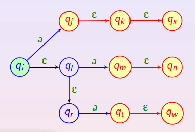

Otra utilidad puede ser unir dos lenguajes luego un mismo autómata puede reconocer dos lenguajes implementando así el lenguaje unión.

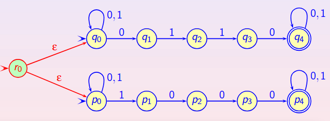

Cabe recalcar que gracias a los pasos nulos podemos avanzar de estado, si el autómata lo permite, y seguir comprobando la misma palabra

___Lenguaje aceptado por un AFND con transiciones nulas___

El lenguaje que tratamos de definir claramente contiene al definido en los _AFND_ pues viene definido de la siguiente manera: $L(M)= \{u \in A^\* : \exists q \in F, (q_0,u)\Vdash(q,\epsilon)\}$

### 2.4.1.Función de estados

Comenzamos con una definición; dado un _AFND con transiciones nulas_, definimos la __Clausura de un estado q__ como la sucesión de estados tales que empezando por _q_ podemos volver a llegar a ellos; es decir, $Cl(q)=\{p : \exists p_1,...,p_n, p_1=q,p_n=p,  p_i \in \delta(p_{i-1},\epsilon) i=2,...,n\}$.

Definimos, ahora sí la función de estados $\delta^\*$ (abuso de notación) como la conocíamos en los _AFND_ tomando como imágenes las clausuras, es decir, $\delta^\*(B,a)$ será la clausura de la unión y $\delta^\*(B,\epsilon) = Cl(B)$.

De hecho, es inmediato comprobar que el lenguaje aceptado por un _AFND con transiciones nulas_ se puede expresar como: $L(M)=\{u\in A^\* : \delta ^\*(q_0,u)\cap F \neq \emptyset\}$.

Veamos ahora que todo _AFD_ es equivalente a un _AFND con transiciones nulas_. Para ello veremos promero la implicación a la derecha:

Buscamos probar ahora que, dado un autómata finito determinista _M_, existe un autómata finito no determinista con transiciones nulas $M'$ que acepta el mismo lenguaje.

_Proof_: Es inmediato pues _M'_ sería un autómata en el que para cada símbolo del alfabeto de entrada hay siempre una opción y para cada estado $\delta(q,\epsilon)=\emptyset$.

Veamos ahora la otra implicación, es decir, que dado un autómata finito no determinista con transiciones nulas _M_, existe otro determinista _M'_ que acepta el mismo lenguaje.

_Proof_: Para esto, la idea intuitiva se basa en construir _M'_ como en el caso de la construcción de un autómata determinista a partir de uno no determinista donde los estados de _M'_ son subconjuntos del conjunto _Q_ de estados de _M_ y un estado $P \subset Q$ de _M'_ representa todos los estados a los que se puede llegar del autómata no determinista con transiciones nulas _M_.

Como ejemplo veamos esta ilustración:

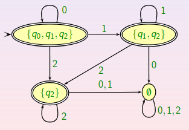

Realizando un comentario sobre el ejemplo, el estaado inicial no es $[q_0]$ (se usarían llaves pero md no deja), sino $Cl(q_0)$; es decir, todos los estados a los que se puede llegar usando transiciones nulas.

Tras esto, actuamos de la misma manera que con un _AFND_ generando los estados restantes, teniendo en cuenta las transiciones nulas que podamos usar.
Veamos la construcción formal de un autómata determinista a partir de un autómata finito no determinista con transiciones nulas. Para ello, tomamos $M=(Q,A,\delta,q_0,F)$ como _AFND con transiciones nulas_ y construimos $M'=(Q',A,\delta',q_0',F')$ donde:
    
i) Q'=P(Q)

ii) $\delta'(P,a)=\delta^\*(P,a)=Cl(\cup_{q\in P}\delta(q,a))$

iii) $q_0'=Cl(q_0)$

iv) $F'={P : P\cap F \neq \emptyset}$

Tenemos ahora que _M'_ acepta el mismo lenguaje que _M_.

## 2.5.Expresiones regulares

Sea _A_ un alfabeto, una __expresión regular__ sobre este alfabeto se define de la siguiente forma:

    · Si el conjunto vacío es una expresión regular, este denota el lenguaje vacío.
    · La palabra vacía como expresión regular representa el lenguaje cuyo único elemento es esta palabra
    · Si un elemento del alfabeto es una expresión regular, esta denota el lenguaje cuyo único elemento es ese elemento del alfabeto.
    · La suma de expresiones regulares que denotan un lenguaje está expresada por la operación suma y representa la unión de ambos lenguajes.
    · La concatenación de expresiones regulares que denotan un lenguajes está expresada por la operación multiplicación y representa la concatenación de ambos lenguajes.
    · La clausura de expresiones regulares que denotan un lenguajes está expresada por la operación potencia y representa la potencia del lenguaje.

Un ejemplo de expresión regular es la que denota al conjunto de palabras que empiezan por la cadena _000_ y tales que esta subcadena sólo se encuentra al principio de la palabra

$$Expresión = (000)(1+10+100)^\*$$

Normalmente, cuando deseamos trabajar ocn expresione regulares, deseamos hacerlo con las expresiones más sencillas posibles; para ello, se utilizan las reglas de simplificación que aparecen en la imagen inferior:

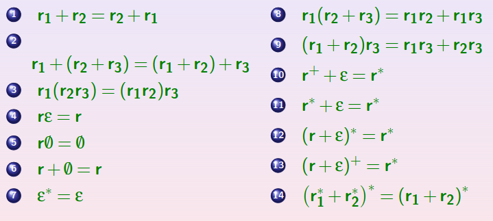

En las diapositivas, aparecen algunas cuestiones de verdadero o falso que merece la pena mirar, en este caso, debido a que sería muy repetitivo no aparecen en el archivo.

### 2.5.1.Equivalencia entre autómatas y expresiones regulares

En este apartado vamos a probar que todo lenguaje determinado por una gramática tipo 3 es el lenguaje determinado por alguna expresión regular y que coincide con el lenguaje aceptado por un autómata.

_Enunciado_: Un lenguaje es aceptado por un autómata finito determinista si y sólo si puede representarse mediante una expresión regular.

_Proof_: Esto se demostrará comprobando:

    · Dada una expresión regular, existe un autómata que acepta el mismo lenguaje que el representado por la expresión regular.
    · Dado un autómata finito existe siempre una expresión regular que represeenta el lenguaje aceptado por el autómata.

La primera transformación es más útil ya que inicialmente los lenguajes se representan mediante expresiones regulares y después necesitamos algoritmos (autómatas) que reconozcan stos lenguajes.

Veamos la primera implicación; para ello, bastará con construir dicho autómata, empezaremos dando las reglas para las cadenas más simples:

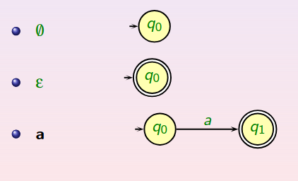

Ahora, veremos cómo crear __autómatas compuestos__, dando lugar a que un mismo autómata acepte varios lenguajes:

    · Unión (r+s): Simplemente consistirá en tomar transiciones nulas partiendo de un nuevo estado inicial y llegando a cada uno de los estados iniciales de los lenguajes R y S.

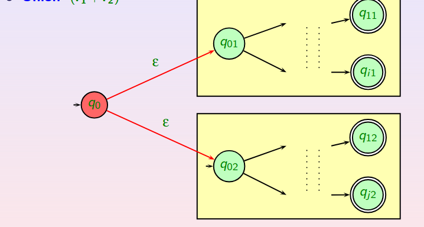

    · Concatenación (rs): Consiste en llevar, mediante transiciones nulas, cada uno de los estados finales del lenguaje R al estado inicial del lenguaje S perdiendo así la propiedad final de los estados "finales" de R.

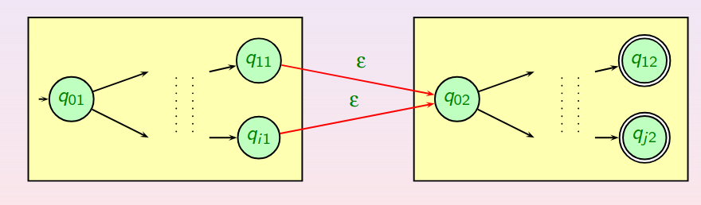

    · Clausura (r*): La clausura no es más que concatenar varias veces la misma palabra, luego de forma lógica bastará con encadenar mediante transiciones nulas los estados finales del autómata con el estado inicial. No obstante, esto no es así porque estaríamos impidiendo la creación de la propia cadena vacía, elemento que debe aparecer en el lenguaje. Para ello, añadiremos un nuevo estado final que permita dicha creación.

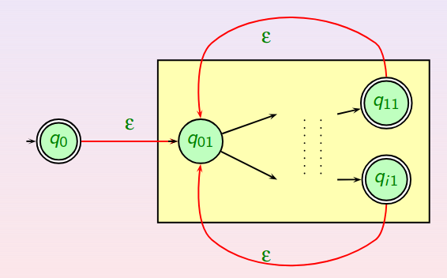

_Nota_: Todos estos casos disponen de una representación matemática construyendo cada uno de los elementos del autómata; en este caso, dicha tarea se deja al lector (puede ver las diapositivas).

Veamos ahora la implicación contraria; para ello, sea el autómata $M=(Q,A,\delta,q_1,F)$ donde $Q=\{q_1,q_2,...,q_n\}$ y $q_1$ el estado inicial. 

Sea ahora $R_{ij}^k$ el conjunto de las cadenas de $A^\*$ que permiten pasar del estado $q_i$ al estado $q_j$ y no pasa por ningún estado intermedio de numeración mayor que $k$; cabe recalcar que $q_i$ y $q_j$ sí pueden tener numeración mayor que $k$.

De la misma manera, diremos que una palabra $u=(a_1...a_m) \in R_{ij}^k$ si y solo si todo estado $q_{ij}=\delta^\*(q_i,a_1...a_l)$ donde $1 \leq l \leq m-1$ es tal que $i_l \leq k$.

Para definir el cálculo de cada $R_{ij}^k$ realizaremos una pequeña inducción:

i) Para el caso de $k=0$ vemos que el cálculo es el siquiente: 

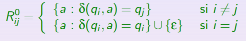

ii) VIsto para $k=0$ y suponiendo que lo sabemos para $k-1$ vamos a ver el cálculo para $k \in N$. Claramente, se ve que está compuesto de dos tipos de palabras:
    
    · Palabras que para ir del estado i al estado j no pasan por el estado k, luego pertenecen al conjunto de k-1.
    · Palabras que para ir del estado i al estado j sí pasan por el estado k.

En definitiva, vemos que una palabra del lenguaje está compuesta de tres partes; las palabras que van del estado _i_ al estado _k_ sin pasar por el estado _k_, es decir $x \in R_{ik}^{k-1}$, las palabras que permanecen en el estado _k_, es decir, $y \in R_{kk}^{k-1}$, y las palabras que parten del estado _k_ y llegan al estado _j_ sin pasar por el estado _k_, es decir, $z \in R_{kj}^{k-1}. 

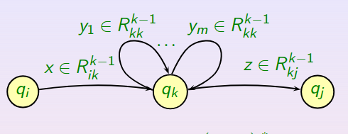

Luego, como la palabra $y_1...y_m \in (R_{kk}^{k-1})^\*$; entonces la palabra completa está en

$$R{ik}^{k-1}(R_{kk}^{k-1})^\*R_{kj}^{k-1}$$

Luego uniendo las dos partes obtenemos que:

$$R_{ij}^k=R_{ij}^{k-1} \cup R{ik}^{k-1}(R_{kk}^{k-1})^\*R_{kj}^{k-1}$$

Necesitamos ahora determinar la __expresión regular asociada__ a $R_{ij}^k$ que denotaremos por $r_{ij}^k$. Procedemos de nuevo por inducción:

Para $k=0$ es inmediato:

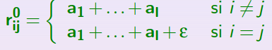

donde $\{a_1,...,a_l\}$ es el conjunto $\{a : \delta(q_i,a)=q_j\}$. Si este conjunto es vacío, la expresión regular sería:

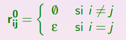

Veamos ahora que pasa para $k \in N$ sabiendo lo que pasa para $k-1$. La expresión regular siguietdo la expresión de los lenguajes sería:

$$r{ik}^{k-1}(r_{kk}^{k-1})i^\*r_{kj}^{k-1}$$

Por último determinamos la __expresión regular del lenguaje aceptado por el autómata__ que no sería otra cosa que:

$$L(M)=\cup_{q_j\in F}R_{1j}^n$$

Por tanto, $L(M)$ viene denotado por la expresión regular $r_{1j_1}^n+...+r_{1j_k}^n$ donde $F=\{q_{j_1},...,q_{j_k}\}$ y $q_1$ es el estado inicial.

Como ejemplo, dejamos al lector que obtenga las expresiones regulares determinadas por el siguiente autómata siguiendo la fórmula descrita y las simplificaciones de expresiones regulares:

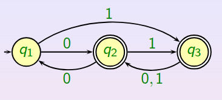

### 2.5.1.Método alternativo

Veamos ahora un método alternativo para el mismo resultado; este método se basa en la reslución de sistemas de ecuaciones donde la idea fundamental consiste en imponer una condición por cada estado del autómata. Como cada estado será una incógnita, obtenemos que habrá tantas ecuaciones como estados disponga el autómata.

___Ecuación de Expresiones Regulares___

Si $r_1,...,r_n$ son variables representando expresiones regulares, una ecuación para la expreseión regular $r_i$ es una expresión de la forma:

$$r_i = \alpha_i+\beta_{i1}r_1+...+\beta_{in}r_n$$

donde $\alpha_i$, $\beta_{i1}$, $\beta_{in}$ son expresiones regulares concretas.

No obstante para poder aplicar __sustitución__ en el sistema de ecuaciones resultante es necesario que la expresión regular $r_i$ esté despejada en su ecuación correspondiente. Para ello, si ya lo está podemos sustituir en todas las demás y reducir el máximo posible; en caso contrario, deberemos usar el _Lema de Arden_.

___Lema de Arden___

Dada una ecuación de la forma  $r_i = \alpha_i+\beta r_i$ donde $\alpha_i$ es la parte de la ecuación que no contiene $r_i$ y $\beta$ es el coeficiente que acompaña a la incógnita, que no debe contener la cadena vacía, se tiene que la solución de esta ecuación viene dada por:

$$r_i=\beta^\*\alpha_i$$

Luego una vez que hayamos aplicado este lema si es necesario, podremos continuar con nuestro cometido.

Cabe recalcar que, para cada estado del autómata habrá una ecuación determinada donde cada sumando será cada uno de los estados a los que puede llegar el estado inicial mediante una relación de cálculo; en caso de que el estado de partida sea final se sumará una cadena vacía, $\epsilon$.

Como el objetivo es __determinar la expresión regular del lenguaje aceptado por un autómata__, deberemos proporcionar la expresión resultante del estado inicial del autómata pues en esta técnica realizamos una construcción a la inversa empezando por los estados más fáciles y llegando a estados más importantes y complicados.

Es importante denotar que no es necesario disponer de un _AFD_ para poder aplicar este método de obtención de expresiones regulares; simplemente, es posible con un _AFND_ siempre y cuando no sea un _AFND_ con transiciones nulas. El único inconveniente será que habrá más de una solución.

## 2.6 Expresiones Regulares en Unix

Seguiremos el estándar IEEE POSIX:

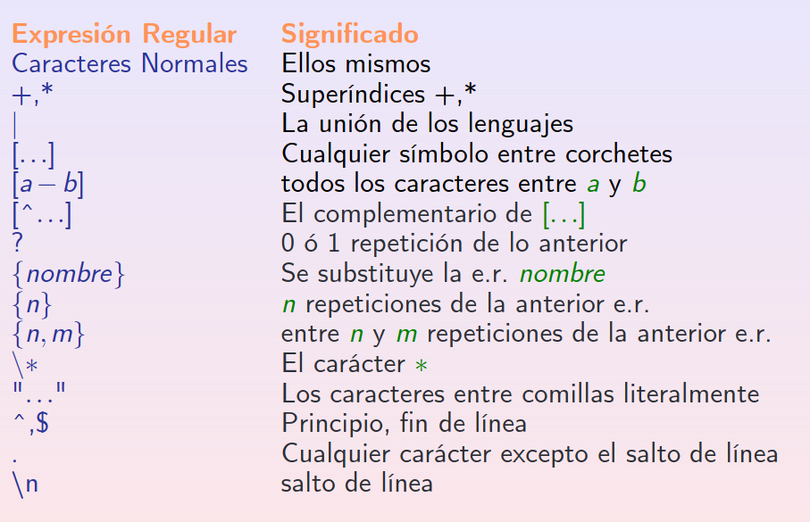

## 2.7.Equivalencia entre Gramáticas lineales y autómatas

Para no complicar el tema, vamos a obviar la notación matemática y simplemente diremos que, para demostrar que dada una gramatica lineal existe un autómata finito determinista que acepta el lenguaje aceptado por la gramática; que será construido a través del _AFND_ con transiciones nulas que acepta dicho lenguaje usando luego la _clausura de Kleene_ para construir el _AFD_.

Para hacer el proceso inverso, es decir, a partir de un _AFD_ obtener la gramática lineal por la derecha simplemente debemos tomar como variables los estados y tomar como producciones las reglas del tipo:

$$p\rightarrow aq$$

Donde p y q son estados, es decir, variables y "a" es la palabra leída. En definitiva, estamos representados todas y cada una de las transiciones.

Si queremos obtener la gramática lineal a la izquierda, deberemos invertir el autómata, construir la gramática lineal por la derecha como se dice arriba e invertir __sólo__ la parte derecha de las producciones.

___Pero... ¿qué es invertir?___

Invertir un autómata en el grafo del mismo consiste en revertir estado final e inicial (el estado final deberá ser único) y revertir el sentido de las flechas.

De esta manera, comenzamos a leer por atrás construyendo las palabras desde el final. De ahí viene la lógica de que el estado inicial pase a ser el final y el final a ser el inicial, pues cuando lleguemos al antiguo estado inicial habremos creado toda la palabra.

___Proceso de inversión___

Los pasos son los siguientes:
    
    1. Si disponemos del autómata:
        
        - Invertimos el autómata.
        - Obtenemos la gramatica lineal por la derecha.
        - Invertimos la parte derecha de las producciones.

    2. Si disponemos de la gramatica lineal por la derecha

        - Obtenemos el autómata.
        - Volvemos al paso 1.

Hasta ahora llevamos demostrado el siguiente esquema:

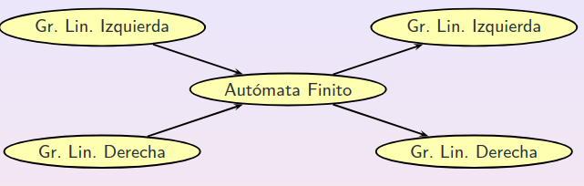

___Obtener el lenguaje inverso___

Esto se consigue, dado un _AFND_ que acepta el lenguaje, simplemente debemos tratar de dejar un sólo estado final para poder determinar un sólo estado inicial intercambiándolo con el final único que hemos conseguido y, por último, invertir las transiciones.

De esta manera hemos conseguido un _AFND_ que acepta el lenguaje inverso. 

___Obtener el lenguaje complementario___

Como curiosidad, para obtener el lenguaje complementario, debemos cambiar los estados finales por no finales y viceversa, pero no invertir el autómata; haciendo este proceso habrá ocasiones donde nos saldrá el estado de error, es algo natural pues estaremos impidiendo que se acepten las palabras del lenguaje de partida.

___Consejo práctico___

Si nos dan una gramática lineal por la izquierda y nos piden obtener el _AFND_ asociado; deberemos seguir los siguientes pasos:
    
    1. Invertir la parte derecha de las producciones.
    2. Construir el autómara con transiciones nulas.
    3. Para cada estado, pensar en lo que lee el autómata desde el principio.

 

Si nos dan directamente la gramática lineal por la derecha pasamos directamente al paso 2.
