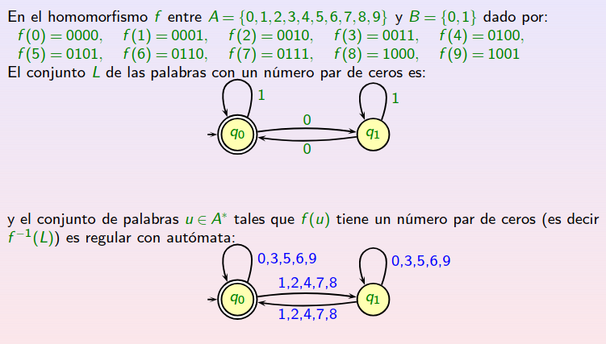
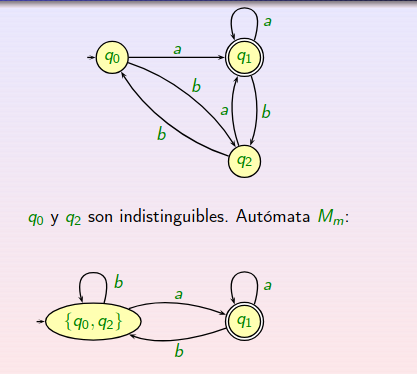
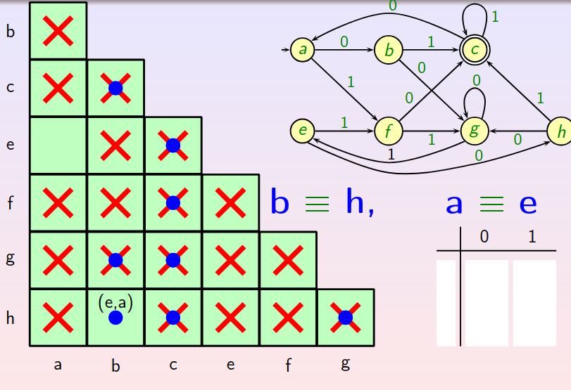
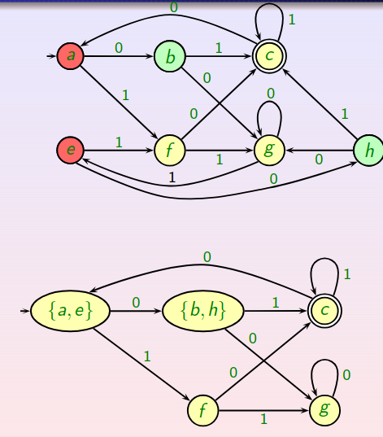

# 3.Propiedades de los Conjuntos Regulares

Diremos que un conjunto es __regular__ cuando todos sus elemenots se pueden formar mediante las operaciones de __unión__,__concatenación__ y __cierre__; además, cada uno de estos conjuntos tendrá asociada una __expresión regular__.

Como añadido, el __conjunto vacío__ se considera conjunto regular.

## 3.1.Lema de Bombeo

Sea $L$ un conjunto regular, entonces _existe_ un $n \in N$ tal que $\forall z \in L$, si $|z| \geq n$, entonces $z$ se puede expresar de la forma $z = uvw$ donde:

i) $|uv|\leq n$

ii) $|v| \geq 1$

iii) $uv^iw \in L \forall i \geq 0$

además $n$ puede ser el número de estados de cualquier autómata que acepte el lenguaje.

_Demostración_

Sea $M=(Q,A,\delta,q_0,F)$ un _AFD_ que acepta el lenguaje $L$ y $n$ su número de estados. SUpongamos qeue $z\in L|z=a_1a_2...a_m$ con $m \geq n$. 

Sabemos que $M$ acepta el lenguaje $L$ luego al leer $z$ en $M$ debemos llegar a un estado final. 

Tomando ahora $z'=a_1a_2...a_n$, la palabra formada por los $n$ primeros símbolos de $z$, y considerando el vecotr de estados $(q_{i0},q_{i1},...,q_{in})$ donde $q_{ij}$ es el estado al que llegamos al leer el estado $q_{ij-1}$ con el símbolo $a_j$.

Nosotros sabemos que el autómata dispone de $n$ estados distintos y el vector dispone de $n+1$ estados; luego, alguno de ellos se debe repetir. Vamos a suponer que se repiten $q_{ik}=q_{il}$.

Entonces, la descomposición de $z$ se haría en las siguientes componentes:

$$u=a_1a_2...a_k, v=a_{k+1}...a_l, w=a_{l+1}...a_m$$

Donde claramente, al pasar por $v$ estamos repitiendo $l-k+1$ veces el mismo estado obteniendo un _ciclo_; como $M$ acepta $L$ tenemos que al acabar de leer $z$ también deberá acabar de leer la palabra $uv^iw$; y por tanto, $uv^iw \in L$.

_Fin demostración_

De forma intuitiva, buscaremos encontrar una palabra que tenga una longitud mayor que el número de estados que el autómata que acepta el lenguaje para tratr de desmostrar que el lenguaje __no__ es regular.

De hecho, este lema nos proporciona una condición __necesaria__ pero __no suficiente__ que debe cumplir un lenguaje para ser regular. En ocasiones, el lenguaje podrá no ser regular y cumplir la condición para el lema de Bombeo para algún $n$.

Cuando busquemos probar que un lenguaje $L$ es regular deberemos proporcionar la gramática regular que genera el lenguaje, el autómata o la expresión regular asociada el lenguaje pero __nunca__ lo probaremos haciendo uso del lema de Bombeo.

Es fácil ver que, si el lenguaje es finito, la condición del lema es trivialmente cierta pues vbasta tomar $n=max{|u| | u\in L}$ luego no existen palabras de longitud mayor que $n$ consiguiendo que sea trivialmente cierta.

### 3.1.1.Un lenguaje no es regular

La idea que perseguimos para demostrar que un lenguaje no es regular, es tratar de encontrar una palabra del lenguaje que, tras repetir un número de veces una subcadena que se encuentra en los $n$ primeros símbolos, la palabra deja de pertenecer al lenguaje.

Formalemente, lo que buscatemos probar es lo siguiente: $\forall n \in N$, existe una palabra $z \in L | |z|\geq n$ cumpliendo que para toda composición $z=uvw$; si se verifican i) y ii) entonces

$$\exists i\in N | uv^iw \notin L$$

Debe quedar muy claro que el __Lema de Bombeo__ es una condición necesaria pero no suficiente; para ello, tomamos como contraejemplo $L=\{a^lb^jc^k : (l=0)\lor (j=k)\}$ que verifica la condición del lema para $n=2$ tomando $l=0$ ó $j=k$ ($u=\epsilon$,$v=$primer símbolo de z y $w=$ resto palabra).

### 3.2.Operaciones de los conjuntos regulares

Las operaciones con conjuntos de las que hablaremos son cerradas para el conjunto de los conjuntos regulares, es decir, el lenguaje resultante de la operación es también un lenguaje tegular; estas operaciones son la __unión__, la __concatenación__, la __clausura de Kleene__, la __diferencia simétrica__(y por consecuencia la __intersección__), el __lenguaje inverso__ y el __cociente__ entre otras. 

Para probar que son cerradas puede hacerse mediante dos algoritmos; el primero de ellos consiste en trabajar con _AFD_ y realizar las operaciones que se vieron en el tema anterior ya que se mantendrá el autçomata finito determinista. El segundo algoritmo consistirá en trabajar con las _expresiones regulares_ de cada lenguaje y aplicarle las operaciones extrapoladas a dichas expresiones.

Otra operación que se cumple es que la imagen por un __homomorfismo__ de un lenguaje regular es también regular pues, si entendemos que un homorfismo no es más que una codificación de nuestro lenguaje, al ser una aplicación cerrada para la concatenación obtenemos claramente que la expresión regular de la codificación es la expresión regular de origen con cada símbolo codificado concatenado con la codificación del siguiente. 

En definitiva, basta con codificar la expresión regular para obtener que la imagen por el homomorfismo es regular.

Esta última propiedad puede usarse para probar que un lenguaje es, o no, regular pues aplicando un homomorfismo podemos llevar nuestro lenguaje a otro lenguaje conocido que sea, o no, regular pues la inversa de un homomorfismo es un homomorfismo.

Para deducir como obtener el lenguaje imagen del homomorfismo inverso dejo por aquí un ejemplo, que simplemente consiste en copiar el autómata del lenguaje imagen, poniendo en cada transición  uno de los elementos que se consiguen al aplicar el autómata del lemguaje imagen a la codificación:

___Cociente___

Hablemos un poco más del lenguaje cociente con un teorema:

_Teorema_

Si $R$ es un conjunto regular y $L$ es un lenguaje cualquiera, entonces el cociente de lenguajes $R/L=\{u\in A^\* : \exists v \in L \land uv \in R \}$ es un conjunto regular.

_Fin Teorema_

El autómata resultados del cociente es aquel con la misma estructura que $R$ con la ligera diferencia de que los estados finales son aquellos a partir de los cuales podemos leer una palabra de $L$ llegando a un estado final.

El problema real reside en definir cómo leer el lenguaje $L$ pues es un lenguaje cualquiera, de forma general sólo podemos trabajar con graáticas tipo 0 luego no podemos encentrar un algoritmo que haga este cometido tan fácil. 

De hecho, aunque se restrinja $L$ al conjunto de los lenguajes recursivamente enumerables no podemos decidirlo (implementarlo con un algoritmo).

## 3.3.Algoritmos

En este apartado vamos a conocer una serie de algoritmos que nos van a permitir identificar ciertas propiedades entre autómatas como __aceptar el mismo lenguaje__, __lenguaje vacío es el aceptado__, __el autómata minimal__...

Comencemos con el __lenguaje vacío es el aceptado__:

Para ello, deberemos eliminar los estados inaccesibles siguiendo un recorrido por el grafo a partir del estado final; entendemos por estados inaccesibles aquellos que, al leer una palabra, es imposible llegar a ellos; y comprobar finalmente si quedan estados finales. 

De forma parecida se puede determinar si el lenguaje aceptado es __finito__ o __infinito__; para ello, suponemos eliminados los estados inaccesibles y los estados de error o aquellos desde los que no se puede llegar a estados finales. Por último, si quedan ciclos en el grafo entonces el lenguaje es infinito.

Continuamos con __aceptar el mismo lenguaje__:

Para ello, sean $L_1$, $L_2$ dos lenguajes aceptados por los autómatas finitos deterministas $M_1$, $M_2$, respectivamente. Buscamos ver que $L_1\equiv L_2$. 

Siguiendo la lógica de conjuntos, sabemos que la igualdad entre conjuntos se puede comprobar gracias a las diferencias simétricas; de manera que, si la unión de ambas diferencias simétricas es vacía entonces los dos conjuntos son el mismo.

Esto se consigue haciendo el autómata que acepta el lenguaje dado por el conjunto

$$(L_1-L_2) \cup (L_2-L_1)$$

y donde tomamos aquellas palabras que están en $L_1$ pero no en $L_2$ y las que complen la propiedad contraria.

Para construir el autómata que acepta este lenguaje, es mucho más fácil partiendo del autóma producto de $M_1$ y $M_2$ tomando como estados finales aquellos donde __sólo__ uno de la pareja de estados sea final.

## 3.4.Autómata minimal

De forma intuitiva, conocemos que un conjunto de elementos que cumple una propiedad es __minimal__ si es el más pequeño de todos los que cumplen esa pripiedad y se verifica que cumple esa propiedad.

Extrapolando esto a autómatas, diremos que un autómata es el __autómata minimal__ que acepta un lenguaje cuando no exista otro con menor número de estados y que acepte el lenguaje.

Para que unautómata sea minimal debe cumplir las siguientes condiciones:
    
    - No tener estados inaccesibles.
    - No tener estados indistinguibles.
    - Aceptar el lenguaje del cual buscamos probar que es minimal.

### 3.4.1.Estados indistinguibles

Hablando sobre las condiciones ha aparecido el concepto de __indistinguibilidad__ entre estados de un autómata; esto no es más que ver que dos estados de un mismo autómata representan el mimso papel. 

De forma más formal, sean _p_ y _q_ dos estados de un autómata finito determinista, diremos que _p_ y _q_ son indistinguibles cuando $\forall u \in A^\*$,$\delta^\*(p,u) \in F \Longleftrightarrow \delta^\*(q,u) \in F$.

Es decir, cuando dada una palabra del alfabeto, llegar a un estado final desde un estado equivale a llegar a un estado final desde el otro estado y viceversa.

No obstante, tratar de localizarlos por la definición es un proceso tedioso, esto es así porque debemos probar con todas las palabras del lenguaje, que normalmente, será infinito.

Diremos por otro lado que dos estados de un autómata son __distinguibles__ cuando no sean __indistinguibles__, es decir: 

$$\exists u \in A^\* | \delta^\*(p,u) \in F \lor \delta^\*(q,u) \in F$$

Donde la expresión lógica " $\lor$ " representa una relación exclusiva.

___Relación de indistinguibilidad___

La relación de indistinguibilidad es una relación de equivalencia, es decir, es reflexiva, simétrica y transitiva.

La demostración de dichas propiedades es trivial y se deja al lector. Gracias a que esta relación es de equivalencia podemos partir el conjunto de estados $Q$ en clases de equivalencia donde para cada estado $q \in Q$, su clase de equivalencia está compuesta por todos los estado que son indistinguibles del mismo. 

Equivalentemente, si hay dos estados indistinguibles, pertenecen a la misma clase de equivalencia.

Veamos algunas propiedades de esta relación de equivalencia:

    - Un estado final y un estado no final serán siempre distinguibles; basta tomar la palabra vacía, que al leerla nos quedamos en el mismo estado, y ver que desde el no final llegamos a un no final y desde el final llegamos a un final.
    - Si tomando un símbolo terminal del lenguaje y aplicando la relación de paso de cálculo llegamos a estados distinguibles, entonces los estados desde los que aplicamos la relación de paso de cálculo son distinguibles. El contrarrecíproco es cierto con indistinguibilidades.
    - Ocurre lo mismo que antes tomando la relación de cálculo *.

### 3.4.2.Autómata que agrupa estados indistinguibles

Dado un autómata finito determinista $M$ buscamos el autómata finito determinista que agrupa a todos los estados indistinguibles; para ello, debemos localizarlos y tomar las clases de equivalencia donde definimos la siguiente relación de paso de cálculo:

$$\delta(\[p\],a)=\[\delta(p,a)\]$$

De forma coloquial, consistirá en tomar como estados las clases de equivalencia, como estados finales aquellas clases de equivalencia donde, al menos uno de los estados incluidos sea final, la relación paso de cálculo definida arriba y como estado inicial, la clase de equivalencia que contiene al estado inicial.

Cabe destacar que, todos los estados que están incluidos en la clase de equivalencia de los estados finales son estados finales por la propiedad 1 de la relación de indistinquibilidad.

Veamos un ejemplo:

Este autómata cumple las siguientes propiedades:
    
    - Ya no dispone de estados indistinguibles pues si los hubiera tendrían la misma clase de equivalencia.
    - El autómata sin estados indistinguibles y el autómata inicial aceptan el mismo lenguaje.

_Demostración de la segunda propiedad_

Usando que $\delta^\*(\[p\],u)=\[\delta^\*(p,u)\]$ podemos deducir que despues de leer $u \in A^\*$ desde $q_0$, el autómata inicial llegará a $\delta^\*(q_0,u)$ mientras que si el autómata sin estados indistinguibles hace los mismo con clases de quivalencia llegamos a $\[\delta^\*(q_0,u)\]$. 

De esta manera, $\[\delta^\*(q_0,u)\] \in F_m \Longleftrightarrow \delta^\*(q_0,u)\in F$ de donde se deduce que aceptan el mismo lenguaje.

### 3.4.3.Minimización de autómatas

___Teorema___

Si $M(Q,A,\delta,q_0,F)$ y $M'(Q',A',\delta',q_0',F')$ aceptan el mismo lenguaje y $u,v\in A^\*$ son tales que $\delta^\*(q_o,u)=\delta^\*(q_o,v)$ entonces $q_i'=(\delta')^\*(q_0',u)$ y $q_j'=(\delta')^\*(q_0,v)$ son estados indistinguibles en $M'$.

_Demostración_

Sea $z\in A$ son estados indistinguibles en $M'$.

_Demostración_

Sea $z\in A^\*$ entonces:

$$\delta^\*(q_0,uz)=\delta^\*(delta^\*(q_0,u),z)=\delta^\*(\delta^\*(q_0,v),z)=\delta^\*(q_0,vz)$$

Por tanto, $uz \in L(M) \Longleftrightarrow vz \in L(M)$ y como $L(M)=L(M')$ entonces $uz \in L(M')  \Longleftrightarrow vz \in L(M')$.
 
Equivalentemente:

$$\delta'^{\*}(q_0',uz) \in F' \Longleftrightarrow \delta'^{\*}(q_0',vz) \in F'$$ 

Como $\delta'^{\*}(q_0',uz) = \delta'^{\*}(\delta'^{\*}(q_0',u),z)=\delta'^{\*}(q_i',z)$ y  $\delta'^{\*}(q_0',vz) = \delta'^{\*}(\delta'^\*(q_0',v),z)=\delta'^{\*}(q_j',z)$, entonces:

$$\delta'^{\*}(q_i',z)\in F' \Longleftrightarrow \delta'^{\*}(q_j',z) \in F'$$

y por definición, $q_i'$ y $q_j'$ son indistinguibles.

_Fin demostración_

___Corolario___

Un autómata sin estados inaccesibles es __minimal__ si y sólo si no hay una pareja de estados distintos indistinguibles.

_Demostración_

Se realizará por contrarrecíproco.

$\[\leftarrow\]$: Si el autómata $M$ dispone de dos estados distintos indistinguibles, como el autómata $M'$ no dispone de estados indistinguibles y acepta el mismo lenguaje que $M$, tendrá menos estados que $M$ consiguiendo así que $M$ no sea minimal.

$\[\rightarrow\]$: Si $M$ no es minimal entonces existirá otro, $M'$, con menos estados que acepta el mismo lenguaje. 

Supongamos ahora que para cada estado $q_i$ hay una palabra $u_i$ tal que $\delta^\*(q_0,u_i)=q_i$; como $M'$ dispone de menos estados entonces habrá dos palabras $u_i,u_j$ que cumplen $\delta'^\*(q_0,u_i)=\delta'^\*(q_0,u_j)$. Entonces, por el resultado anterior, $q_i$ y $q_j$ son indistinguibles.

_Fin demostración_

___Teorema de Unicidad___

Si $M(Q,A,\delta,q_0,F)$ y $M'(Q',A,\delta',q_0',F')$ son dos autómatas minimales que aceptan el mismo lenguaje, entonces $\exists f: Q \rightarrow Q'$ biyectiva que cumple:

i) $f(q_0)=q_0'$

ii) Si $\delta(p,u)=q \Longrightarrow \delta'(f(p),u)=f(q)$

iii) f(F) = F'

A los autómatas se les dice __isomorfos__.

_Demostración_

Sea $q \in Q$ un estado accesible cualquiera; definimos $u_q \in A^\*$ como la palabra que cumple que $\delta(q_0,u_q)=q$. Entonces, sabemos por definicion de isomorfismo que $f(q)=\delta'^{\*}(f(q_0),u_q) por aceptar el mismo lenguje.

Veamos que esta aplicación no depende de $u_q \in A^\* | \delta^\*(q_0,u_q)=q$; para ello, nos vale con determinar que si hubiera otra de manera que $\delta^\*(q_0,u_q)=q=\delta^\*(q_0,v_q)$ , $v_q \in Q$ y que $\delta'^{\*}(q_0',u_q)\neq \delta'^{\*}(q_0',v_q)$ obtendríamos que el autómata $M$ no es minimal pues $\delta'^{\*}(q_0',u_q)$ y $\delta'^{\*}(q_0',v_q)$ serían indistinguibles. 

Ahora, vamos a ver que $f:M\leftarrow M'$ es biyectiva:
    - Inyectividad: supongamos que hay dos estados con la misma imagen, es decir f(q)=f(p) entonces existen p' y q' estados de M que llegan a p y q por la relacion de paso de cálculo. Aplicando la propiedad ii) obtenemos que f(p') y f(q') llegan a f(p)=f(q) luego p' y q' serían indistinguibles deduciendo de aquí que p=q.

    - Sobreyectividad: como f es inyectiva y la imagen de f es M' que tiene un conjunto de estados finito. Ayudándonos de que M' es minimal y acepta el mismo lenguaje que M tenemos que es sobreyectiva.

Por tanto, hemos demostrado que f es biyectiva.

Vamos ahora con la demostración de las propiedades:

$\[i)\]$: tomando $u_{q_0}=\epsilon$ obtenemos que $f(q_0)=\delta'^{\*}(q_0',\epsilon)=q_0'$ ya que f es isomorfismo, en particular, homomorfismo.

$\[ii)\]$: Supongamos que $\delta(q,a)=p$, entonces tomando $u_q\in Q | q=\delta^\*(q_0,u_q)$ obtenemos que $p=\delta^\*(q_0,u_qa)$. Luego como $f(q)=\delta'^{\*}(q_0',u_q)$ obtenemos que 

$$f(p)=\delta'^{\*}(q_0',u_qa)=\delta'(\delta'^{\*}(q_0,u_q),a)=\delta'(f(q),a)$$

$\[iii)\]$: Esto es consecuencia de que ambos autómatas acepten el mismo lenguaje; ya que si $q \notin F$ y $f(q) \in F'$ entonces $u_q\in A^\*$ sería aceptada en un lenguaje y no en el otro.

_Fin demostración_

### 3.4.4.Identificación de estados indistinguibles

___Definiciones___

Diremos que dos estados $p$ y $q$ son __distinguibles de nivel $n$__ si y sólo si existe una palabra de longitud menor o igual a $n$ tal que en la imagen de la palabra por cada uno de los estados hay uno final y otro no final.

De esta manera deducimos que una pareja de estados es __distinguible__ si es _distinguible de nivel n_ para algún $n\in N$.

De forma trivial, las parejas distinguibles de nivel 0 son aquellas formadas por un estado final y otro no final.

Como propiedad de construcción de parejas distinguibles, el conjunto de las parejas distinguibles a nivel $n+1$ está formado por el conjunto de parejas distinguibles a nivle $n$ añadiendo aquellas tales que tomando otro símbolo terminal la pareja de estados $(\delta(q,a),\delta(p,a))$ sean distinguibles a nivel $n$; donde $(q,p)$ es la pareja de la cual queremos conocer si es distinguible a nivel $n+1$. 

___Cálculo de parejas de estados distinguibles___

Para este objetivo hay dos métodos posibles que se basan en la teoría ya comentada:

_Método 1_

El conjunto de los estados distinguibles $\mathlab{D}$ se calcula aplicando el siguiente algoritmo:
    
    1. Introducir las parejas de estados que sean distinguibles a nivel 0, es decir, las parejas {estado_final, estado_inicial}.
    2. Aplicar la siguiente distintiva:
      
        - Si tengo dos estados cuya pareja al aplicarle la relación de calculo con algún simbolo terminal es distinguible; entonces, los dos estados de partida son distinguibles.
    3. A parte de las parejas iniciales sólo se añaden las parejas que cumplen la propiedad (2.).

Este método es mucho más inefectivo que el siguiente; que, además, dispone de un método gráfico que ayuda al cálculo.

_Método 2_
Consta de los siguientes elementos de utilidad:
    - Variable booleana: para cada pareja de estados (que serán accesibles) indica si son distinguibles o no.
    - Lista de relacionados: cada pareja de estados dispone de una lista de los cuales, si la pareja inicial se marca como distinguible entonces todos los de la lista y sus listas asociadas serán marcados como distinguibles.

Este método se divide en los siguientes pasos:
    
    1. Eliminar los estados inaccesibles.
    2. Para cada pareja de estados accesibles (los que nos deberían quedar):
        
        a. Si son distinguibles de nivel 0, es decir, uno es final y otro inicial ponemos la variable booleana a 'true'.
    3. Una vez determinadas las parejas de nivel 0; para cada pareja de estados accesibles:
        a. Para cada símbolo del alfabeto de entrada:
            
            i) Calcular el paso de cálculo al leer el símbolo.
            ii) Si surgen estados distintos:
                
                - Si la pareja de estados resultante no esta marcada se añade la pareja de estados inicial (3.) a la lista lista de la pareja de estados resultante.
                - Si la pareja de estados resultante está marcada, entonces se marca la pareja inicial (3.) y todas las parejas de la lista asociada a (3.).

De esta manera, una vez terminado el proceso y vistas todas las parejas, aquellos estados que permanezcan sin marcar serán estados indistinguibles.

Veamos un ejemplo gráfico donde ya se han eliminado los estados inaccesibles:

### 3.4.4.Construcción formal del autómata minimal

El autómata minimal genérico viene dado por la construcción a partir del autómata general $M=(Q,A,\delta,q_0,F) donde R es la relación de equivalencia de indistinguibilidad entre estados y $\[q\]$ es la clase de equivalencia del estado $q \in Q$ que engloba a todos los indistinguibles con él.

El nuevo autómata viene dado por $M_m=(Q_m,A,\delta_m,q_0^{m},F_m)$ donde:

   - El conjunto de estados es el conjunto de las clases de equivalencia resultantes al aplicar la relación de equivalencia R.
   - El conjunto de estadso finales es el conjunto de las clases de equivalencia tales que, al menos, uno de los elementos de la clase es final (ya hemos visto que todos deberán serlo).
   - La relación de cálculo vendrá dada por la siguiente frase: "La imagen de la clase de equivalencia es la clase de equivalencia de la imagen" donde se usa el mismo símbolo del alfabeto en ambos casos.
   - El estado inicial viene dado por la clase de equivalencia del estado inicial de M.

Además, está asegurado que este autómata es el autómata minimal que acepta el mismo lenguaje que $M$.

Siguiendo con el ejemplo de antes, obtenemos el siguiente autómata como minimal:
    

