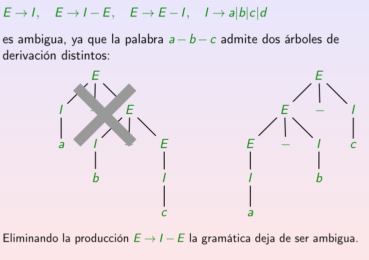

# 4.Gramáticas Independientes del Contexto

## 4.1.Árboles y derivaciones

Definimos el __árbol de derivación__ como un árbol dirigido donde, dada una palabra $u \in A^\*$ donde $A^\*$ es la clausura de un alfabeto, se construye la palabra aplicando las reglas de derivación siguiendo los siguientes pasos:
    
    1. Comenzamos con el símbolo inicial siendo el nodo raíz del árbol.
    2. Cada vez que apliquemos una regla de derivación:
        
        - Creamos un nodo hijo por cada variable que aparezca en la regla.
        - Si quedan símbolos de variable volvemos a 2.
    
    3. Hemos conseguido la palabra buscada.

En el caso de que exista una regla de producción de la forma $A \rightarrow \epsilon$ tal que $A \in V$ sólo se crea un hijo con el valor $\epsilon$.

Como resultado deberemos obtener (3.) leyendo de izquierda a derecha los valores de las hojas del árbol que necesariamente deberán ser __símbolos terminales__.

Este concepto es muy importante en la compilación de programas, ya que para conocer si una palabra está correctamente escrita se genera su _árbol de derivación_.

Algunas __propiedades__ de los _árboles de derivación_ son:
    
    · Dos procesos de derivación distintos pueden originar el mismo árbol de derivación.
    · Cuando al realizar el proceso de derivación aplicamos primero las reglas a la variable que aparece más a la izquierda, derivamos por la izquierda.

    · Cuando al realizar el proceso de derivación aplicamos primero las reglas sobre la variable que aparece más a la derecha, derivamos por la derecha.

Relacionado con los tipos de derivación, hay casos donde podemos realizar la misma cantidad de sustituciones, incluso de los mismos contenidos, y conseguir la misma palabra. Con esto me refiero, con ordenes distintos de derivación podemos conseguir la misma palabra con el mismo número de sustituciones.

## 4.2.Gramáticas ambiguas y lenguajes inherentemente ambiguos

### 4.2.1.Gramáticas ambiguas

Diremos que una gramática es __ambigua__ cuando una misma palabra aceptada por el lenguaje generado por la gramática dispone de más de un _árbol de dervición_.

___Problema___

_Es claro que encontrar que la gramática sí es ambigua es algo computable, es decir, se puede hacer mediante algoritmos, pero... ¿qué ocurre si buscamos demostrar que la gramática no es ambigua?_

La  única solución vista hasta ahora sería probar con todas las palabras que acepta el lenguaje generado por dicha gramática que, normalmente, serán infinitas.

Este problema introduce el concepto de problema __semidecidible__, esto es cuando la respuesta positiva a la pregunta se resuelve mediante un algoritmo; pero, cuando la respuesta es negativa, el programa puede estar destinado a ciclar de forma indefinida.

En ocasiones, podremos eliminar una serie de reglas de producción que producen la ambigüedad. Estas reglas de producción no sabemos, por ahora, cómo encontrarlas pero, eliminandolas conseguiremos una gramática que no será ambigua.

### 4.2.2.Lenguajes inherentemente ambiguos

Del concepto de _gramática ambigua_ pasamos al de __lenguaje inherentemente ambiguo__. Diremos que un lenguaje de __tipo 2__ es __inherentemente ambiguo__ si toda la gramática que lo genera es _ambigua_.

___Problema___

_Al igual que con gramáticas ambiguas... ¿cuándo podemos determinar que un lenguaje sea o no inherentemente ambiguo?_

En este caso, el problema ni siguiera es _semidecidible_, es completamente __indecidible__; es decir, no podemos determinar mediante algoritmos ninguna de las dos respuestas.La demostración de ello se basa en la reducción al absurdo usando que si existiera obtendríamos un problema que resolvería el _problema de la parada_.

Una propiedad que debe quedar clara es que __ningún lenguaje regular__ es __inherentemente ambiguo__, pues equivale a que sea generado por un _AFD_, o visto de otra manera, por una gramática _regular_ que sabemos que no puede ser _ambigua_.

No obstante, ya vimos una forma de la cual se peude conocer que un lenguaje __no__ es ambiguo usando la [corrección de ambigüedad](#corrección); pues, si al aplicarla conseguimos una gramática __no__ ambigua sabemos ya que el lenguaje dado no sería inherentemente ambiguo.

Con el ejemplo podemos deducir que los problemas se localizan en la __intersección__ de ambo lenguajes, es decir, las palabras que pertenecen a ambos. 

No obstante, darse cuenta de que hay una gramática ambigua que genera el lenguaje no demuestra nada salvo lo que ya se ha dicho, pues esto no implica que todas las gramáticas son ambiguas luego no nos dice que el lenguaje es inherentemente ambiguo.

## 4.3.Símbolos y Producciones inútiles

Diremos que un símbolo $X \in (V\cup T)$ es útil si y sólo si existe una cadena de derivaciones en la gramática tal que:

$$S \longrightarrow  \alpha X \beta \longrightarrow w \in T^\*$$

donde cada derivación puede incluir otras tantas como sean necesarias.

Intuitivamente basta con ver que hay, al menos, una palabra del lenguaje que se crea haciendo uso de esa variable. Por tanto, un símbolo de variable será inútil si no se usa para formar ninguna palabra.

De aquí deducimos que una regla de producción es __inútil__ si alguno de los símgbolos de variable de la regla de producción son inútiles.

Lo que haremos para trabajar de forma más cómoda buscando que una gramática deje de ser ambigua es eliminar estos símbolos y producciones inútiles, que tenemos garantizado que el lenguaje aceptado por la nueva gramática será el mismo.

Por otra parte, debe quedar claro que para detectar símbolos inútiles hay dos pasos que pueden dar interferencias:
    
    1. Encontrar y eliminar los símbolos que no son accesibles desde el estado inicial.
    2. Encontrar y eliminar los símbolos que no pueden acabar en una palabra del lenguaje, es decir, no se pueden eliminar una vez aparecen.

Es importante aplicar los pasos en el orden (2.,1.) pues podría haber ocasiones donde se den pasos en vano.

_Demostración_

Supongamos que disponemos de la siguiente casuística:
    
$$ X \longrightarrow \alpha Y\beta \longrightarrow u \in T^\*$$

donde $X$ no ha sido detectada como inútil en la primera parte pero usa una variable Y que no es accesible desde la variable inicial. 

Como $Y$ no es accesible desde la variable inicial, $X$ tampoco lo será pues si lo fuera tendríamos que $Y$ también lo sería, lo cual es una contradicción. Por tanto, $X$ será eliminada por la segunda parte del algoritmo.

_Fin demostración_

### 4.3.1.Obtención de variables no sustituibles por símbolos terminales

El algoritmo a aplicar dispone de las siguientes condiciones denotando por $V_t$ al conjunto de las variables que __sí__ se pueden dustituir por símbolos terminales:
    
    · Condición básica: Si una variable se sustituye directamente por un símbolo terminal, esa variable pertenece a Vt.
    · Condición recursiva: si una variable deriva en una concatenación de símbolos terminales y variables de Vt, entonces esa variable pertenece a Vt.

El algoritmo busca calcular todo $V_t$ para obtener $V \setminus V_t$ y sigue los siguientes pasos:
    
    1. Vt es vacío.
    2. Para cada producción `A->w`, A se introduce en Vt.
    3. Mientras Vt cambie:
        
        a. Para cada producción `B->ſ`
            
            · Si todas las variables de ſ pertenecen a Vt, B se introduce en Vt.

    4. Eliminar las variables que estén en V y no en Vt.
    5. Eliminar todas las producciones donde aparezca una variable de V\Vt.

Una vez aplicado esto y conseguido, hemos determinado una gramatica que podría seguir siendo ambigua pues nos queda por aplicar el [paso 1](#paso-2). En este paso inicial, hemos eliminado todas las producciones ocn variables inútiles.

### 4.3.2.Obtención de variables derivadas del símbolo inicial

Para ello, simplemente obtendremos de forma recursiva dichas variables haciendo uso de la siguiente notación:

$$V_s \rightarrow variables-obtenibles-desde-el-símbolo-inicial$$
$$T_s \rightarrow símbolos-terminales-obtenidos$$
$$J \rightarrow variables-por-analizar$$

Seguiremos los siguientes pasos:

    1. J={S}, Vs={S},Ts={}
    2. Mientras J!={}:
        
        a. Extraer un elemento de J -> J=J\{A}
        b. Para cada producción `A->ſ`
            
            · Si B no está en Vs añadir B a J y a Vs.
        
        c. Poner todos los símbolos terminales de ſ en Ts.

    3. Eliminar todas las variables que no estén en Ts.
    4. Eliminar todas las producciones donde aparezca un símbolo o variable eliminados en el paso anterior.

De esta manera hemos obtenido esa gramática no ambigua a partir de la que nos dieron de partida, que sí sabíamos que era ambigua.

En ocasiones, podremos incluso determinar que el lenguaje generado por una gramática es el __vacío__, esto se detecta cuando resulta que la variable inicial es inútil aplicando el algoritmo. En ese caso, se puedene eliminar todas las producciones, pero por definición de gramática __no__ podemos eliminar el símbolo inicial. dejaríamos la siguiente regla de producción únicamente:
    
$$S -> S$$

## 4.4.Formas normales

Estas formas se encargan de definir una serie de características que deben verificar todas y cada una de las reglas de producción de una gramática para pertenecer a esa forma normal.

___Motivación___

Nos surge el siguiente problema, dada una gramática independiente del contexto y una palabra $u$, ¿ $u\in L(G)$ ?

Como primera solución, podríamos generar un árbol de derivación con todas las posibles aplicaciones de las reglas de producción, lo cual nos resolvería la parte positiva de la pregunta; pero si la palabra no es generada por la gramática... ¿hasta qué profundidad tenemos que generar para convencernos de que no se puede?

### 4.4.1.Producciones nulas

Una regla de producción decimos que es una __producción nula__ cuando es de la forma:
    
$$A\rightarrow \epsilon$$

Estas producciones entorpecen nuestro algoritmo y no nos permite determinar con facilidad la solución al problema pues cada vez que apliquemos una _producción nula_ reduciremos en una unidad la longitud de nuestra palabra.

Para eliminarlas aplicaremos un algoritmo de manera que $L(G_n)=L(G)\setminus$ \{ $\epsilon$ \}. Donde $G_n$ es la gramática generada por el algoritmo.

Cade destacar que este algoritmo provoca la pérdida de la palabra vacía siempre y cuando $\epsilon \in L(G)$. No obstante, el algoritmo nos permite conocer en qué momento se pierde.

Como solución a esto sólo deberemos realizar el siguiente cambio:

$$S' \rightarrow S$$
$$S' \rightarrow \epsilon$$

donde hemos creado un nuevo símbolo inicial que parchea este problema.

De la eliminación de producciones nulas surge el siguiente concepto: las __variables anulables__.

Una casuística típica es la siguiente:
    
$$C \right arrow AB , A \rightarrow \epsilon, B\rightarrow \epsilon$$

donde eliminaríamos las producciones nulas teniendo que añadir las siguientes reglas de producción apra no perder información:

$$C \rightarrow A, C\rightarrow B, C \rightarrow \epsilon$$

para después volver a aplicar el algoritmo.

Para evitar este ciclo, vamos a calcular desde le pricipio todas las variables que en algún momento llegarían a ser producción nulas. A estas variables les llamaremos __variables anulables__.

Por tanto, el algoritmo seguirá dos partes en este orden:

    1. Obtención de variables anulables.
    2. Eliminación de producciones nulas.

### 4.4.2.Algoritmo

Lo dividiremos en dos partes, una primera que consistirá en el [paso (1.)](#algoritmo). Y otra segunda que consistirña en el [paso (2.)](#algoritmo).

___Paso (1.)___

El algoritmo se basa en calcular el conjunto de variables anulables $H$:

    1. H={}
    2. Para cada producción nula, añadimos la variable a H.
    3. Mientras H cambie:
        
        · Para cada producción `B->{An}` donde Ai pertenece a H para todo i, se añade B a H.

___Paso (2.)___

Consiste en eliminar las porducciones nulas y añadir producciones para no perder palabras del lenguaje:
    
    1. Se eliminan todas las producciones nulas de la gramática.
    2. Para cada producciñon de la gramática de la forma `A->{ſn}` donde ſi es una variable o un símbolo terminal:
        
        · Se añaden todas las producciones de la forma A->{ßn} donde:
            
            - ßi=ſi si ſi no pertenece a H.
            - (ßi=ſi) ó (ßi=palabra vacía) si ſi pertenece a H y no todos los ßi son pueden ser nulos al mismo tiempo.
