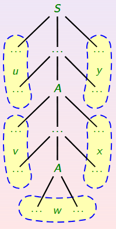

# 6.Propiedades de los lenguajes independientes del contexto

---
## Índice
1. [Lema de Bombeo](#LDB)
2. [Operaciones con lenguajes Independientes del Contexto](#ops)
    1. Complementario de un lenguaje independiente del contexto.
    2. Intersección de un lenguaje independiente del contexto y un lenguaje regular.
3. [Algoritmos](#Alg)
    1. Algoritmo de Cocke-Younger-Kasami
    2. Algoritmo de Early
4. [Problemas indecidibles](#PI)
---

## 6.1.Lema de Bombeo

Al igual que para lenguajes regulares disponíamos de una condición necesaria para que un lenguaje fuera regular, para lenguajes independientes del contexto disponemos de otro _Lema de Bombeo_.

___Enunciado___

Sea $L$ un lenguaje independiente del contexto, entonces existe una constante $n \in N$, que depende solo de $L$, tal que si $z \in L, |z| \geq n$, y $z$ se puede escribir de la forma $z=uvwxy$ verificando:
1. $|vx| \geq 1$
2. $|vwx| \leq n$
3. $\forall i \geq 0, uv^iwx^iy \in L$

Para la demostración del mismo necesitaremos la siguiente propiedad:
- Si en una gramática en forma normal de Chomsky existe una palabra que es derivada con un árbol de derivación en el que todos los caminos desde la raíz a una horja son de longitud menor o ingual a $2^{m-1}$, además en un camino de la raíz de la hoja de longitud $k$ aparecen $k$ variables.

_Demostración del lema de bombeo_

Realmente, daremos una idea intuitiva de por qué se verifica el teorema.

Todo consiste en la posibilidad de suponer que $L$ se puede expresar mediante una gramática en forma normal de _Chomsky_ para simplificar la idea. Sea $p \in N$ el número de variables que contiene la gramática y definimos $n=2^p$. Se ahora $u\in L$ tal que $|u|\geq n$ eso quiere decir que, en un árbol de derivación cualquiera, el camino más largo de la raíz a las hojas debe contener una repetición, ya que dicho camino debe contener al menos $p+1$ variables. 

En este paso hemos usado que la gramática está en forma normal de _Chomsky_. Supongamos que $A \in V$ la variable del árbol de derivación que se repite.

Hasta ahora sabemos:
- $|vx| \geq 1$ pues la gramática no dispone de producciones nulas ni unitarias.
- $|vwx| \leq n$ pues la longitud del camino más largo que parte de la $A$ más cercana a la raíz es menor o iugal a $p+1$.

De esta manera, hemos encontrado un posible ciclo de las partes $v$ o $x$ de la palabra, esto es así porque siempre que aparezca una $A$, podremos sustituir dicha variable por la parte del árbol que hay hasta la próxima $A$ ocasionando así que esto sea tan prolongado como se quiera.siempre que aparezca una $A$, podremos sustituir dicha variable por la parte del árbol que hay hasta la próxima $A$ ocasionando así que esto sea tan prolongado como se quiera.

_Fin demostración_

Al igual que el uso real del lema de Bombeo para lenguajes regulares consistía en probar que no era regular porque no cumplía la condición necesaria, en este caso la aplicación es la misma; es decir, mediante el incumplimiento de la condición necesaria, dicho lenguaje no será independiente del contexto. 

## 6.2.Operaciones con Lenguajes Independientes del Contexto

Los lenguajes independientes del contexto son cerrados para las siguientes operaciones:
- Unión: la demostración consiste en hacer la gramática que puede bifurcarse en el símbolo inicial para general la palabra de un lenguaje o de otro.

$$S \rightarrow S_1, S \rightarrow S_2$$

- Concatenación: la idea es similar a la anterior solo que permitiendo generar las dos palabras una seguida de la otra:

$$S \rightarrow S_1S_2$$

- Clausura: no deja de ser una concatenación de un lenguaje consigo mismo infinitas veces, luego se consigue así:

$$S \rightarrow S_1S$$

No obstante, hay otras operaciones para los que los lenguajes independientes del contexto no son cerrados, como por ejemplo:

- Intersección, esta clase de operaciones no es cerrada pues la intersección de independeintes del contexto puede no ser independiente del contexto, basta tomar los lenguajes $L=$ \{ $a^ib^ic^j \mid i,j \geq 1$ \} y $L'=$ \{ $a^ib^jc^j \mid i,j \geq 1$ \}.

- Complementario, es claro que no lo es pues si lo fuera podríamos deducir que la intesección lo es lo cual es una contradicción.

### 6.2.1. Complementario de un Lenguaje Independiente del Contexto Determinista

Cuando el lenguaje origen $L$ es independiente del contexto __determinista__ la cosa cambia.

En este caso, su complementario sí que será independiente del contexto determinista.

_Demostración_

La demostración no es simple debido a la existencia de transiciones nulas (por definición de lenguaje independiente del contexto determinista). La idea principal consiste en considerar un _APD_ que acepte $L$ por estados finales completo(esto quiere decir que se permita la lectura de palabras completas).

El problema fundamental es que después de leer la palabra de entrada completa, el autómata ¿inicial? tiene que pasar por todas las transicione snulas posibles y si nunca ha pasado por un estaod final, entonces acepta.

Para ello, hace tres copias de cada estado $q$: $(q,0),(q,1)(q,2)$ con el siguiente significado:
- $(q_0)$: significa que el autómata está en $q$, no ha pasado por ningún estado final desde el útlimo símbolo leído y con el contenido actual de la pula, pueden quedar transiciones nulas por hacer.
- $(q,1)$: está en $q$ y sí ha pasado por algún estado final desde el último estado leido.
-$(q,2)$: está en $q$, no ha pasado por ningún estado final desde el último símbolo leído y con el contenido actual de la pila, no quedan transiciones nulas por hacer.

Los finales serán los de este último tipo que no sean finales en el autómata inicial. El estado inicial es $(q_0,0)$ si $q_0 \notin F$ y $(q_0,1)$ si $q_0 \in F$.

Las transiciones vendrán dadas de la siguiente forma
- Si $(p,\alpha) \in \delta(q,\epsilon,X)$ entonces añadimos al autómata nuevo $((q,i),\alpha) \in \delta'((q,j),\epsilon,X) donde $j=0,1$ e $i=1$ si $j=1$ ó $p \in F$ e $i=0$ en caso contrario.
- Si $(p,\alpha) \in \delta(q,a,X)$ donde $a\in A$, entonces añadimos al autómata nuevo $((q,2),X \in \delta¿'?((q,0),\epsilon,X) para indicar que si la palabra termna aquí aceptamos(no hemos pasado por un estado final desde el último símbolo léido).
También se añade $((p,i),\alpha) \in \delta'((q,j),a,X) donde $j=1,2$ e $i=0$ si $p \notin F$ e $i=1$ en caso contrario, para poder seguir leyendo símbolos si la palabra no ha terminado.

El autómata así construido acepta el lenguaje complementario y es determinista.

_Fin demostración_

___Anotación___

Este resultado no implica que la intersección de lenguajes independientes del contexto deterministas sea determinista, ya que la unión de deterministas no tiene por qué ser determinista.

### 6.2.2.Intersección de un lenguaje independiente del contexto y un regular

___Resultado___

Si $L$ es un lenguaje independiente del contexto y $R$ es un lenguaje regular, entoences $L \cap R$ es independiente del contexto.

_Demostración_

La idea intuitiva se basa en que se puede controlar todo con un autómata con pila.

Supongamos un autómata con pila $M=(Q,A,B,\delta,q_0,Z_0,F)$ que acepta $L$ por el criterio de estados finales y un autómata finito determinista $M'=(Q',A,\delta',q_0',F')$. 

Construimos el sisguiente autómata ocn pila $M''=(Q'',A,B,\delta'',q_0'',Z_0,F'')$:

- $Q''=Q \times Q'$
- $q_0''=(q_0,q_0')$
- $F''=F \times F'$
- $\delta''((p,q),a,X)=$ \{ $((r,s),\alpha) \mid (r,\alpha) \in \delta(p,a,X), s=\delta'(q,a)$ \} donde $a\in A$.
- $\delta''((p,q),\epsilon,X)=$ \{ $((r,q),\alpha) \mid (r,\alpha) \in \delta(p,\epsilon,X)$ \}.

Este autómata acepta $L\cap R$ y por tanto es independiente del contexto.

_Fin demostración_

## 6.3.Algoritmos

Ya vimos en temas anteriores algoritmos para determinar si un lenguaje generado por una gramática es vacío asi como algoritmos para determinar si el lenguaje generado por una gramática independiente del contexto es inifinito.

Por repasar, este último puede basarse en eliminar los símbolos y producciones inútiles y las producciones nulas y unitarias. De esta manera, quitando los estados inaccesibles, si el autómata resultado de la gramática dispone de ciclos será infinito.

En este tema, nos volveremos a centrar en el problema de la **pertenencia** de una palabra a un cierto lenguaje, lo cual se puede reducir a estudiar si una gramática tipo 2 genera cierta palabra.

### 6.3.1.Algoritmo de Cocke-Younger-Kasami

Este algoritmod e complejidad $O(n³)$ donde $n$ es la longitud de la palabra se basa en estudiar el problema de la pertenecia para gramáticas en forma normal de __Chomsky__.

La idea es, dada la subcadena $u_{ij}$ que comienza en la posición $i$ y tiene longitud $j$, buscaremos calcular el conjunto $V_{ij}$, es decir, el conjunto de variables que generan $u_{ij}$.

Dispone de dos condiciones:
- Condición básica: Si el i-ésimo símbolo de $u$ es $a$ y tenemos la producción $A\rightarrow a$ entonces $A \in V_{ij}$.
- Condición recursiva ($j > 1$): Si $A \rightarrow BC$ es una producción y $B \in V_{ik}$, $C \in V_{i+k,j-k}$ entonces $A \in V_{ij}$. Pues la palabra completa se genera como concatenación de palabras generadas por $B$ y $C$.

___Algoritmo___
1. Para $i=1$ hasta $n$:
    - Calcular $V_{i1}=$ \{ $A \mid A \rightarrow a$ es una producción y el símbolo i-ésimo de $u$ es $a$ \}.
2. Para $j=2$ hasta $n$ 
    1. Para $i=1$ hasta $n-j+1$
    + $V_{ij} = \emptyset$
    + Para $k=1$ hasta $j-1$ $V_{ij}=V_{ij} \cup $ \{ $A \rightarrow BC$ es una producción y $B \in V_{ik}$, $C \in V_{i+k,j-k}$ \}

Para ver un ejemplo de uso se recomienda buscar las diapositivas o en las relaciones de ejercicios como exámenes.

### 6.3.2.Algoritmo de Early

Pasamos al algortimo de pertenencia más sofisticado, basado en programación dinámica, que conocemos, es útil para toda gramática sin producciones nulas ni unitarias. Es de complejidad $O(n³)$ en general, pero en ocasiones puede llegar a ser $O(n)$ siendo $n$ el tamaño de la palabra.

Para entenderlo debemos introducir la siguiente notación:
- $u[i..j]$ será la subcadena de $u$ que va desde la posicion $i$ a la posición $j$.
- $(i,j,A,\alpha,\beta)$ donde $i,j$ son enteros y $A\rightarrow \alpha \beta$ es una producción de la gramática; serán registros que indicarán un hecho ya conseguido y un objetivo:
    + Hecho: $u[i+1..j]$ es derivable a partir de $\alpha$.
    + Objetivo: entontrar todos los $k$ tales que $\beta$ deriva a $u[j+1..k]$.

- $Registros[j]$ contendrá todos los registros existentes de la forma $(i,j,A,\alpha,\beta)$ para $j$.

___Algoritmo___

Se basa en varios pasos de bastante complejidad:

1. __Inicialización__. Las variables iniciales serán las siguientes con los siguientes valores:
    + $Registros[0]=$ \{ $(0,0,S,\epsilon,\beta) : S\rightarrow B$ es una producción \}.
    + $Registros[j]=\emptyset$ para $j=1,2,...,n$.
2. __Clausura__. Para cada registro $(i,j,A,\alpha,B \gamma)$ en $Registros[j]$ y cada producción $B \rightarrow \delta$, crear el registro $(j,j,B,\epsilon,\delta)$ e insertarlo en $Registros[j]$. Repetir la operación recursivamente para los nuevos registros insertados hasta hacerlos todos.
3. __Avance__. Para cada registro $(i,j,A,\alpha,c\gamma)$ en $Registros[j]$, donde $c$ es un símbolo terminal que aparece en la posición $j+1$ de $u$, crear $(i,j+1,A,\alphac,\gamma)$ e insertarlo en $Registros[j+1]$.
    * En este punto hacer $j=j+1$.
4. __Terminación__. Para cada registro $(i,j,A,\alpha,\epsilon)$ que llamaremos _completo_ en $Registros[j]$, buscar los registros de la forma $(h,i,B,\gamma,A\delta)$ en $Registros[i]$ y para cada uno de ellos crear el nuevo registro $(h,j,B,\gamma A, \delta)$ e insertarlo en $Registros[j]$.
5. Si $j < n$ ir a __Clausura__.
6. Si en $Registros[n]$ hay un registro de la forma $(0,n,S,\alpha,\epsilon)$, entonces $u$ es generada. En caso contrario no es generada.

Para ver un ejemplo de uso consultar exámenes o ejercicios de la relación.

## 6.4.Problemas indecidibles

Simplemente, por curiosidad, se dejan por aquí algunos problemas que son indecidibles, es decir, resolubles mediante algoritmos.

Suponemos $G,G_1$ y $G_2$ gramáticas independientes del contexto y $R$ un lenguaje regular. Son indecidibles:

- Saber si $L(G_1) \cap L(G_2) = \emptyset$.
- Determinar si $L(G)=T^\*$, donde $T$ es el conjunto de símbolos terminales.
- Comprobar que $L(G_1) = L(G_2)$ asicomo las inclusiones respectivas.
- Determinar si $L(G)=R$.
- Determinar si $L(G)$ es regular.
- Determinar si $G$ es ambigua.
- Conocer si $L(G)$ es inherentemente ambiguo.
- Comprobar si $L(G)$ es determinista.
